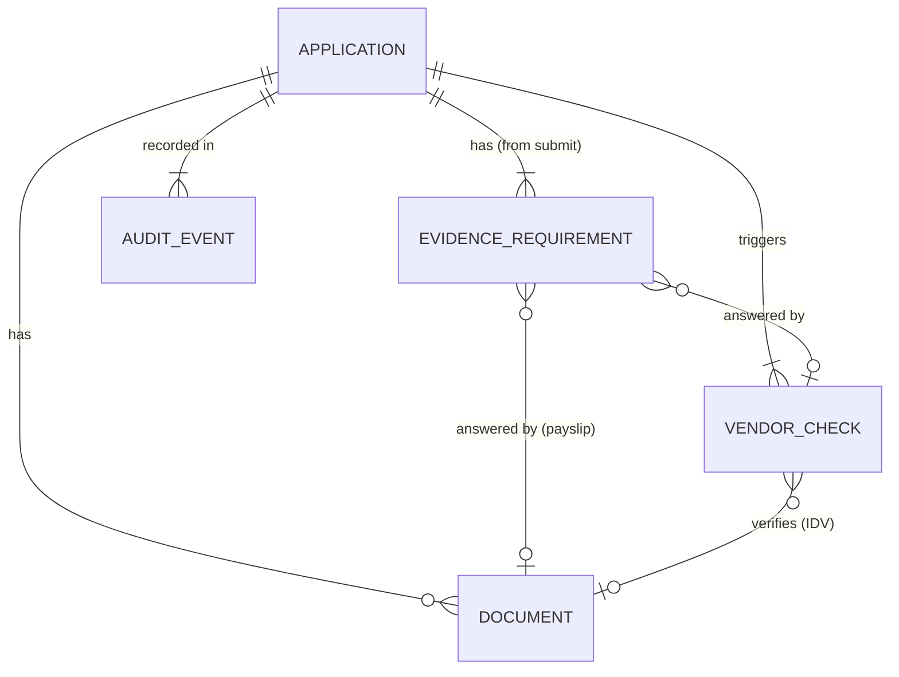
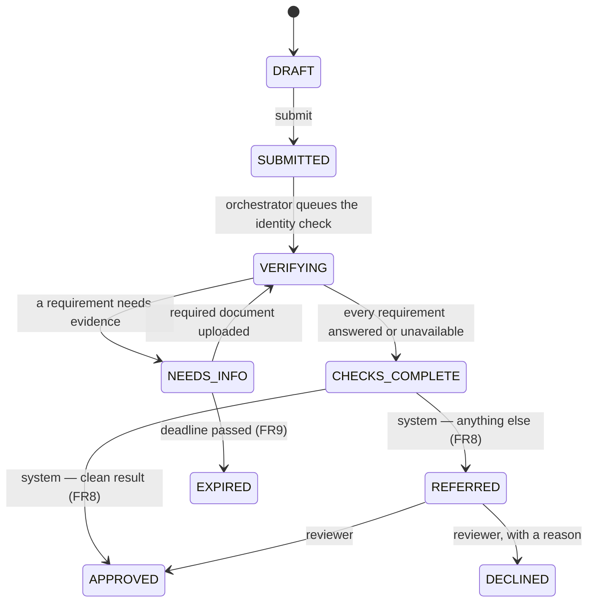
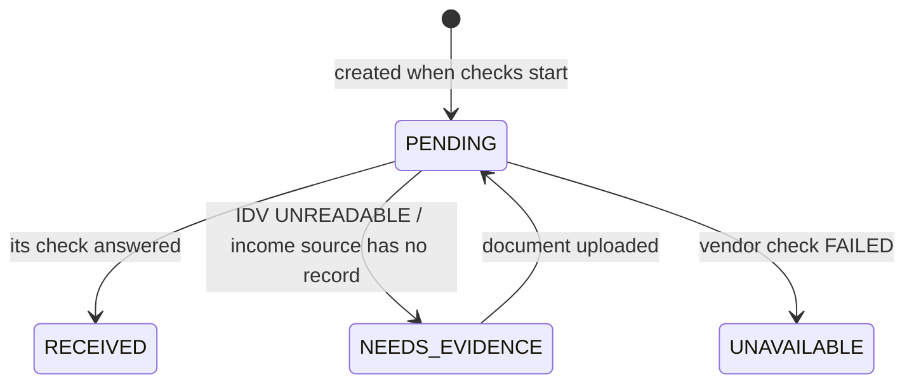
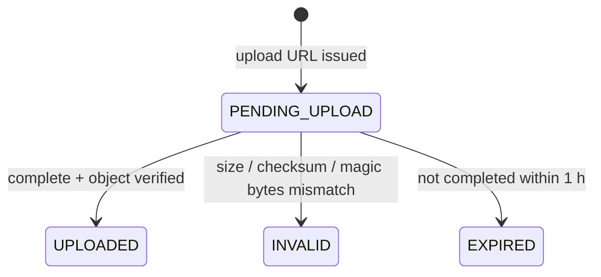
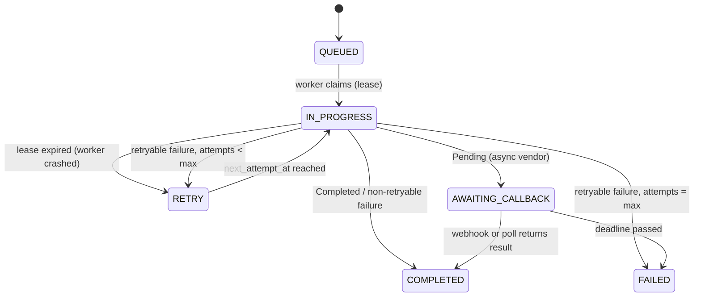
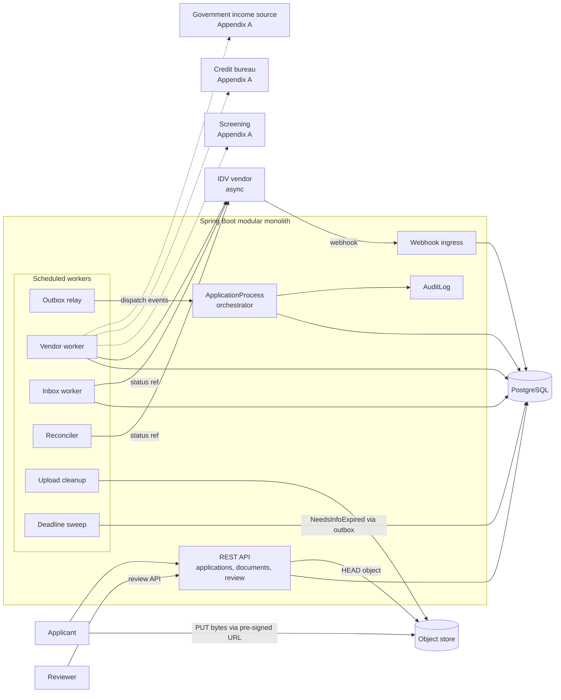

# Credit Card Application

Spring Boot 4.1, Java 21, JPA, PostgreSQL, an S3-compatible object store (LocalStack in development and tests), and
a WireMock stand-in for Onfido.

```bash
./gradlew build     # compile + test
./gradlew bootRun   # docker-compose brings up Postgres, the object store and the Onfido mock;
                    # then open http://localhost:8080 for the web UI (FR10)
```

One tech design per increment: [FR1 — Draft](docs/fr1-draft-application.md) ·
[FR2 — Audit log](docs/fr2-audit-log.md) · [FR3 — Document upload](docs/fr3-document-upload.md) ·
[FR4 — Submit](docs/fr4-submit.md) · [FR5 — Identity verification](docs/fr5-identity-verification.md) ·
[FR8 — Decision](docs/fr8-decision.md) · [FR9 — Deadlines](docs/fr9-deadlines.md) · [FR10 — Web UI](docs/fr10-web-ui.md) · [FR11 — Live timeline](docs/fr11-timeline.md).
Alongside them: the [C4 model](docs/c4-model.html), the [coding conventions](docs/coding-conventions.md)
and 17 [decision records](docs/adr).

## 0. Business background

At a high level, a card decision answers five questions: is this person who they say they are, are we allowed to serve
them, can they afford it, are they likely to repay, and is the application genuine. Third-party data supplies most of the
evidence for those questions, and the rule engine turns it into a decision.

Each question maps to exactly one check, and the check to one evidence requirement. The requirement is named after the
**question**, never after the vendor — that is what lets a vendor be swapped without changing what the evidence means:

| #   | What we need to know                  | Check                                      | Typical provider                               | Mode                                | Requirement | Integration spec                                                  |
|-----|---------------------------------------|--------------------------------------------|------------------------------------------------|-------------------------------------|-------------|-------------------------------------------------------------------|
| 1   | Is this person who they say they are? | Identity verification                      | IDV vendor (e.g. Onfido)                       | **Async** — submit, then webhook    | `IDENTITY`  | [providers/identity-verification.md](docs/providers/identity-verification.md) |
| 2   | Are we allowed to serve them?         | Sanctions, PEP and adverse media screening | Screening vendor (e.g. World-Check, Dow Jones)  | Sync request/response               | `SCREENING` | [providers/screening.md](docs/providers/screening.md)                   |
| 3   | Can they afford it?                   | Income verification                        | Government data source, or an uploaded payslip | Sync request/response               | `INCOME`    | [providers/income-verification.md](docs/providers/income-verification.md) |
| 4   | Are they likely to repay?             | Credit bureau report                       | Credit bureau                                  | Sync request/response               | `CREDIT`    | [providers/credit-bureau.md](docs/providers/credit-bureau.md)           |
| 5   | Is the application genuine?           | Fraud signals                              | None — computed from our own history           | Internal, no network call           | —           | [providers/fraud-signals.md](docs/providers/fraud-signals.md)           |

Row 1 is this project's scope, built in FR5. Rows 2–4 are designed for but **outside this project** — see
[Appendix A](#appendix-a). Row 5 is deferred entirely. One provider is asynchronous and four interactions are
request/response, which is the single fact that most shapes the design: the async one needs a webhook inbox, a
reconciler and a deadline, and the sync ones do not.

Three consequences worth stating up front, because they shape everything below:

- **Questions 1–4 buy evidence; question 5 does not.** The first four are answered by someone we pay and wait on, which
  is why they dominate the design: idempotency keys, timeouts, retries, a webhook inbox. Fraud signals come from our own
  application history, need no network call, and are deferred with the rest of screening.
- **This scope answers the evidence half, then takes the smallest safe decision.** [FR8](docs/fr8-decision.md)
  approves a clean result, refers everything else to a person, and only a person declines. The rule engine that weighs
  the evidence properly is a later increment.
- **The questions are stable; the vendors are not.** Swapping Onfido for Jumio must not change what `IDENTITY` means.
  That is why requirements are typed by question and why vendor DTOs never leave their adapter package.

Question 2 is one check but three kinds of hit, and they are not equally hard. A sanctions list is an authoritative
register: a match is close to a fact. Adverse media is name-matching against news, so it produces false positives at a
rate the other two do not — which is why every hit carries a `matchScore` and a `type`, and why no hit may ever be
auto-actioned. `SCREENING` is `RECEIVED` when the provider answered, hits or not; judging the hits belongs to compliance,
not to this scope.

Scope: two phases, and nothing after them.

1. **Application intake (internal).** The applicant submits the application and documents. The orchestrator creates a
   durable workflow instance and records it in the audit log.
2. **Parallel checks (external).** The orchestrator calls these providers concurrently, each with its own protocol,
   timeout and retry policy:
    - ID and document verification (e.g. Onfido, Jumio)
    - Sanctions, PEP and adverse media screening (e.g. World-Check, Dow Jones)
    - Credit bureau report
    - Income verification (uploaded documents or a government data source)

   This project builds the first of the four. The other three, and the declared data they need, are outside it
   ([Appendix A](#appendix-a)). Sections 2–5 still describe the four-check design, so the extension slots in without
   reshaping what is built; read "four checks" there as the design the identity check was built to fit.

The application ends this scope at `CHECKS_COMPLETE`: every requirement answered or recorded as unavailable, every raw
vendor response stored. From there FR8 decides — `APPROVED`, or `REFERRED` to a reviewer who approves or declines.
Normalization, features, the ruleset, provisioning and notification are later increments — see [Deferred](#deferred). Optimized for learning the
core patterns, not feature breadth.

## 1. Requirements

| #   | Functional | Status |
|-----|------------|--------|
| FR1 | Create a draft application for a card product and update declared data. Design: [fr1-draft-application.md](docs/fr1-draft-application.md). The remaining declared data — national id, address, declared income — and the credit bureau consent are outside this project ([Appendix A](#appendix-a)). | **Built** |
| FR2 | **Audit log.** An append-only record of what happened, written in the same transaction as the change it describes. Design: [fr2-audit-log.md](docs/fr2-audit-log.md) — infrastructure, not a feature, and every increment from FR3 depends on it. | **Built** |
| FR3 | **Upload KYC documents.** `ID` (required before submit), `PAYSLIP` (when asked). A pre-signed URL out, a verified object in. Design: [fr3-document-upload.md](docs/fr3-document-upload.md). | **Built** |
| FR4 | **Submit.** Starts the application's durable workflow instance and records it in the audit log. Design: [fr4-submit.md](docs/fr4-submit.md) — also the spine every later check runs on: the outbox, the relay and the orchestrator. | **Built** |
| FR5 | **Verify identity with an IDV vendor.** The first external check, and the only asynchronous one. Design: [fr5-identity-verification.md](docs/fr5-identity-verification.md). | **Built** |
| FR6 | **The remaining parallel checks.** Sanctions + PEP + adverse media screening, the credit bureau and income verification, run concurrently with each other and with FR5, each with its own protocol, timeout and retry policy. | Out of scope — [Appendix A](#appendix-a) |
| FR7 | **Status.** The applicant views status and outstanding requirements. Extends FR1's existing `GET` endpoints rather than adding a surface. | **Built** |
| FR8 | **Decision.** When checks complete, approve a clean result and refer anything else to a reviewer, who approves or declines with a reason. Only a person declines. Design: [fr8-decision.md](docs/fr8-decision.md). | **Built** |
| FR9 | **Deadlines.** An application left in `NEEDS_INFO` past its deadline becomes `EXPIRED` — terminal, not a decline; an overdue referral is flagged in the review queue and logged, never closed automatically. Design: [fr9-deadlines.md](docs/fr9-deadlines.md). | **Built** |
| FR10 | **Web UI.** A browser front end for the whole loop — apply, upload, submit, follow the check, get a decision, review a referral — served by the app as static files, calling only existing endpoints. Design: [fr10-web-ui.md](docs/fr10-web-ui.md). | **Built** |
| FR11 | **Live timeline.** A development-only panel streaming what the system did after submit — retries, adopted checks, reconciled results, the decision — over Server-Sent Events, read from the audit log. Design: [fr11-timeline.md](docs/fr11-timeline.md). | Planned |

**FR2 is infrastructure, and earns a number anyway.** Every increment from FR3 onward takes an `AuditTrail` in a
constructor, so none of them can be built without it and none of them owns it. Numbering it makes the dependency explicit
and keeps its design — `MANDATORY` propagation, the `seq` argument, append-only by trigger — in one place instead of inside
whichever feature happens to need it first.

**FR3, FR4 and FR5 are deliberately three requirements, not one.** It is tempting to treat "upload an ID and get it
verified" as a single feature, and it is not: uploading is a client PUT-ing bytes to a store we verify, submitting is a
state change that starts a durable workflow, and verifying is a paid asynchronous call to a third party that may never
answer. Three different failure modes, three different things that can be got wrong independently. They share the document
and nothing else, and they are separate modules in the code for the same reason.

<a id="deferred"></a>
Deferred to later increments, each named so nothing is lost: contact verification by OTP; fraud screening (duplicate
detection, velocity limits per national id / phone / email / device); normalization of vendor responses into an internal
evidence model; feature computation; the versioned ruleset and rule engine (FR8's decision is a fixed table); review
queues split by underwriting and compliance, and a review UI (FR8 has one queue, over an API); the single final
`Decision` row; card provisioning through a
processor; applicant notification; rule management, pre-deploy replay and decision-rate monitoring.

Out of scope entirely: real auth (`X-User-Id` stands in), open banking as an income source, malware scanning, PII
encryption at rest, withdrawal by the applicant, ongoing post-decision sanctions monitoring. (Expiry of an application
that never sends what was asked is built — [FR9](docs/fr9-deadlines.md).)

| Quality         | Requirement                                                                                                                                                                                                              |
|-----------------|--------------------------------------------------------------------------------------------------------------------------------------------------------------------------------------------------------------------------|
| Correctness     | Retries never duplicate. A vendor call runs **at most once per idempotency key** — paid calls, and a repeated bureau pull is a second hard inquiry on the applicant's file.                                               |
| Durability      | No lost transitions, events or webhooks (transactional outbox + webhook inbox). The audit log is append-only.                                                                                                             |
| Resilience      | Vendor timeouts and 5xx are retried with backoff; lost webhooks recovered by polling. A vendor that never answers leaves its requirement `UNAVAILABLE` — visible and recorded, never silently dropped or treated as a result. |
| Compliance      | A sanctions, PEP or adverse media hit is stored as evidence and nothing in this scope acts on it. Nothing in a later increment may auto-approve or auto-decline one without compliance sign-off.                          |
| Consistency     | Application state strongly consistent (single Postgres, optimistic locking); the client sees status within seconds.                                                                                                      |
| Latency         | API p99 < 300 ms. The identity check answered p90 < 1 min after submit with a healthy vendor (all four, once Appendix A adds them), excluding `NEEDS_INFO` time.                                                                                                    |
| Reproducibility | Every check stores its raw vendor response, so the evidence a later decision runs on can be rebuilt and replayed.                                                                                                        |
| Security        | Uploads via short-lived pre-signed URLs, content verified server-side. Webhooks HMAC-verified. No PII in logs or audit payloads.                                                                                          |
| Scale           | ~10k applications/day, ~20 submits/s peak, 4 vendor checks each. One Postgres is enough; vendor latency and rate limits are the bottleneck.                                                                              |

## 2. Core Entities



| Entity                  | Fields                                                                                                                                                                                                            | Invariants                                                                                               |
|-------------------------|-------------------------------------------------------------------------------------------------------------------------------------------------------------------------------------------------------------------|----------------------------------------------------------------------------------------------------------|
| **Application** (root)  | `id`, `userId`, `cardProductCode`, `status`, declared data (`firstName`, `lastName`, `dateOfBirth`, `country`), `decisionReason?` (FR8), `statusChangedAt` (FR9), `version`. National id, address, declared income and consents are [Appendix A](#appendix-a) | Declared data immutable after submit. Status changes only via state-machine methods, each recording when it happened. |
| **Document**            | `id`, `applicationId`, `kind` (`ID`\|`PAYSLIP`), `objectKey`, `sha256`, `sizeBytes`, `contentType`, `status`, `createdAt`                                                                                          | Only `UPLOADED` documents can answer a requirement or be sent to a vendor.                              |
| **EvidenceRequirement** | `id`, `applicationId`, `type` (`IDENTITY`; the others are [Appendix A](#appendix-a)), `status`, `source` (`Vendor(vendorCheckId)`\|`Upload(documentId)`)                                                       | `RECEIVED` implies `source` is set. One per type per application.                                       |
| **VendorCheck**         | `id`, `applicationId`, `type` (`IDV`), `provider`, `documentId?`, `idempotencyKey`, `status`, `vendorRef?`, `vendorSubjectRef?`, `outcome?`, `rawResponse`, `attempts`, `nextAttemptAt`, `leaseUntil?`, `deadlineAt?` | `idempotencyKey` unique: `{appId}:IDV:{documentId}` — a re-upload is a new check. `vendorRef` unique. |
| **AuditEvent**          | `id`, `applicationId`, `seq`, `type`, `actor` (`APPLICANT`\|`SYSTEM`\|`REVIEWER`), `actorId?`, `payload` json, `at`                                                                                                | Append-only: the app's DB role has `INSERT` and `SELECT` only. `payload` holds ids and codes, never PII. |

Infrastructure tables: `outbox` (events committed atomically with state changes), `processed_event` PK (`consumer`,
`eventId`) (consumer dedupe), `vendor_inbox` UNIQUE (`vendor`, `eventId`) (webhook dedupe + durable hand-off). An
`idempotency_key` table for API idempotency is designed but not built (FR4 §8).

**The workflow instance is the application's own process state** — status, requirements, checks and the outbox — created
at submit and recorded as `WorkflowStarted` in the audit log. No separate workflow engine: Postgres already gives
durability, and a second system of record (Temporal, Camunda) would have to agree with the first.

**No normalized evidence model yet.** A requirement records *that* its check answered; the answer itself stays as
`vendor_check.rawResponse`. An internal schema per evidence type earns its place when something reads it — the
decisioning increment — and an abstraction with no consumer is one that gets the shape wrong.

## 3. State Machines

Every machine follows: transitions are methods that apply or throw a `DomainException` (FR1 §5.6) — no status setters,
no result wrapper; racy transitions use a conditional update (`UPDATE … WHERE status = :expected`) or `@Version`; each
application transition writes an outbox event and an audit event in the same transaction.

### 3.1 Application



| From → To                        | Trigger              | Guard                                                                            |
|----------------------------------|----------------------|----------------------------------------------------------------------------------|
| ∅ → `DRAFT`                      | `POST /applications` | —                                                                                |
| `DRAFT` → `SUBMITTED`            | `submit`             | Declared data valid, an `ID` document `UPLOADED`                                 |
| `SUBMITTED` → `VERIFYING`        | `ApplicationProcess` | The `IDENTITY` requirement `PENDING` and its check `QUEUED`, in one transaction  |
| `VERIFYING` → `NEEDS_INFO`       | `ApplicationProcess` | Some requirement `NEEDS_EVIDENCE`, none `PENDING`                                |
| `NEEDS_INFO` → `VERIFYING`       | `DocumentUploaded`   | Kind matches a `NEEDS_EVIDENCE` requirement                                      |
| `VERIFYING` → `CHECKS_COMPLETE`  | `ApplicationProcess` | Every requirement `RECEIVED` or `UNAVAILABLE`                                    |
| `CHECKS_COMPLETE` → `APPROVED`   | `ChecksCompleted`    | A clean result (FR8)                                                             |
| `CHECKS_COMPLETE` → `REFERRED`   | `ChecksCompleted`    | Anything else — fraud, or no answer (FR8)                                        |
| `REFERRED` → `APPROVED`/`DECLINED` | Reviewer           | Version matches; a decline names a reviewer's reason (FR8)                       |
| `NEEDS_INFO` → `EXPIRED`         | `NeedsInfoExpired`   | Still `NEEDS_INFO` and past its deadline, re-checked when applied (FR9)          |

`SUBMITTED` exists so the API transaction stays small: it records intake and nothing else. Creating the requirement and
queueing its check is the orchestrator's job, reached through the outbox, which is also what makes a crash between the two harmless.

`CHECKS_COMPLETE` carries no verdict — it means the evidence is in, including the case where a requirement is
`UNAVAILABLE` because a vendor never answered. The decision follows it in its own transaction
([FR8](docs/fr8-decision.md)). `APPROVED`, `DECLINED` and `EXPIRED` are terminal: only a reviewer declines, and
nothing that arrives after a terminal state moves the application ([FR9](docs/fr9-deadlines.md)). Vendor results arriving during `NEEDS_INFO`
still update requirements; only the application status waits for the upload.

### 3.2 EvidenceRequirement

Created `PENDING` at the `VERIFYING` transition, one per type. A requirement only says whether an answer **arrived** —
whether that answer is good is nobody's call in this scope.



| Type        | Check           | → `RECEIVED`                                              | → `NEEDS_EVIDENCE`                                  |
|-------------|-----------------|-----------------------------------------------------------|-----------------------------------------------------|
| `IDENTITY`  | `IDV`           | IDV answered `VERIFIED` / `FRAUD`                         | `UNREADABLE` (re-upload starts a new IDV check)     |
| `SCREENING` | `SANCTIONS`     | Screening answered — clear, or one or more hits           | —                                                   |
| `CREDIT`    | `CREDIT_BUREAU` | Report returned, or a no-hit (a thin file is an answer)   | —                                                   |
| `INCOME`    | `INCOME`        | Government source returned income, or a payslip uploaded  | Government source has no record → ask for a payslip |

### 3.3 Document



### 3.4 VendorCheck



`COMPLETED` means the vendor gave an answer, which may be a business outcome such as `SubjectNotFound`; `FAILED` means
no answer was obtained. Both emit `VendorCheckCompleted` through the outbox. `max` and the deadline are per provider
(§5.5).

## 4. API

`X-User-Id` identifies the applicant and `X-Reviewer-Id` the reviewer — placeholder auth for both, resolved in `web`.
Errors are RFC 9457 `application/problem+json`.

| Method | Path                                               | Purpose                                                    |
|--------|----------------------------------------------------|------------------------------------------------------------|
| POST   | `/v1/applications`                                 | Create draft → `201 {id, status: DRAFT}`                   |
| PATCH  | `/v1/applications/{id}`                            | Update declared data (`DRAFT` only)                        |
| GET    | `/v1/applications`                                 | List own applications                                      |
| GET    | `/v1/applications/{id}`                            | Status and outstanding requirements                        |
| POST   | `/v1/applications/{id}/documents`                  | Request pre-signed upload URL                              |
| POST   | `/v1/applications/{id}/documents/{docId}/complete` | Confirm upload; server verifies the object                 |
| POST   | `/v1/applications/{id}/submit`                     | Submit → `202 {status: SUBMITTED}`                         |
| POST   | `/webhooks/idv`                                    | IDV callback (HMAC-verified)                               |
| GET    | `/v1/review/applications`                          | Referred applications, overdue first (FR8, FR9)            |
| POST   | `/v1/review/applications/{id}/decision`            | Reviewer approves or declines a referred application (FR8) |

**Request upload** — `{ "kind": "ID", "contentType": "image/jpeg", "sizeBytes": 812334, "sha256": "9a1f..." }` returns
`201` with `documentId`, `url`, `method: PUT`, `requiredHeaders` (content type + `x-amz-checksum-sha256`) and
`expiresAt`. Allowed only in `DRAFT` or `NEEDS_INFO`; `contentType` ∈ {`image/jpeg`, `image/png`, `application/pdf`};
`sizeBytes` ≤ 10 MB.

**Get application** — `200` with `status` and a `requirements[]` of `{type, status, acceptedDocumentKinds?}`. No
`decision` member: the outcome is the status ([FR8](docs/fr8-decision.md)), and its reason is never shown to the
applicant.

**IDV webhook** — Onfido's `{payload: {resource_type, action, object: {id}}}` with `X-SHA2-Signature`, an HMAC over the
raw body. The body is only a notification; the result is always fetched by the check's id.

**Idempotency** — creating a draft is idempotent through FR1's one-draft rule, and a repeated submit is `409`. An
`Idempotency-Key` header on submit is designed but not built (FR4 §8).

**Error mapping** — every refusal is a `DomainException` naming a `Category` (FR1 §5.6): `INVALID_VALUE` → 422
(validation, ID document required, unsupported content type, too large, a decline without a reviewer's reason),
`CONFLICTING_STATE` → 409 (illegal transition, stale version, deciding an application that is not referred),
`NOT_FOUND` → 404.

## 5. High-Level Design

### 5.1 Components



Dashed arrows are the three providers outside this project.

One deployable, modules split by package (`application`, `document`, `vendor`, `audit`, `shared`), boundaries enforced by
**Spring Modulith**: `ApplicationModules.verify()` runs as a test, each module declares its allowed dependencies in its
`package-info.java`, and a module may only use types another module has exposed.

That is stronger than the ArchUnit rules this spec first promised, and switching it on found real coupling rather than
confirming good behaviour — three dependency cycles and a dozen reaches into other modules' repositories. The per-increment designs spell out how. `EvidenceRequirement` lives in `application`: it is the workflow's own progress, not a thing of its own.

### 5.2 Orchestration

`ApplicationProcess` is the **only** component that decides the next step; workers do one job and report back.

| Message                                                            | Direction               | Mechanism                                                                     |
|--------------------------------------------------------------------|-------------------------|-------------------------------------------------------------------------------|
| Command "run vendor check"                                         | Process → vendor worker | Insert `vendor_check` (`QUEUED`) in the process's tx — the table is the queue  |
| Event `ApplicationSubmitted`, `VendorCheckCompleted`, `DocumentUploaded` | API / workers → process | `outbox` row → relay → `ApplicationProcess.on(event)`                    |
| Event `ChecksCompleted`                                            | Process → process       | `outbox` row — the decision runs off it, in its own transaction (FR8)         |
| Event `NeedsInfoExpired`                                           | Deadline sweep → process | `outbox` row — the process re-checks the deadline and expires (FR9)          |

The outbox only guarantees delivery; this is orchestration because one component owns the flow. With choreography each
module would react to others' events and decide for itself.

Event handling is one transaction: insert `processed_event` → load the application (a terminal one ignores the event) →
apply what the event says (a vendor result moves its requirement) → `evaluate(...)` → apply the `NextStep` → write the
outbox and audit events, commit. On an optimistic-lock conflict (two results at once), roll back and retry from the start.

```java
sealed interface NextStep {
    record StartIdentityCheck(UUID documentId) implements NextStep { }   // queue an IDV check for this document
    record Wait() implements NextStep { }                                // something is still outstanding
    record RequestInfo(List<RequirementType> missing) implements NextStep { }
    record Complete() implements NextStep { }                            // → CHECKS_COMPLETE
}

// pure: no I/O, no clock
NextStep evaluate(Application application, List<EvidenceRequirement> requirements, List<Documents.Accepted> documents);

// FR8, also pure: approve a clean result, refer anything else, never decline
Decision DecisionRules.decide(List<Evidence> evidence);                  // Approve | Refer(reason)
```

### 5.3 Flow: submit → decision

```mermaid
sequenceDiagram
    participant C as Applicant
    participant API
    participant DB as Postgres
    participant P as ApplicationProcess
    participant VW as Vendor worker
    participant IDV as IDV vendor
    participant IW as Inbox worker
    C ->> API: POST /submit
    API ->> DB: tx{ DRAFT→SUBMITTED, audit WorkflowStarted, outbox ApplicationSubmitted }
    API -->> C: 202 SUBMITTED
    DB -->> P: relay ApplicationSubmitted
    P ->> DB: tx{ SUBMITTED→VERIFYING, IDENTITY PENDING, vendor_check QUEUED }
    VW ->> IDV: create applicant (id stored), upload document, create check
    IDV -->> VW: check id, in progress
    VW ->> DB: tx{ AWAITING_CALLBACK, vendor_ref, deadline }
    IDV ->> API: webhook (HMAC over the raw body)
    API ->> DB: insert vendor_inbox ON CONFLICT DO NOTHING, 200 fast
    IW ->> IDV: GET check, GET report
    IW ->> DB: tx{ UPDATE … WHERE status='AWAITING_CALLBACK' → COMPLETED, outbox VendorCheckCompleted }
    DB -->> P: relay VendorCheckCompleted
    P ->> DB: tx{ IDENTITY RECEIVED, evaluate → Complete, VERIFYING→CHECKS_COMPLETE, outbox ChecksCompleted }
    DB -->> P: relay ChecksCompleted
    P ->> DB: tx{ DecisionRules → APPROVED, or REFERRED with a reason; audit DECISION_MADE }
```

No webhook? The reconciler polls the same check. No answer by the deadline? The check is `FAILED`, the requirement
`UNAVAILABLE` — which still completes the checks, and is referred to a reviewer rather than hanging or being declined.

### 5.4 Flow: upload and the NEEDS_INFO loop

1. `POST /documents` creates `Document(PENDING_UPLOAD)` and returns a pre-signed PUT bound to content type, length and
   checksum.
2. The client PUTs bytes straight to the object store — bytes never pass through the API.
3. `POST /complete` makes the server `HEAD` the object and read its first bytes, check size, sha256 and magic bytes,
   then set `UPLOADED` or `INVALID`. An accepted document also writes outbox `DocumentUploaded`.
4. The process reacts: an `ID` while `IDENTITY` needs evidence starts a new check on the newest accepted ID, inserting
   `vendor_check(IDV, key={appId}:IDV:{docId})`, and the application goes back to `VERIFYING`. The document the vendor
   already rejected is never sent again.
5. A cleanup job marks `PENDING_UPLOAD` documents older than 1 h `EXPIRED` and deletes their objects. An application
   left in `NEEDS_INFO` past its own deadline becomes `EXPIRED` ([FR9](docs/fr9-deadlines.md)).

### 5.5 Vendor integration

Only identity is built. The other three columns, and the ports below them, are the design [Appendix A](#appendix-a)
builds on.

|              | IDV — **async**                                            | Screening — **sync**                           | Credit bureau — **sync**                                          | Income — **sync**                             |
|--------------|------------------------------------------------------------|------------------------------------------------|-------------------------------------------------------------------|-----------------------------------------------|
| Example      | Onfido, Jumio                                              | World-Check, Dow Jones                         | —                                                                 | Government data source                        |
| Input        | ID document, name, DOB                                     | Name, DOB, nationality                         | National id, name, DOB, address                                   | National id                                   |
| Output       | `VERIFIED` / `UNREADABLE` / `FRAUD` + extracted name, DOB  | Hits: `{list, type SANCTION\|PEP\|ADVERSE_MEDIA, matchScore}` | Score, open accounts, monthly debt payments, inquiries, or no-hit | Verified monthly income, or `SubjectNotFound` |
| Interaction  | Submit → `202 {ref}` → webhook → `GET status(ref)`         | Request/response                               | Request/response                                                  | Request/response                              |
| Timeout      | 10 s submit; 30 min result deadline                        | 5 s                                            | 8 s                                                               | 5 s                                           |
| Max attempts | 5                                                          | 5                                              | 3, **same idempotency key** — a retry must not re-pull            | 5                                             |
| Full spec    | [identity-verification.md](docs/providers/identity-verification.md) | [screening.md](docs/providers/screening.md)      | [credit-bureau.md](docs/providers/credit-bureau.md)                    | [income-verification.md](docs/providers/income-verification.md) |

This table is the summary. Each provider has its own spec with the concrete calls, the vendor-to-internal mapping, the
failure taxonomy and the fake-vendor triggers: the four above, plus [fraud-signals.md](docs/providers/fraud-signals.md) for
the fifth question, which has no provider at all.

Ports, with vendor DTOs never leaving adapter packages:

```java
interface IdvPort {                             // built (FR5)
    // Onfido ignores idempotency keys: the applicant id is stored before the billed call, and a retry
    // lists that applicant's checks before creating another (providers/identity-verification.md §6).
    VendorResult<IdvOutcome> submit(Subject subject, VendorSubjectRef registered,
                                    Consumer<VendorSubjectRef> onRegistered, UUID documentId, IdempotencyKey key);

    VendorResult<IdvOutcome> status(VendorRef ref);
}

interface ScreeningPort {                       // Appendix A from here down
    VendorResult<ScreeningOutcome> screen(Person p, IdempotencyKey k);
}

interface CreditBureauPort {
    VendorResult<CreditReport> pull(Person p, IdempotencyKey k);
}

interface IncomePort {                          // open banking is a later implementation of this port
    VendorResult<VerifiedIncome> fetch(Person p, IdempotencyKey k);
}

sealed interface VendorResult<T> {
    record Completed<T>(T value, String rawResponse) implements VendorResult<T> {
    }

    record Pending<T>(VendorRef ref, String rawResponse) implements VendorResult<T> {
    }

    record Failed<T>(VendorFailure failure, String rawResponse) implements VendorResult<T> {
    }
}

sealed interface VendorFailure {
    record Timeout() implements VendorFailure {
    }

    record Unavailable(int status) implements VendorFailure {
    }

    record SubjectNotFound() implements VendorFailure {
    }

    record InvalidRequest(String reason) implements VendorFailure {
    }

    default boolean retryable() {
        return switch (this) {
            case Timeout t, Unavailable u -> true;
            case SubjectNotFound s, InvalidRequest i -> false;
        };
    }
}
```

The port outcomes (`IdvOutcome`, `ScreeningOutcome`, `CreditReport`, `VerifiedIncome`) are the adapter's own types, not
a shared evidence model — they exist to let the worker tell an answer from a failure. What a later increment reads is
`rawResponse`.

**Vendor worker** (DB-backed job queue) — each check is a row (one today, four with Appendix A), so checks run in
parallel across worker threads and instances with no extra coordination. This is what makes "concurrently" true: not
threads in one method, but independently claimable rows, each retried on its own schedule.

1. Claim a batch, set `IN_PROGRESS` and `lease_until = now + 1 min`, commit:
   ```sql
   SELECT ... FROM vendor_check
   WHERE (status IN ('QUEUED','RETRY') AND next_attempt_at <= now())
      OR (status = 'IN_PROGRESS' AND lease_until < now())
   FOR UPDATE SKIP LOCKED LIMIT 10
   ```
2. Call the vendor **outside** any transaction, sending the idempotency key, with that provider's timeout.
3. Record the result and the raw response in a new transaction per §3.4. Backoff `2^attempts s ± jitter`, capped at the
   provider's max attempts.

Crash safety: if the worker dies after the call but before recording, the lease expires and the check is retried.
**Onfido does not honour idempotency keys**, so the retry must not simply call again: the applicant id is stored before
the billed call, and the retry lists that applicant's checks and adopts one that already exists
([identity-verification.md](docs/providers/identity-verification.md) §6). Each later provider needs the same answer, by
key where the vendor honours it and by lookup where it does not.

**Webhook + reconciliation:** the ingress verifies the HMAC — and, where the vendor sends a timestamp, a ±5 min window — inserts into `vendor_inbox`
(dedupe on `(vendor, eventId)`) and returns `200` fast. The inbox worker fetches `status(ref)` and completes the check
with `UPDATE … WHERE status = 'AWAITING_CALLBACK'`. The reconciler polls `AWAITING_CALLBACK` checks past
`next_attempt_at` every 30 s and sets `FAILED` after the deadline. Webhook and reconciler can race on the same check;
the conditional update lets exactly one win, and the loser updates 0 rows and does nothing.

Every timer is a deadline column + poller + race-safe update: `vendor_check.next_attempt_at` (retry backoff, and the IDV
callback deadline), `vendor_check.lease_until` (worker crash recovery), `document.created_at` (1 h stale upload),
`application.status_changed_at` (the `NEEDS_INFO` and referral deadlines, [FR9](docs/fr9-deadlines.md)).

**Fake vendors.** IDV is mocked by a **dockerized WireMock** speaking Onfido's real API (`mock/onfido`, shared by
`compose.yaml` and the specs) — an in-process controller cannot exercise a connect timeout or a webhook arriving on a
real socket. A test picks its scenario through ordinary request data, the applicant's last name: `Fraud` → `FRAUD`,
`Unreadable` → `UNREADABLE`, `Caution` → an answer with a caveat, `Flaky` → 503 twice then success, `Timeout` → hangs
past the submit timeout, `Lostreply` → the check is created but its reply is lost; anything else verifies. See
[mock/onfido/README.md](mock/onfido/README.md). The other providers would follow the same pattern (Appendix A).

### 5.6 Audit log

`audit_event` gets a row in the same transaction as every application transition, every check result and every document
verdict, so a change that committed is a change that was logged. Rows carry ids, codes and versions, never declared data.
The log is append-only and `seq` is contiguous per application, so a missing row is visible rather than silent.

**Designed in [FR2](docs/fr2-audit-log.md)**, as its own increment: every later one takes an `AuditTrail` in a constructor, so
none of them can be built without it and none of them owns it. Later increments add event types and change nothing else:

| Increment | Event types it adds                                                                        |
|-----------|--------------------------------------------------------------------------------------------|
| FR3       | `UPLOAD_REQUESTED`, `DOCUMENT_VERIFIED`                                                     |
| FR4       | `WORKFLOW_STARTED`, `STATUS_CHANGED`, `REQUIREMENT_CHANGED`                                  |
| FR5       | `VENDOR_CHECK_QUEUED`, `VENDOR_CHECK_COMPLETED`, `VENDOR_CHECK_FAILED`, `WEBHOOK_RECEIVED`   |
| FR8       | `DECISION_MADE`                                                                              |

That ordering has one consequence worth knowing: upload precede submit, so **`WorkflowStarted` is the first row of the
workflow, not of the application**. It is an easy thing to assert wrongly.

### 5.7 Open questions

- **Income source.** This scope uses one government data source with payslip upload as the fallback. Open banking needs
  a consent redirect flow and is deferred behind `IncomePort`.
- **Soft vs hard bureau pull** at application time, and the consent wording FR1's consent increment must capture before
  a hard pull.
- **How long `CHECKS_COMPLETE` may sit.** With no decisioning, evidence ages: a bureau report and a sanctions screen
  both have a shelf life. Whether a stale `CHECKS_COMPLETE` re-runs its checks is for the decisioning increment, but the
  answer changes whether `rawResponse` needs a `retrievedAt` per check (it does — cheap to add now, awkward later).
- **What `UNAVAILABLE` means to the next increment.** Here it is simply recorded. A vendor outage must not become a
  decline downstream, which is a constraint on the decisioning design, not something this scope can enforce.

<a id="appendix-a"></a>
## Appendix A — Beyond this project

This project ends at identity: `CHECKS_COMPLETE` means the one requirement it asks, `IDENTITY`, is answered or recorded
as unavailable. Two increments would turn it into the four-check workflow §0 describes. They are named here so nothing is
lost, and they are **not** part of this project's scope or its definition of done.

### A.1 Remaining declared data and consent

National id, address and declared monthly income on the application, and the credit bureau consent, captured in `DRAFT`
alongside the four fields FR1 built and validated the same way — value objects that validate themselves. It comes first
because the other checks cannot run without it: screening and the bureau match on national id and address, income
verification compares against the declared figure, and a hard bureau pull needs consent.

### A.2 The remaining parallel checks

| Requirement | Check           | Mode                  | Provider spec                                                          |
|-------------|-----------------|-----------------------|------------------------------------------------------------------------|
| `SCREENING` | `SANCTIONS`     | Sync request/response | [providers/screening.md](docs/providers/screening.md)                   |
| `CREDIT`    | `CREDIT_BUREAU` | Sync request/response | [providers/credit-bureau.md](docs/providers/credit-bureau.md)           |
| `INCOME`    | `INCOME`        | Sync, payslip fallback | [providers/income-verification.md](docs/providers/income-verification.md) |

Run concurrently with each other and with identity, each with its own timeout and retry policy. §5.7's income-source and
bureau-pull questions belong here.

### A.3 What the extension needs from the current design

The orchestration is built around one requirement, and several things that are correct for one are wrong for four. An
extension would first make the design general, with no change in behaviour for identity, then add the providers:

- **Create every requirement at kick-off,** from a pure plan of what the application needs. Today `IDENTITY` is created
  lazily when its check starts, so "every requirement settled" is only sound because there is one.
- **Let each requirement type say how it is answered** — which check, which documents, whether an upload is sent to the
  check (an ID) or is the answer itself (a payslip) — so the orchestrator never names a type.
- **Derive the status from the whole requirement set:** ask the applicant once nothing is still running, and stay in
  `NEEDS_INFO` until nothing still needs evidence, so a second upload is not refused.
- **Apply a result only to the requirement waiting on that check,** by storing the current check id on the requirement.
- **Lock the application row per event,** because requirements are separate aggregates and two results can otherwise both
  read the other as pending and leave the application stuck in `VERIFYING` (write skew).
- **Make the vendor API generic over the kind of check,** key `vendor_ref` uniqueness by provider, and dispatch the vendor
  worker per kind.
- **Order documents by when they were verified,** not when the upload was requested.
