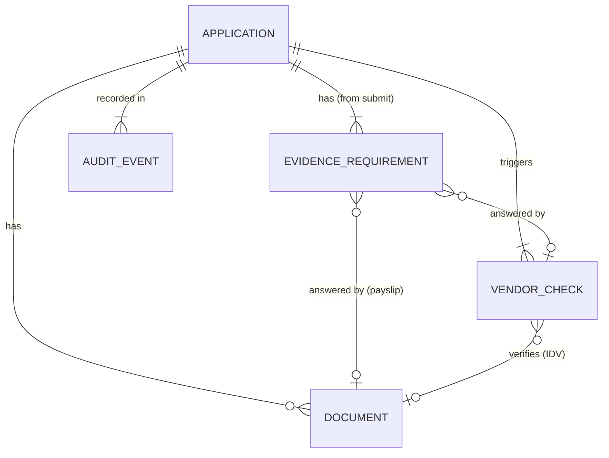
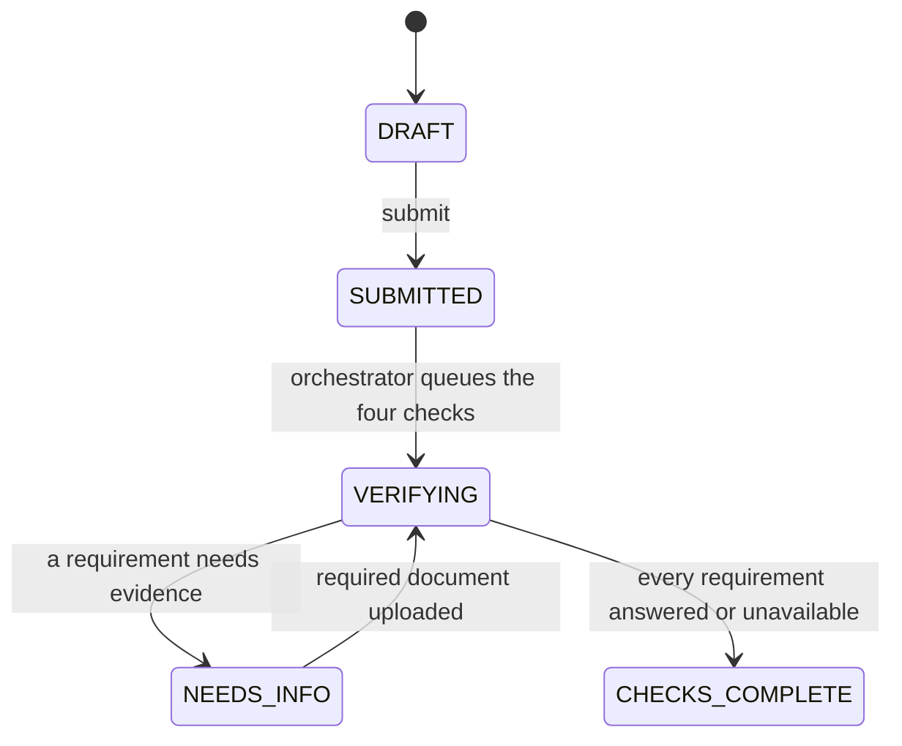
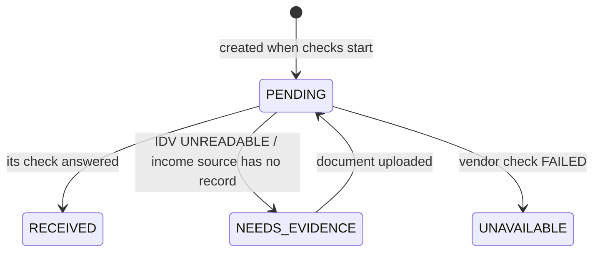
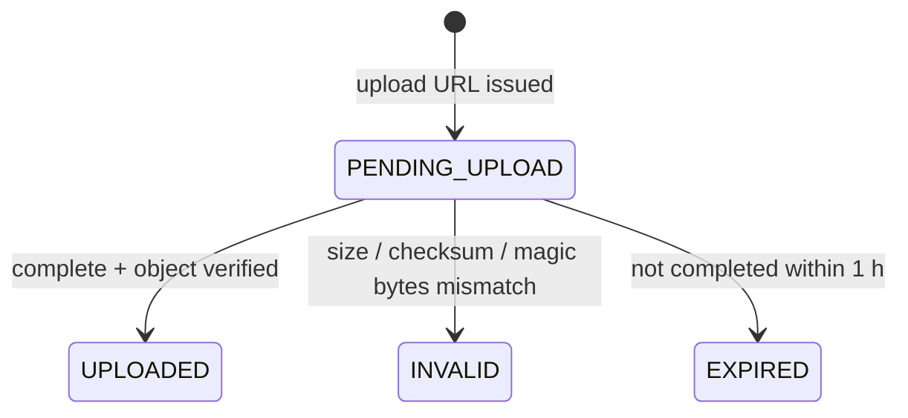
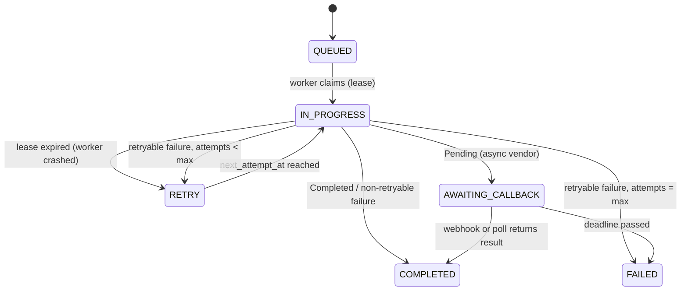
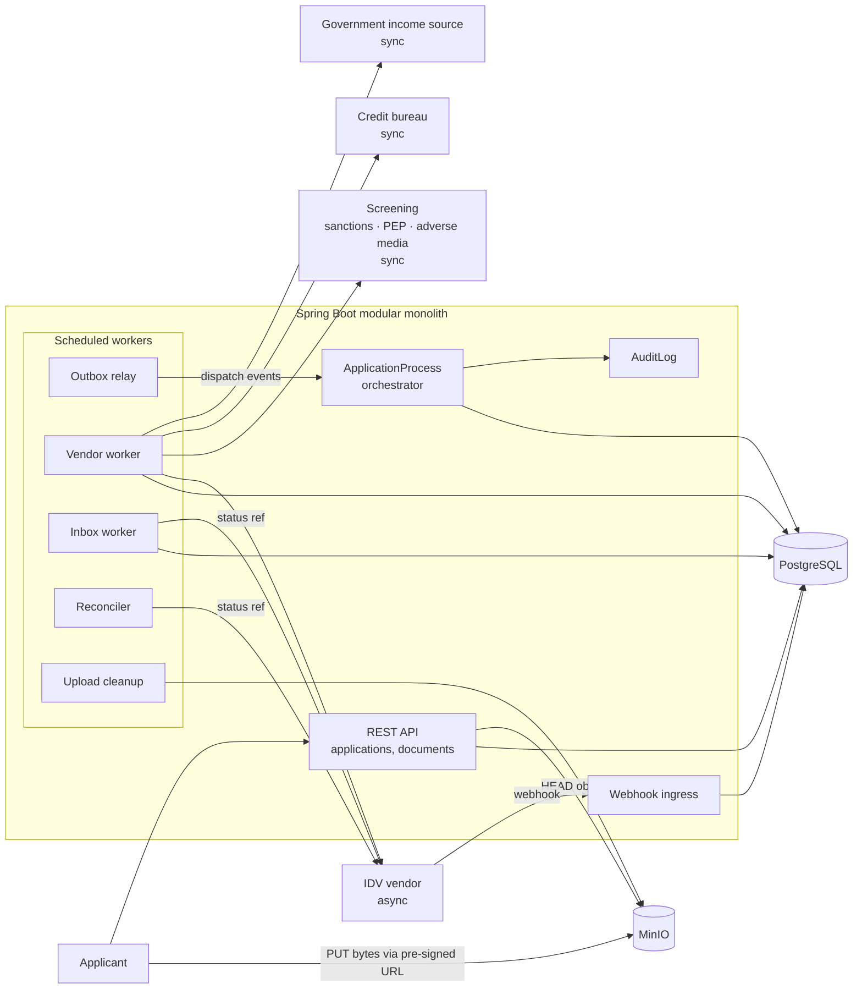
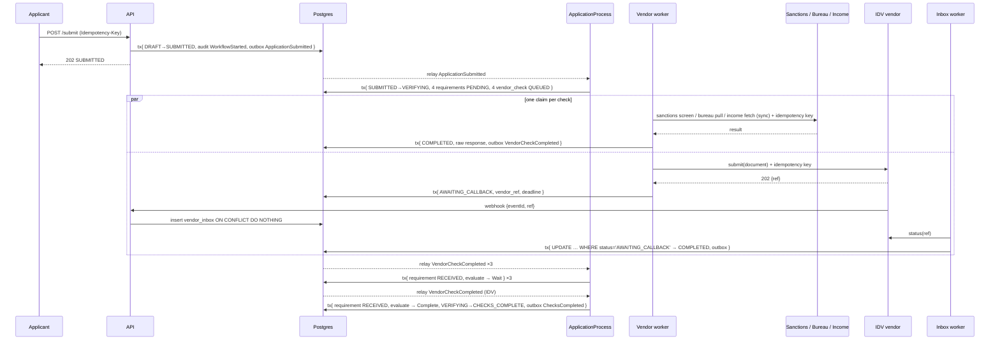

# Credit Card Application — Intake and Checks

Spring Boot 4.1, Java 21, JPA, PostgreSQL, MinIO (S3-compatible).

## 0. Business background

At a high level, a card decision answers five questions: is this person who they say they are, are we allowed to serve
them, can they afford it, are they likely to repay, and is the application genuine. Third-party data supplies most of the
evidence for those questions, and the rule engine turns it into a decision.

Each question maps to exactly one check, and the check to one evidence requirement. The requirement is named after the
**question**, never after the vendor — that is what lets a vendor be swapped without changing what the evidence means:

| #   | What we need to know                  | Check                                      | Typical provider                               | Mode                                | Requirement | Integration spec                                                  |
|-----|---------------------------------------|--------------------------------------------|------------------------------------------------|-------------------------------------|-------------|-------------------------------------------------------------------|
| 1   | Is this person who they say they are? | Identity verification                      | IDV vendor (e.g. Onfido)                       | **Async** — submit, then webhook    | `IDENTITY`  | [providers/identity-verification.md](providers/identity-verification.md) |
| 2   | Are we allowed to serve them?         | Sanctions, PEP and adverse media screening | Screening vendor (e.g. World-Check, Dow Jones)  | Sync request/response               | `SCREENING` | [providers/screening.md](providers/screening.md)                   |
| 3   | Can they afford it?                   | Income verification                        | Government data source, or an uploaded payslip | Sync request/response               | `INCOME`    | [providers/income-verification.md](providers/income-verification.md) |
| 4   | Are they likely to repay?             | Credit bureau report                       | Credit bureau                                  | Sync request/response               | `CREDIT`    | [providers/credit-bureau.md](providers/credit-bureau.md)           |
| 5   | Is the application genuine?           | Fraud signals                              | None — computed from our own history           | Internal, no network call           | —           | [providers/fraud-signals.md](providers/fraud-signals.md)           |

Rows 1–4 are gathered in this scope; row 1 is built (FR5) and rows 2–4 are FR6. Row 5 is deferred entirely. One provider is asynchronous and four interactions are
request/response, which is the single fact that most shapes the design: the async one needs a webhook inbox, a
reconciler and a deadline, and the sync ones do not.

Three consequences worth stating up front, because they shape everything below:

- **Questions 1–4 buy evidence; question 5 does not.** The first four are answered by someone we pay and wait on, which
  is why they dominate the design: idempotency keys, timeouts, retries, a webhook inbox. Fraud signals come from our own
  application history, need no network call, and are deferred with the rest of screening.
- **This scope answers the evidence half and stops.** The rule engine that turns any of it into a decision is a later
  increment — so nothing here approves, declines or refers.
- **The questions are stable; the vendors are not.** Swapping Onfido for Jumio must not change what `IDENTITY` means.
  That is why requirements are typed by question and why vendor DTOs never leave their adapter package.

Question 2 is one check but three kinds of hit, and they are not equally hard. A sanctions list is an authoritative
register: a match is close to a fact. Adverse media is name-matching against news, so it produces false positives at a
rate the other two do not — which is why every hit carries a `matchScore` and a `type`, and why no hit may ever be
auto-actioned. `SCREENING` is `RECEIVED` when the provider answered, hits or not; judging the hits belongs to compliance,
not to this scope.

Scope: two phases, and nothing after them.

1. **Application intake (internal).** The applicant submits the application and documents. The orchestrator creates a
   durable workflow instance and records it in the audit log.
2. **Parallel checks (external).** The orchestrator calls these providers concurrently, each with its own protocol,
   timeout and retry policy:
    - ID and document verification (e.g. Onfido, Jumio)
    - Sanctions, PEP and adverse media screening (e.g. World-Check, Dow Jones)
    - Credit bureau report
    - Income verification (uploaded documents or a government data source)

The application ends this scope at `CHECKS_COMPLETE`: every requirement answered or recorded as unavailable, every raw
vendor response stored. **Nothing decides.** Normalization, features, the ruleset, manual review, provisioning and
notification are the next increment and pick up from that state — see [Deferred](#deferred). Optimized for learning the
core patterns, not feature breadth.

## 1. Requirements

| #   | Functional | Status |
|-----|------------|--------|
| FR1 | Create a draft application for a card product and update declared data. Design: [fr1-draft-application.md](fr1-draft-application.md). Remaining declared data — national id, address, declared income — and the credit bureau consent get their own increment before FR6. | Planned |
| FR2 | **Audit log.** An append-only record of what happened, written in the same transaction as the change it describes. | Planned |
| FR3 | **Upload KYC documents.** `ID` (required before submit), `PAYSLIP` (when asked). A pre-signed URL out, a verified object in. | Planned |
| FR4 | **Submit.** Starts the application's durable workflow instance and records it in the audit log. | Planned |
| FR5 | **Verify identity with an IDV vendor.** The first external check, and the only asynchronous one. | Planned |
| FR6 | **The remaining parallel checks.** Sanctions + PEP + adverse media screening, the credit bureau and income verification, run concurrently with each other and with FR5, each with its own protocol, timeout and retry policy. | Planned |
| FR7 | **Status.** The applicant views status and outstanding requirements. Extends FR1's existing `GET` endpoints rather than adding a surface. | Planned |

**FR2 is infrastructure, and earns a number anyway.** Every increment from FR3 onward takes an `AuditTrail` in a
constructor, so none of them can be built without it and none of them owns it. Numbering it makes the dependency explicit
and keeps its design — `MANDATORY` propagation, the `seq` argument, append-only by trigger — in one place instead of inside
whichever feature happens to need it first.

**FR3, FR4 and FR5 are deliberately three requirements, not one.** It is tempting to treat "upload an ID and get it
verified" as a single feature, and it is not: uploading is a client PUT-ing bytes to a store we verify, submitting is a
state change that starts a durable workflow, and verifying is a paid asynchronous call to a third party that may never
answer. Three different failure modes, three different things that can be got wrong independently. They share the document
and nothing else, and they are separate modules in the code for the same reason.

<a id="deferred"></a>
Deferred to later increments, each named so nothing is lost: contact verification by OTP; fraud screening (duplicate
detection, velocity limits per national id / phone / email / device); normalization of vendor responses into an internal
evidence model; feature computation; the versioned ruleset and rule engine; the approve / decline / refer decision;
manual review queues for underwriting and compliance; the single final `Decision` row; card provisioning through a
processor; applicant notification; rule management, pre-deploy replay and decision-rate monitoring.

Out of scope entirely: real auth (`X-User-Id` stands in), open banking as an income source, malware scanning, PII
encryption at rest, withdrawal/expiry, ongoing post-decision sanctions monitoring.

| Quality         | Requirement                                                                                                                                                                                                              |
|-----------------|--------------------------------------------------------------------------------------------------------------------------------------------------------------------------------------------------------------------------|
| Correctness     | Retries never duplicate. A vendor call runs **at most once per idempotency key** — paid calls, and a repeated bureau pull is a second hard inquiry on the applicant's file.                                               |
| Durability      | No lost transitions, events or webhooks (transactional outbox + webhook inbox). The audit log is append-only.                                                                                                             |
| Resilience      | Vendor timeouts and 5xx are retried with backoff; lost webhooks recovered by polling. A vendor that never answers leaves its requirement `UNAVAILABLE` — visible and recorded, never silently dropped or treated as a result. |
| Compliance      | A sanctions, PEP or adverse media hit is stored as evidence and nothing in this scope acts on it. Nothing in a later increment may auto-approve or auto-decline one without compliance sign-off.                          |
| Consistency     | Application state strongly consistent (single Postgres, optimistic locking); the client sees status within seconds.                                                                                                      |
| Latency         | API p99 < 300 ms. All four checks answered p90 < 1 min after submit with healthy vendors, excluding `NEEDS_INFO` time.                                                                                                    |
| Reproducibility | Every check stores its raw vendor response, so the evidence a later decision runs on can be rebuilt and replayed.                                                                                                        |
| Security        | Uploads via short-lived pre-signed URLs, content verified server-side. Webhooks HMAC-verified. No PII in logs or audit payloads.                                                                                          |
| Scale           | ~10k applications/day, ~20 submits/s peak, 4 vendor checks each. One Postgres is enough; vendor latency and rate limits are the bottleneck.                                                                              |

## 2. Core Entities



| Entity                  | Fields                                                                                                                                                                                                            | Invariants                                                                                               |
|-------------------------|-------------------------------------------------------------------------------------------------------------------------------------------------------------------------------------------------------------------|----------------------------------------------------------------------------------------------------------|
| **Application** (root)  | `id`, `userId`, `cardProductCode`, `status`, declared data (`firstName`, `lastName`, `dateOfBirth`, `country`, `nationalId`, `address`, `declaredMonthlyIncome`), `consents`, `version`                                                     | Declared data immutable after submit. Status changes only via state-machine methods.                     |
| **Document**            | `id`, `applicationId`, `kind` (`ID`\|`PAYSLIP`), `objectKey`, `sha256`, `sizeBytes`, `contentType`, `status`, `createdAt`                                                                                          | Only `UPLOADED` documents can answer a requirement or be sent to a vendor.                              |
| **EvidenceRequirement** | `id`, `applicationId`, `type` (`IDENTITY`\|`SCREENING`\|`CREDIT`\|`INCOME`), `status`, `source` (`Vendor(vendorCheckId)`\|`Upload(documentId)`)                                                                    | `RECEIVED` implies `source` is set. One per type per application.                                       |
| **VendorCheck**         | `id`, `applicationId`, `type` (`IDV`\|`SANCTIONS`\|`CREDIT_BUREAU`\|`INCOME`), `provider`, `documentId?`, `idempotencyKey`, `status`, `vendorRef?`, `rawResponse` json, `attempts`, `nextAttemptAt`, `leaseUntil?` | `idempotencyKey` unique: `{appId}:{type}`, or `{appId}:IDV:{documentId}` for a re-uploaded ID.          |
| **AuditEvent**          | `id`, `applicationId`, `seq`, `type`, `actor` (`APPLICANT`\|`SYSTEM`), `actorId?`, `payload` json, `at`                                                                                                            | Append-only: the app's DB role has `INSERT` and `SELECT` only. `payload` holds ids and codes, never PII. |

Infrastructure tables: `outbox` (events committed atomically with state changes), `processed_event` PK (`consumer`,
`eventId`) (consumer dedupe), `vendor_inbox` UNIQUE (`vendor`, `eventId`) (webhook dedupe + durable hand-off),
`idempotency_key` PK (`userId`, `key`) with `requestHash` and stored response (API idempotency).

**The workflow instance is the application's own process state** — status, requirements, checks and the outbox — created
at submit and recorded as `WorkflowStarted` in the audit log. No separate workflow engine: Postgres already gives
durability, and a second system of record (Temporal, Camunda) would have to agree with the first.

**No normalized evidence model yet.** A requirement records *that* its check answered; the answer itself stays as
`vendor_check.rawResponse`. An internal schema per evidence type earns its place when something reads it — the
decisioning increment — and an abstraction with no consumer is one that gets the shape wrong.

## 3. State Machines

Every machine follows: transitions are methods that apply or throw a `DomainException` (FR1 §5.6) — no status setters,
no result wrapper; racy transitions use a conditional update (`UPDATE … WHERE status = :expected`) or `@Version`; each
application transition writes an outbox event and an audit event in the same transaction.

### 3.1 Application



| From → To                        | Trigger              | Guard                                                                            |
|----------------------------------|----------------------|----------------------------------------------------------------------------------|
| ∅ → `DRAFT`                      | `POST /applications` | —                                                                                |
| `DRAFT` → `SUBMITTED`            | `submit`             | Declared data valid, consents accepted, an `ID` document `UPLOADED`              |
| `SUBMITTED` → `VERIFYING`        | `ApplicationProcess` | Four requirements `PENDING`, four checks `QUEUED`, in one transaction            |
| `VERIFYING` → `NEEDS_INFO`       | `ApplicationProcess` | Some requirement `NEEDS_EVIDENCE`, none `PENDING`                                |
| `NEEDS_INFO` → `VERIFYING`       | `DocumentUploaded`   | Kind matches a `NEEDS_EVIDENCE` requirement                                      |
| `VERIFYING` → `CHECKS_COMPLETE`  | `ApplicationProcess` | Every requirement `RECEIVED` or `UNAVAILABLE`                                    |

`SUBMITTED` exists so the API transaction stays small: it records intake and nothing else. Creating the four checks is
the orchestrator's job, reached through the outbox, which is also what makes a crash between the two harmless.

`CHECKS_COMPLETE` is **terminal for this scope** and carries no verdict — it means the evidence is in, including the
case where a requirement is `UNAVAILABLE` because a vendor never answered. Vendor results arriving during `NEEDS_INFO`
still update requirements; only the application status waits for the upload.

### 3.2 EvidenceRequirement

Created `PENDING` at the `VERIFYING` transition, one per type. A requirement only says whether an answer **arrived** —
whether that answer is good is nobody's call in this scope.



| Type        | Check           | → `RECEIVED`                                              | → `NEEDS_EVIDENCE`                                  |
|-------------|-----------------|-----------------------------------------------------------|-----------------------------------------------------|
| `IDENTITY`  | `IDV`           | IDV answered `VERIFIED` / `FRAUD`                         | `UNREADABLE` (re-upload starts a new IDV check)     |
| `SCREENING` | `SANCTIONS`     | Screening answered — clear, or one or more hits           | —                                                   |
| `CREDIT`    | `CREDIT_BUREAU` | Report returned, or a no-hit (a thin file is an answer)   | —                                                   |
| `INCOME`    | `INCOME`        | Government source returned income, or a payslip uploaded  | Government source has no record → ask for a payslip |

### 3.3 Document



### 3.4 VendorCheck



`COMPLETED` means the vendor gave an answer, which may be a business outcome such as `SubjectNotFound`; `FAILED` means
no answer was obtained. Both emit `VendorCheckCompleted` through the outbox. `max` and the deadline are per provider
(§5.5).

## 4. API

`X-User-Id` identifies the applicant (placeholder auth, resolved in `web`). Creating `POST`s accept `Idempotency-Key`.
Errors are RFC 9457 `application/problem+json`.

| Method | Path                                               | Purpose                                                    |
|--------|----------------------------------------------------|------------------------------------------------------------|
| POST   | `/v1/applications`                                 | Create draft → `201 {id, status: DRAFT}`                   |
| PATCH  | `/v1/applications/{id}`                            | Update declared data + consents (`DRAFT` only)             |
| GET    | `/v1/applications`                                 | List own applications                                      |
| GET    | `/v1/applications/{id}`                            | Status and outstanding requirements                        |
| POST   | `/v1/applications/{id}/documents`                  | Request pre-signed upload URL                              |
| POST   | `/v1/applications/{id}/documents/{docId}/complete` | Confirm upload; server verifies the object                 |
| POST   | `/v1/applications/{id}/submit`                     | Submit → `202 {status: SUBMITTED}`                         |
| POST   | `/webhooks/idv`                                    | IDV callback (HMAC-verified)                               |

**Request upload** — `{ "kind": "ID", "contentType": "image/jpeg", "sizeBytes": 812334, "sha256": "9a1f..." }` returns
`201` with `documentId`, `uploadUrl`, `method: PUT`, `requiredHeaders` (content type + `x-amz-checksum-sha256`) and
`expiresAt`. Allowed only in `DRAFT` or `NEEDS_INFO`; `contentType` ∈ {`image/jpeg`, `image/png`, `application/pdf`};
`sizeBytes` ≤ 10 MB.

**Get application** — `200` with `status` and a `requirements[]` of `{type, status, acceptedDocumentKinds?}`. No
`decision` member: this scope produces none, and an always-`null` field invites a client to depend on it.

**IDV webhook** — `{eventId, type, ref}` with `X-Signature` and `X-Timestamp`. The body is only a notification; the
result is always fetched with `GET status(ref)`.

**Idempotency** — new key → insert row, process, store response. Same key and request hash → replay the stored response
if completed, `409` if in flight. Same key, different hash → `422`.

**Error mapping** — every refusal is a `DomainException` naming a `Category` (FR1 §5.6): `INVALID_VALUE` → 422
(validation, missing consent, ID document required, unsupported content type, too large), `CONFLICTING_STATE` → 409
(illegal transition, idempotency key in flight), `NOT_FOUND` → 404.

## 5. High-Level Design

### 5.1 Components



One deployable, modules split by package (`application`, `document`, `vendor`, `audit`, `shared`), boundaries enforced by
**Spring Modulith**: `ApplicationModules.verify()` runs as a test, each module declares its allowed dependencies in its
`package-info.java`, and a module may only use types another module has exposed.

That is stronger than the ArchUnit rules this spec first promised, and switching it on found real coupling rather than
confirming good behaviour — three dependency cycles and a dozen reaches into other modules' repositories. The per-increment designs spell out how. `EvidenceRequirement` lives in `application`: it is the workflow's own progress, not a thing of its own.

### 5.2 Orchestration

`ApplicationProcess` is the **only** component that decides the next step; workers do one job and report back.

| Message                                                            | Direction               | Mechanism                                                                     |
|--------------------------------------------------------------------|-------------------------|-------------------------------------------------------------------------------|
| Command "run vendor check"                                         | Process → vendor worker | Insert `vendor_check` (`QUEUED`) in the process's tx — the table is the queue  |
| Event `ApplicationSubmitted`, `VendorCheckCompleted`, `DocumentUploaded` | API / workers → process | `outbox` row → relay → `ApplicationProcess.on(event)`                    |
| Event `ChecksCompleted`                                            | Process → downstream    | `outbox` row — the seam the decisioning increment subscribes to               |

The outbox only guarantees delivery; this is orchestration because one component owns the flow. With choreography each
module would react to others' events and decide for itself.

Event handling is one transaction: insert `processed_event` (skip if present) → load application, requirements, checks,
documents → apply the vendor result to its requirement → `evaluate(...)` → apply the `NextStep` → write the outbox and
audit events, commit. On an optimistic-lock conflict (two results at once), roll back and retry from the start.

```java
sealed interface NextStep {
    record StartChecks(List<CheckType> checks) implements NextStep {   // on ApplicationSubmitted
    }

    record Wait() implements NextStep {
    }

    record RequestInfo(List<RequirementType> missing) implements NextStep {
    }

    record StartIdv(DocumentId document) implements NextStep {
    }

    record Complete() implements NextStep {                            // → CHECKS_COMPLETE
    }
}

// pure: no I/O
NextStep evaluate(Application app, List<EvidenceRequirement> reqs, List<VendorCheck> checks, List<Document> docs);
```

### 5.3 Flow: submit → checks complete



A `FAILED` check marks its requirement `UNAVAILABLE`, which still counts as answered for the `Complete` guard — the
application reaches `CHECKS_COMPLETE` with that gap visible rather than hanging forever on a vendor that is down.

### 5.4 Flow: upload and the NEEDS_INFO loop

1. `POST /documents` creates `Document(PENDING_UPLOAD)` and returns a pre-signed PUT bound to content type, length and
   checksum.
2. The client PUTs bytes straight to MinIO — bytes never pass through the API.
3. `POST /complete` makes the server `HEAD` the object and read its first bytes, check size, sha256 and magic bytes,
   then set `UPLOADED` or `INVALID`. In `NEEDS_INFO` it also writes outbox `DocumentUploaded`.
4. The process reacts: `ID` → `IDENTITY` back to `PENDING` and `StartIdv(doc)`, inserting
   `vendor_check(IDV, key={appId}:IDV:{docId})`; `PAYSLIP` → `INCOME` `RECEIVED` with `Upload(docId)`, application back
   to `VERIFYING`, then `evaluate` again.
5. A cleanup job marks `PENDING_UPLOAD` documents older than 1 h `EXPIRED` and deletes their objects.

### 5.5 Vendor integration

|              | IDV — **async**                                            | Screening — **sync**                           | Credit bureau — **sync**                                          | Income — **sync**                             |
|--------------|------------------------------------------------------------|------------------------------------------------|-------------------------------------------------------------------|-----------------------------------------------|
| Example      | Onfido, Jumio                                              | World-Check, Dow Jones                         | —                                                                 | Government data source                        |
| Input        | ID document, name, DOB                                     | Name, DOB, nationality                         | National id, name, DOB, address                                   | National id                                   |
| Output       | `VERIFIED` / `UNREADABLE` / `FRAUD` + extracted name, DOB  | Hits: `{list, type SANCTION\|PEP\|ADVERSE_MEDIA, matchScore}` | Score, open accounts, monthly debt payments, inquiries, or no-hit | Verified monthly income, or `SubjectNotFound` |
| Interaction  | Submit → `202 {ref}` → webhook → `GET status(ref)`         | Request/response                               | Request/response                                                  | Request/response                              |
| Timeout      | 10 s submit; 30 min result deadline                        | 5 s                                            | 8 s                                                               | 5 s                                           |
| Max attempts | 5                                                          | 5                                              | 3, **same idempotency key** — a retry must not re-pull            | 5                                             |
| Full spec    | [identity-verification.md](providers/identity-verification.md) | [screening.md](providers/screening.md)      | [credit-bureau.md](providers/credit-bureau.md)                    | [income-verification.md](providers/income-verification.md) |

This table is the summary. Each provider has its own spec with the concrete calls, the vendor-to-internal mapping, the
failure taxonomy and the fake-vendor triggers: the four above, plus [fraud-signals.md](providers/fraud-signals.md) for
the fifth question, which has no provider at all.

Ports, with vendor DTOs never leaving adapter packages:

```java
interface IdvPort {
    VendorResult<IdvOutcome> submit(Person p, DocumentRef doc, IdempotencyKey k);

    VendorResult<IdvOutcome> status(VendorRef ref);
}

interface ScreeningPort {
    VendorResult<ScreeningOutcome> screen(Person p, IdempotencyKey k);
}

interface CreditBureauPort {
    VendorResult<CreditReport> pull(Person p, IdempotencyKey k);
}

interface IncomePort {                          // open banking is a later implementation of this port
    VendorResult<VerifiedIncome> fetch(Person p, IdempotencyKey k);
}

sealed interface VendorResult<T> {
    record Completed<T>(T value) implements VendorResult<T> {
    }

    record Pending<T>(VendorRef ref) implements VendorResult<T> {
    }

    record Failed<T>(VendorFailure failure) implements VendorResult<T> {
    }
}

sealed interface VendorFailure {
    record Timeout() implements VendorFailure {
    }

    record Unavailable(int status) implements VendorFailure {
    }

    record SubjectNotFound() implements VendorFailure {
    }

    record InvalidRequest(String reason) implements VendorFailure {
    }

    default boolean retryable() {
        return switch (this) {
            case Timeout t, Unavailable u -> true;
            case SubjectNotFound s, InvalidRequest i -> false;
        };
    }
}
```

The port outcomes (`IdvOutcome`, `ScreeningOutcome`, `CreditReport`, `VerifiedIncome`) are the adapter's own types, not
a shared evidence model — they exist to let the worker tell an answer from a failure. What a later increment reads is
`rawResponse`.

**Vendor worker** (DB-backed job queue) — the four checks are four rows, so they run in parallel across worker threads
and instances with no extra coordination. This is what makes "concurrently" true: not four threads in one method, but
four independently claimable rows, each retried on its own schedule.

1. Claim a batch, set `IN_PROGRESS` and `lease_until = now + 1 min`, commit:
   ```sql
   SELECT ... FROM vendor_check
   WHERE (status IN ('QUEUED','RETRY') AND next_attempt_at <= now())
      OR (status = 'IN_PROGRESS' AND lease_until < now())
   FOR UPDATE SKIP LOCKED LIMIT 10
   ```
2. Call the vendor **outside** any transaction, sending the idempotency key, with that provider's timeout.
3. Record the result and the raw response in a new transaction per §3.4. Backoff `2^attempts s ± jitter`, capped at the
   provider's max attempts.

Crash safety: if the worker dies after the call but before recording, the lease expires and the check is retried; the
vendor dedupes by idempotency key and returns the original result, so the paid call — or the bureau inquiry — isn't
repeated. **This depends on each vendor honouring idempotency keys; confirm it per contract**, and for one that doesn't,
look up by our reference before calling again.

**Webhook + reconciliation:** the ingress verifies the HMAC — and, where the vendor sends a timestamp, a ±5 min window — inserts into `vendor_inbox`
(dedupe on `(vendor, eventId)`) and returns `200` fast. The inbox worker fetches `status(ref)` and completes the check
with `UPDATE … WHERE status = 'AWAITING_CALLBACK'`. The reconciler polls `AWAITING_CALLBACK` checks past
`next_attempt_at` every 2 min and sets `FAILED` after the deadline. Webhook and reconciler can race on the same check;
the conditional update lets exactly one win, and the loser updates 0 rows and does nothing.

Every timer is a deadline column + poller + race-safe update: `vendor_check.next_attempt_at` (retry backoff, and the IDV
callback deadline), `vendor_check.lease_until` (worker crash recovery), `document.created_at` (1 h stale upload).

**Fake vendors.** IDV is mocked by a **dockerized WireMock** speaking Onfido's real API
(see the identity-verification increment) — an in-process controller cannot exercise a connect
timeout, TLS, or a webhook arriving on a real socket. The remaining three providers follow the same pattern in FR6. The
trigger vocabulary is shared, driven by request data so a test picks its scenario without special wiring: last name `FLAKY` → 503 twice then success, `TIMEOUT` → hangs past the read timeout, `LOSTHOOK` → no webhook,
`DUPHOOK` → webhook twice, `SANCTIONED` / `PEP` / `ADVERSEMEDIA` → a screening hit of that type; national id ending `0` → IDV `FRAUD`, `1` →
`UNREADABLE` first then `VERIFIED`, `2`/`3`/`4` → bureau score 550/650/750, `5` → bureau no-hit, `6` → income
`SubjectNotFound`.

### 5.6 Audit log

`audit_event` gets a row in the same transaction as every application transition, every check result and every document
verdict, so a change that committed is a change that was logged. Rows carry ids, codes and versions, never declared data.
The log is append-only and `seq` is contiguous per application, so a missing row is visible rather than silent.

**FR2 designs it**, as its own increment: every later one takes an `AuditTrail` in a constructor, so none of them can be
built without it and none of them owns it. Later increments add event types and change nothing else:

| Increment | Event types it adds                                                                        |
|-----------|--------------------------------------------------------------------------------------------|
| FR3       | `UPLOAD_REQUESTED`, `DOCUMENT_VERIFIED`                                                     |
| FR4       | `WORKFLOW_STARTED`, `STATUS_CHANGED`, `REQUIREMENT_CHANGED`                                  |
| FR5       | `VENDOR_CHECK_QUEUED`, `VENDOR_CHECK_COMPLETED`, `VENDOR_CHECK_FAILED`, `WEBHOOK_RECEIVED`   |

That ordering has one consequence worth knowing: uploads precede submit, so **`WorkflowStarted` is the first row of the
workflow, not of the application**. It is an easy thing to assert wrongly.

### 5.7 Open questions

- **Income source.** This scope uses one government data source with payslip upload as the fallback. Open banking needs
  a consent redirect flow and is deferred behind `IncomePort`.
- **Soft vs hard bureau pull** at application time, and the consent wording FR1's consent increment must capture before
  a hard pull.
- **How long `CHECKS_COMPLETE` may sit.** With no decisioning, evidence ages: a bureau report and a sanctions screen
  both have a shelf life. Whether a stale `CHECKS_COMPLETE` re-runs its checks is for the decisioning increment, but the
  answer changes whether `rawResponse` needs a `retrievedAt` per check (it does — cheap to add now, awkward later).
- **What `UNAVAILABLE` means to the next increment.** Here it is simply recorded. A vendor outage must not become a
  decline downstream, which is a constraint on the decisioning design, not something this scope can enforce.
