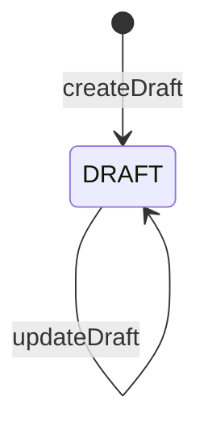
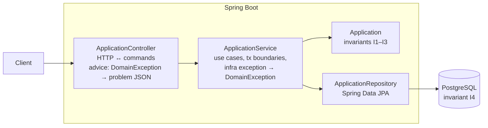
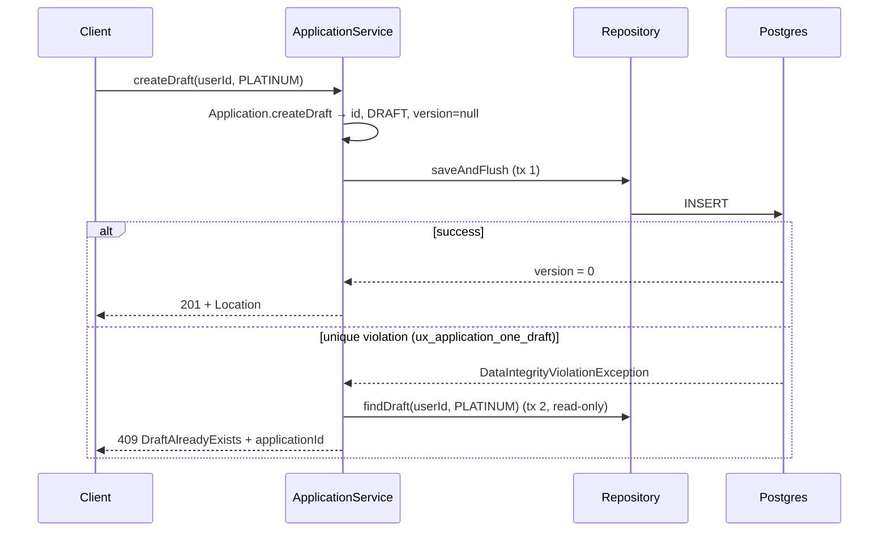
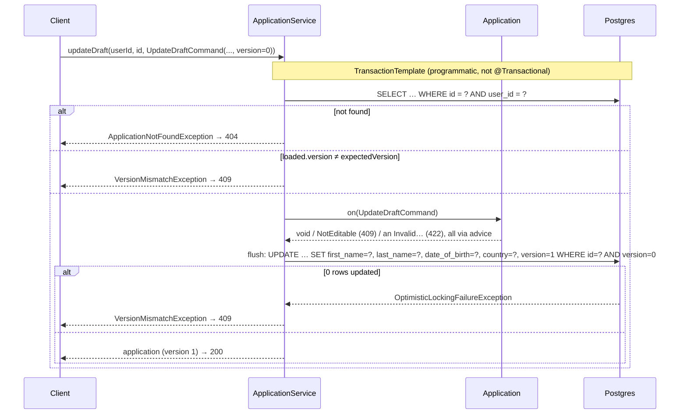

# FR1 — Draft Application

Parent: [MVP Spec](credit-card-application-design-spec.md). Spring Boot 4.1, Java 21, Spring Data JPA, PostgreSQL, Flyway.

First increment, no dependencies on other FRs. Later FRs extend `Application` (status, declared fields) without changing this API's contract.

## 1. Requirements

| # | Functional |
|---|---|
| FR1.1 | Create a draft application for a card product (`CLASSIC`, `PLATINUM`). |
| FR1.2 | Update declared data — `firstName`, `lastName`, `dateOfBirth`, `country` — while `DRAFT`, as one form. |
| FR1.3 | View one own application by id. |
| FR1.4 | List own applications (so a draft resumes on another device). |
| FR1.5 | At most **one draft per user per card product**. |

Out of scope, later increments: auth (`X-User-Id` stands in), national id/income/consents (before FR6), draft deletion, draft expiry, list pagination.

| Quality | Requirement |
|---|---|
| No lost updates | Concurrent edits never silently overwrite. The stale write gets `409 version-mismatch`. |
| No duplicates | Retries, double-taps and concurrent creates never yield two drafts for the same user + product. |
| Ownership | Others' ids return `404`, not `403`, so ids can't be probed. |
| Validation | Name parts: trimmed, 1–70 code points each, any script, no control characters. `dateOfBirth`: in the past, not before 1900-01-01. `country`: ISO 3166-1 alpha-2, upper-cased. |
| Atomicity | The four declared fields save together. A rejection on any one leaves the row exactly as it was. |
| Ids | Non-guessable: UUIDv7 (74 random bits, time-ordered — §5.5). |
| Latency | p99 < 200 ms. |
| Privacy | No declared value — names, date of birth — is ever logged or echoed in an error. |

## 2. Core Entities

**Application** (aggregate root)

| Field | Type | Notes |
|---|---|---|
| `id` | `UUID` | UUIDv7 from the domain factory, before persisting |
| `userId` | `String` | From `X-User-Id`. Immutable. |
| `cardProductCode` | `CardProduct` | Immutable |
| `status` | `ApplicationStatus` | Only `DRAFT` in FR1 |
| `firstName` | `FirstName`, nullable | `FirstNameConverter` ↔ `varchar(70)`; `null` until set |
| `lastName` | `LastName`, nullable | `LastNameConverter` ↔ `varchar(70)` |
| `dateOfBirth` | `DateOfBirth`, nullable | `DateOfBirthConverter` ↔ `date` |
| `country` | `Country`, nullable | `CountryConverter` ↔ `varchar(2)` |
| `version` | `Long` | Optimistic lock. `null` before insert, `0` after. Client echoes it on update. |

`cardProductCode`, not `creditCardId`: a card doesn't exist until approval, and the card will reference `applicationId`. A draft needs the *product*. `CardProduct` stays an enum until products need runtime-editable attributes.

| # | Invariant | Enforced by |
|---|---|---|
| I1 | New applications start `DRAFT` | `Application.createDraft(...)` |
| I2 | Declared data changes only in `DRAFT`, and every field must be valid | `Application.on(UpdateDraftCommand)` |
| I2a | A rejected field never leaves a partial update | All four value objects are built before any is assigned |
| I3 | `userId` and `cardProductCode` never change | No setters; `updatable = false` |
| I4 | One `DRAFT` per (`userId`, `cardProductCode`) | **Partial unique index** — unenforceable in memory under concurrency |

## 3. State Machine



| Operation | Allowed in | Rejected with |
|---|---|---|
| `createDraft(userId, product)` | — | `DraftAlreadyExistsException(applicationId)` (detected at persistence) |
| `on(UpdateDraftCommand)` | `DRAFT` | `NotEditableException`, `InvalidNameException`, `InvalidDateOfBirthException`, `InvalidCountryException` |

The `DRAFT` guard can't fail yet; it exists so FR4's `submit` (`DRAFT → SUBMITTED`) makes `on(UpdateDraftCommand)` reject edits without changing any caller.

Failures are exceptions, not result types: the happy path reads as plain code and no caller can ignore a failure by forgetting to inspect a return value. The hierarchy is flat — every exception extends `DomainException` directly and names its `Category` (`INVALID_VALUE`/`CONFLICTING_STATE`/`NOT_FOUND` → 422/409/404), so adding a refusal is one class and nothing else. `code()` gives the problem type (class name minus `Exception`, kebab-cased, or fixed by the category); `details()` gives extra problem members.

| Exception | Category | `details()` |
|---|---|---|
| `DraftAlreadyExistsException` | `CONFLICTING_STATE` | `applicationId` |
| `NotEditableException` | `CONFLICTING_STATE` | `currentStatus` |
| `VersionMismatchException` | `CONFLICTING_STATE` | `currentVersion` |
| `InvalidNameException` | `INVALID_VALUE` | the rejected part (`firstName` or `lastName`) |
| `InvalidDateOfBirthException` | `INVALID_VALUE` | `dateOfBirth` |
| `InvalidCountryException` | `INVALID_VALUE` | `country` |
| `ApplicationNotFoundException` | `NOT_FOUND` | — |

## 4. API

`X-User-Id` required on every endpoint (missing → `401`). JSON bodies; errors are RFC 9457 `application/problem+json` with a stable `type`.

All endpoints return the same representation:

```json
{ "id": "0192f3a4-...", "cardProductCode": "PLATINUM", "status": "DRAFT", "firstName": null, "lastName": null,
  "dateOfBirth": null, "country": null, "version": 0 }
```

No `ETag`/`If-Match` — the client echoes `version` in the update body. It's for optimistic concurrency, not HTTP caching.

**POST `/v1/applications`** (FR1.1, FR1.5) — `{ "cardProductCode": "PLATINUM" }`

| Outcome | Response |
|---|---|
| Created | `201`, `Location: /v1/applications/{id}`, body |
| Unknown / missing product | `422` `/problems/invalid-request`, `errors: [{field: "cardProductCode", …}]` |
| Draft already exists | `409` `/problems/draft-already-exists`, `applicationId` |

Create is naturally idempotent through FR1.5: a retry after a lost `201` gets `409` with the same `applicationId`, which the client treats as success and follows with a GET. No `Idempotency-Key` table until submit needs one (FR4), where there is no business key to fall back on.

**PATCH `/v1/applications/{id}`** (FR1.2) — `{ "firstName": "Jane", "lastName": "Tan", "dateOfBirth": "1990-04-12", "country": "SG", "version": 0 }`, where `version` is from the client's last read. Only these five fields are accepted; unknown fields are `422`, so a typo can't be silently ignored.

The whole form is sent every time, not a subset: a JSON record cannot tell an absent field from an explicit `null`, and a client that means "clear the country" must not be indistinguishable from one that means "leave it alone". Saving the four together also makes the atomicity rule above expressible — there is one write, so there is one outcome.

| Outcome | Response |
|---|---|
| Updated | `200`, `version: 1` |
| Unchanged value | `200`, no version bump (no-op write skipped) |
| Not found / not owner | `404` |
| `VersionMismatchException` | `409` `/problems/version-mismatch`, `currentVersion` (client reloads and retries) |
| `NotEditableException` | `409` `/problems/not-editable`, `currentStatus` |
| Any invalid, missing or null declared field, or `version` | `422` `/problems/invalid-request`, `errors[]` naming that field |

**GET `/v1/applications/{id}`** (FR1.3) — `200` with body; `404` if absent or not the caller's.

**GET `/v1/applications?status=DRAFT`** (FR1.4) — `200 { "items": [...] }`, newest first. `status` optional. No pagination yet, since there's at most one draft per product.

## 5. High-Level Design

### 5.1 Components



| Layer | Owns | Must not |
|---|---|---|
| Controller | Header parsing, DTO ↔ command mapping, status mapping | Business rules; touching the repository |
| Service | Load-by-owner, version precondition, tx boundaries, exception translation | Field validation (the aggregate owns it) |
| Aggregate | State guards; value objects own field validation | Know about HTTP or JPA exceptions |
| DB | Uniqueness under concurrency, optimistic lock `WHERE version = ?` | — |

```
com.mettyoung.creditcardapplication.application
├── web/          ApplicationController, CreateDraftRequest, UpdateDraftRequest,
│                 ApplicationResponse (+ Mapper), UserId (+ Converter), ApiExceptionHandler, ProblemMapper
├── domain/       Application, CardProduct, ApplicationStatus,
│                 FirstName, LastName, NameRules, DateOfBirth, Country (+ a converter each),
│                 the 7 exceptions
├── service/      ApplicationService
└── persistence/  ApplicationRepository
com.mettyoung.creditcardapplication.shared
└── UuidV7, DomainException (+ Category)
```

The JPA entity *is* the domain class (no separate persistence model) until mapping friction justifies splitting. Explicit constructors, `protected` no-arg for JPA, Lombok `@Getter` only — no `@Setter`/`@Data` on an aggregate.

### 5.2 Schema (Flyway `V1__application.sql`)

```sql
CREATE TABLE application (
    id                 uuid         PRIMARY KEY,
    user_id            text         NOT NULL,
    card_product_code  text         NOT NULL,
    status             text         NOT NULL,
    first_name         varchar(70),
    last_name          varchar(70),
    date_of_birth      date,
    country            varchar(2),
    version            bigint       NOT NULL,
    CONSTRAINT ck_application_date_of_birth_floor
        CHECK (date_of_birth IS NULL OR date_of_birth >= DATE '1900-01-01')
);

-- I4 / FR1.5: one draft per user per product
CREATE UNIQUE INDEX ux_application_one_draft
    ON application (user_id, card_product_code)
    WHERE status = 'DRAFT';

-- FR1.4: list own applications
CREATE INDEX ix_application_user ON application (user_id);
```

Declared data is nullable: an application starts as an empty draft and is filled in.

Flyway, not `ddl-auto`: Hibernate can't generate partial indexes, and schema changes should be reviewed, versioned SQL
(`ddl-auto=validate`). Enums as `text` with `@Enumerated(STRING)`: ordinals break on reorder, and a Postgres enum type
would make every new status a migration — FR4 adds four of them and needs none.

The `CHECK` carries only the absolute half of the date rule. `current_date` is not immutable, so "in the past" cannot be a
constraint; the value object holds both halves, and the column holds the one that can never become false.

### 5.3 Create flow



1. **Never check-then-insert.** Two concurrent requests would both see nothing and both insert. The unique index is the only reliable arbiter.
2. **`saveAndFlush`, not `save`** — the violation must surface inside the service method, not at a commit up the stack where it can't be translated.
3. **Separate transactions.** After a violation Postgres aborts the tx and Spring marks it rollback-only, so the follow-up SELECT can't run in it: `createDraft` is **not** `@Transactional`, the insert uses the repository's own tx, the lookup a new read-only one.
4. **Translate only this constraint** (match name `ux_application_one_draft`). Any other integrity violation is a bug and becomes a 500.
5. **`version` is `Long`, not `long`.** Spring Data reads `null` as new and calls `persist`; a primitive would fall back to the pre-assigned id, assume the entity exists and `merge` (extra SELECT, wrong semantics).

*Alternative considered:* native `INSERT … ON CONFLICT … DO NOTHING RETURNING id` avoids exception-as-control-flow, but bypasses the JPA lifecycle and duplicates the column mapping. Revisit if duplicate-create traffic is high.

### 5.4 Update flow



Two checks, two different races:

| Check | Race it catches | Mechanism |
|---|---|---|
| Request `version` == loaded `version` | Client edits a **stale copy** (other tab saved minutes ago) | Explicit comparison in the service |
| `@Version` on UPDATE | **Concurrent writer** commits between our SELECT and UPDATE | Hibernate's `WHERE version = ?`; 0 rows → exception → translated |

`@Version` alone isn't enough: it compares against the version loaded *in this request*, not the one the client saw.

- **Programmatic transaction, catch outside it.** With `@Transactional`, the failing `saveAndFlush` marks the tx rollback-only; the service would translate to `VersionMismatchException` and then the proxy would throw `UnexpectedRollbackException` at commit. With `TransactionTemplate` the callback throws, the template rolls back, and translation happens after the transaction ended.
- **No-op update:** re-assigning equal value objects leaves the entity clean (dirty checking uses `equals` against the loaded snapshot), so no UPDATE and no version bump. Records give that `equals` for free, and the aggregate needs no guard.
- **The aggregate throws; the service decides what that means.** Each value object validates in its constructor, so no invalid instance exists; the aggregate guards state (`status != DRAFT → NotEditableException`) and the ordering that keeps an update all-or-nothing. Both exceptions propagate through the template to `ApiExceptionHandler`; the service catches neither.

### 5.5 Read flows

- `GET /{id}` uses `findByIdAndUserId`. Absent and not-owned both raise `ApplicationNotFoundException` — there is never a "found but forbidden" branch.
- `GET /` uses `findByUserIdOrderByIdDesc` (plus `status` when given). Random UUIDs don't sort by time, so `id` is UUIDv7: time-ordered, still unguessable, and better B-tree insert locality than a `created_at` column would give.
- Reads are single repository calls, which Spring Data already runs `readOnly`, so the service adds no annotations.

### 5.6 Error mapping

One advice handler switches exhaustively over `Category`; the type comes from `code()` and the extra members from `details()`, so **a new exception of an existing category needs no web change** while a new category breaks the build. A `details()` key may not be named after an RFC 9457 member (`type`, `title`, `status`, `detail`, `instance`), which it would shadow.

| Category | HTTP | Body |
|---|---|---|
| `INVALID_VALUE` | 422 | `/problems/invalid-request`, `errors: [{field, message}]` built from `details()` |
| `CONFLICTING_STATE` | 409 | `/problems/<code>` plus `details()` |
| `NOT_FOUND` | 404 | `/problems/not-found` |

`INVALID_VALUE` keys `details()` by rejected field (`{"firstName": "<rule>"}`), which the advice turns into the same `errors[]` array request-shape failures use — one 422 shape whether the rule lives in a value object or a request record. The `switch` proves every *category* is mapped, not every exception; a wrong category or a shadowing `details()` key is caught by tests, not the compiler.

Structural rules (`cardProductCode`, `version`) are `@NotNull` on the request records with `@Valid`, so `MethodArgumentNotValidException` becomes the same `422` + `errors[]` automatically. Value rules for the declared fields stay in the domain, where a non-HTTP caller can't bypass them.

Request-shape problems live in the same `@RestControllerAdvice`: malformed JSON / unknown field / bad enum → 422; missing or blank `X-User-Id` → 401; malformed `{id}` path variable → 404. It needs `@Order(HIGHEST_PRECEDENCE)` — with `spring.mvc.problemdetails.enabled=true` Boot registers its own handler that answers the same exceptions with `400` and otherwise wins.

### 5.7 Config

`spring.jpa.hibernate.ddl-auto=validate` (explicit schema), `spring.jpa.open-in-view=false` (no lazy loading leaking into the web layer), `spring.jackson.deserialization.fail-on-unknown-properties=true`, `spring.mvc.problemdetails.enabled=true`. Boot 4 split the starters into modules — the web and Flyway starters are `spring-boot-starter-webmvc` and `spring-boot-starter-flyway`.

### 5.8 Test plan

Kotlin + Kotest on the JUnit platform; main sources stay Java. **No mocking library** — collaborators are real, so every assertion is about behaviour a client can observe.

| Level | Style | Where |
|---|---|---|
| Unit | `DescribeSpec` | `NamePart` (both parts), `DateOfBirth`, `Country`, the four converters, `Application`, `DomainException`, `UuidV7` |
| API, end to end | `BehaviorSpec` | `ApplicationControllerTest`: real controller → service → aggregate → Hibernate → Testcontainers Postgres, driven over MockMvc |

Four framework-forced details:

- **Testcontainers lifecycle.** Kotest has no `@Testcontainers`, so the container is a companion-object val started in `init`, and `@EnabledIf(DockerAvailable::class)` skips the spec when Docker is absent. `@ServiceConnection` wires the datasource; `extension(SpringExtension())` wires Spring.
- **Isolation.** Kotest reuses one instance per spec, so `IsolationMode.InstancePerTest` plus a per-instance random user id keeps each test to its own rows.
- **Log capture.** `OutputCaptureExtension` is a JUnit parameter resolver, so the privacy test attaches a logback `ListAppender`, which also catches non-console appenders.
- **Concurrency.** A latch-released thread pool (`runConcurrently`); requests must overlap to exercise the index and the lock at all.

| Level | Test | Proves |
|---|---|---|
| Unit | `on(UpdateDraftCommand)`: valid, trim, country case, same value twice | I2, validation |
| Unit | A rejection on the first *and* on a later field leaves every field as it was | I2a |
| Unit | `FirstName` / `LastName` run the same spec: any script, whitespace-only, > 70 code points, control chars, emoji counted as code points | Validation, and the two cannot drift |
| Unit | `DateOfBirth`: past dates, today and future rejected, the 1900 floor, a minor is *valid* | Validity is not eligibility |
| Unit | `Country`: ISO codes, case and whitespace normalised, `XX` and withdrawn `AN` rejected | Validation |
| Unit | All four converters: round trip, `null` both ways, invalid stored value rejected on load | Mapping, bad-data guard |
| Unit | `DomainException.code()` per category, `Exception` suffix dropped | Problem types stay stable |
| API | Create twice → `409` with the first id; two users, same product → both created | FR1.5 |
| API | N threads create the same user + product concurrently → 1 success, rest `409`, 1 row | I4 under concurrency |
| API | Two updates with the same `version` concurrently → 1 success, 1 `409 version-mismatch` | No lost updates |
| API | Update with a stale `version` → `409`, row unchanged | Stale-copy race |
| API | User B GETs / PATCHes user A's application → `404`, row untouched | Ownership |
| API | Missing `version` → 422; unknown field → 422; malformed uuid → 404; missing header → 401 | Request-shape contract |
| API | A blank `firstName`, a future `dateOfBirth`, a non-ISO `country` each answer `422` naming that field, row untouched | Per-field validation |
| API | A malformed date is refused by Jackson in the same `errors[{field, message}]` shape | One shape for every 422 |
| API | Error bodies and logs never contain a name or a date of birth | Privacy |

`NotEditableException` has no test: nothing can leave `DRAFT` until FR4 adds submit, so the API can't be driven into that state. Its mapping is covered by the other `CONFLICTING_STATE` case. [FR4](fr4-submit.md) makes it reachable and writes that test.

## 10. Why the name is two fields

One `fullName` column would be simpler and is wrong, because the downstream providers need the parts separately:
screening matches on a name and a nationality, and the bureau needs a date of birth
([§0 of the parent spec](credit-card-application-design-spec.md)). One combined column serves neither, and splitting it
later would mean a lossy backfill — a full name cannot be reliably divided in exactly the markets this system targets,
where there may be multiple given names, a family name first, or no surname at all.

Two decisions inside that which are easy to get wrong:

- **`FirstName` and `LastName` are distinct types**, not one `NamePart` used twice. They have identical rules, shared in a
  package-private `NameRules`, but the compiler then refuses to pass a surname where a given name belongs — which a single
  type would allow at every call site. The limit is 70 *each* rather than 100 shared, so a long surname is never rejected
  because the given name was long.
- **Both of `DateOfBirth`'s bounds are time-safe.** "In the past" is monotonic, so a date that passes never stops passing.
  The floor is the absolute date 1900-01-01 rather than "within the last 120 years" — the converter routes every load
  through the constructor, so a relative floor would make an applicant's own row fail to load once they passed 120. That
  is the kind of bug that appears years after the code is written.

Two things left open:

- **One error at a time.** `on(UpdateDraftCommand)` throws on the first invalid field, so a form with three bad fields is
  fixed in three round trips. Reporting all of them needs an exception carrying a list of field errors, which changes the
  `DomainException` contract every other refusal depends on. Deferred deliberately, not overlooked.
- **`country` is one field for two meanings.** Screening wants nationality; the bureau wants country of residence. They
  are the same for most applicants and different for the ones who matter. FR6 may have to split it.
