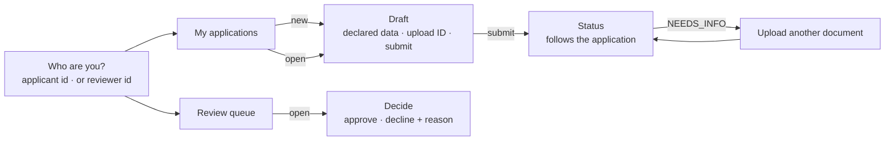

# FR10 — Web UI

Parent: [Credit Card Application](../README.md). Previous: [FR9 — Deadlines](fr9-deadlines.md).
Spring Boot 4.1 serving static files; plain HTML, CSS and JavaScript modules in the browser.

Everything so far is an API. This increment puts a browser in front of it, so the whole loop — apply, upload an ID,
submit, watch the check, get a decision, and review a referral — can be walked through by a person rather than a test.
It adds **no backend behaviour**: every screen calls an endpoint that already exists. The one server change is the
configuration a browser needs to upload straight to the object store.

## 1. Requirements

| #      | Functional                                                                                                           |
|--------|----------------------------------------------------------------------------------------------------------------------|
| FR10.1 | An applicant chooses who they are (the `X-User-Id` placeholder), lists their applications and starts a draft.        |
| FR10.2 | They fill in the declared data and save it; a stale copy is explained, not silently lost.                            |
| FR10.3 | They upload an ID document straight to the object store and see it verified.                                         |
| FR10.4 | They submit, and the page follows the application to its outcome without a manual refresh.                          |
| FR10.5 | When asked for another document, the page says what is accepted and lets them upload it.                             |
| FR10.6 | A reviewer (the `X-Reviewer-Id` placeholder) sees the referred queue, overdue first, and approves or declines with a reason. |
| FR10.7 | Every refusal from the API is shown as its problem detail, in plain words.                                          |

Out of scope: real sign-in (the identity pickers are the same placeholders as the headers), a design system,
internationalisation, offline use, notifications, and anything the API does not already offer.

| Quality         | Requirement                                                                                          |
|-----------------|------------------------------------------------------------------------------------------------------|
| No build step   | Static files under `src/main/resources/static`, served by the app itself. No Node, no bundler, no new toolchain. |
| Same origin     | The UI and the API share an origin, so the API needs no CORS. Only the object store sees a cross-origin request. |
| No secrets      | Nothing in the browser beyond the placeholder ids; no tokens, no storage credentials.                |
| No PII at rest  | Declared data is never put in `localStorage`; only the chosen placeholder id is remembered.           |
| Usable on a phone | One column below 640 px, no horizontal scrolling.                                                   |

## 2. Why this stack

| Option                          | Verdict                                                                                     |
|---------------------------------|---------------------------------------------------------------------------------------------|
| **Static HTML + JS modules, served by Spring Boot** | **Chosen.** One deployable, one origin, nothing to install. Enough for a handful of forms and two lists. |
| React/Vue + Vite, separate app  | A second toolchain and a CORS policy for a UI this small; worth it when the UI grows.        |
| Compose Multiplatform (web)     | The global default for UI, but its web target is heavy for a few forms, and this project has no other client to share code with. |

If the UI outgrows plain modules, the API does not change: a framework app can replace `static/` and call the same
endpoints.

## 3. Screens



| Screen          | Calls                                                                                   | Shows                                                                                       |
|-----------------|-----------------------------------------------------------------------------------------|---------------------------------------------------------------------------------------------|
| Who are you?    | —                                                                                       | Two fields: applicant id or reviewer id. Remembered in `localStorage`                        |
| My applications | `GET /v1/applications`                                                                  | Product, status, last name; a "new application" button (`POST /v1/applications`)             |
| Draft           | `GET`/`PATCH /v1/applications/{id}`, the upload pair, `POST …/submit`                    | The four declared fields; the ID upload with its verdict; submit once both are done           |
| Status          | `GET /v1/applications/{id}`, every 3 s until terminal                                   | The status as a plain sentence, each requirement's status, and the outcome                   |
| Upload another  | The upload pair                                                                         | Appears only when `acceptedDocumentKinds` is present — the API already hides it otherwise    |
| Review queue    | `GET /v1/review/applications`                                                           | Referred applications, overdue ones marked and first, with the referral reason               |
| Decide          | `POST /v1/review/applications/{id}/decision`                                            | Approve, or decline with one of the reviewer reasons                                          |

Statuses are shown as sentences, not codes: `VERIFYING` is "We're checking your ID", `REFERRED` is "A member of our team
is reviewing your application" — never the reason, which the API does not send to the applicant anyway.

## 4. The upload, from a browser

The API already returns a pre-signed `PUT` bound to content type, length and SHA-256 (FR3). The browser:

1. Reads the file, computes its SHA-256 with Web Crypto (`crypto.subtle.digest`), as hex for the request and base64 for
   the header.
2. `POST …/documents` with kind, content type, size and hash.
3. `PUT`s the bytes to the returned URL with the returned `requiredHeaders`.
4. `POST …/documents/{id}/complete` and shows the verdict (`UPLOADED` or `INVALID`).

Step 3 is the only cross-origin request: the page is on the app's origin, the URL on the object store's. A browser sends
a CORS preflight for it, so the bucket needs a CORS rule allowing `PUT` from the app's origin. Its allowed headers are a
wildcard rather than the two the URL is signed with: LocalStack splits a preflight's `Access-Control-Request-Headers` only
on `", "`, and browsers send `content-type,x-amz-checksum-sha256` with no space, so naming the two refused every real
browser upload in development. The wildcard costs nothing, because the signature already fixes which headers and values
the store accepts. `BucketInitializer` already creates the bucket in development; it now also sets that rule,
from a new property:

| Property                         | Default                 | Meaning                                       |
|----------------------------------|-------------------------|-----------------------------------------------|
| `app.storage.cors-allowed-origins` | `http://localhost:8080` | Origins allowed to `PUT` to a pre-signed URL |

In production the bucket and its CORS rule are provisioned out of band, as the bucket itself already is (FR3 §8).

## 5. Following the application

There is no push channel, so the status screen polls `GET /v1/applications/{id}` every 3 s while the application is
`SUBMITTED`, `VERIFYING` or `CHECKS_COMPLETE`, and stops at any other status. The Onfido mock never calls back, so in
development a result arrives when the reconciler polls (FR5). `app.onfido.poll-after` drops from `1m` to `10s` in
`application.properties`, so a person walking through the flow waits seconds, not a minute; the API specs already set
it to `0s`.

### 5.1 Choosing a path on purpose

Every path should be reachable by someone who has never read the mock's stubs. The draft screen therefore has an
**Identity vendor response** dropdown, marked *development only*:

| Choice                                   | Last name   | Ends in                                         |
|------------------------------------------|-------------|-------------------------------------------------|
| None — use the last name I type          | as typed    | Approved (any other name verifies)               |
| Approved — clear result                  | `Tan`       | Approved                                         |
| Referred to review — suspected fraud     | `Fraud`     | Referred, for a reviewer to decide               |
| Asks for another ID once, then approved  | `Blurry`    | Needs info → re-upload → approved                |
| Asks for another ID every time           | `Unreadable`| Needs info, again after each re-upload           |
| Referred to review — the vendor is down  | `Unavailable` | Referred, as `EVIDENCE_UNAVAILABLE` (about a minute of retries) |

The mock picks its answer from the applicant's last name — the way vendor sandboxes key off test names — so a
choice simply **fills in the last name**, visibly, and locks the field while it is chosen. Nothing new goes to the
backend: a test field stored on the application would put mock plumbing in the production path. A global setting was
the other option, and was rejected because it applies to every new draft and is easy to forget is on. The status
screen repeats the chosen scenario, so a referral is never mistaken for a real one.

`Blurry` and `Unavailable` are new mock scenarios. `Blurry` is a WireMock scenario: the first applicant created is
unreadable and the next is clear, so it suits one walkthrough at a time; `POST /__admin/scenarios/reset` on the mock
starts it over. `Unavailable` answers every check with `503`, so the retries run out and the check fails.

Only choices that **end visibly differently** are offered. Three of the mock's scenarios are deliberately left out,
because to an applicant each is just another "approved": `Caution` (`consider` / `caution` maps to `VERIFIED`, and the
caveat survives only in the raw response), `Flaky` (two `503`s the worker retries through — visible only as a few extra
seconds, and only on the first run, since the mock's counter is shared) and `Lostreply` (crash recovery, invisible by
design). They stay in the mock, where the automated tests exercise them.

## 6. Structure

```
src/main/resources/static/
├── index.html      shell and the screen templates
├── styles.css
├── app.js          hash routing (#/who, #/applications, #/applications/{id}, #/review, …) and the screens
└── api.js          fetch wrapper: adds the placeholder header, turns problem JSON into an Error with its detail
```

`api.js` is the only file that knows the headers and the paths. A screen never builds a URL or reads a status code; it
calls a function and gets data or an error to show.

Not a module in the Spring Modulith sense: static files sit outside the Java packages, so `ModuleStructureTest` is
unaffected.

## 7. Tests

| Level  | Spec                    | Covers                                                                                     |
|--------|-------------------------|--------------------------------------------------------------------------------------------|
| API    | `WebUiTest`             | `/` serves the UI; `index.html`, `app.js`, `api.js` and `styles.css` are served with the right content types |
| API    | `BucketCorsTest`        | The bucket's CORS rule allows `PUT` from the configured origin, and nothing else            |
| Manual | `docs/fr10-web-ui.md` §8 | The walkthrough below, against `./gradlew bootRun`                                         |

There is no browser automation: it would bring the toolchain this increment avoids, for a UI that adds no behaviour of
its own. If the UI grows logic of its own, Playwright is the next step.

## 8. Manual walkthrough

1. Choose an applicant id, start a draft, fill in the four fields, pick **Approved — clear result**, upload a JPEG,
   submit — the status reaches **Approved** within about 10 s.
2. Repeat with **Referred to review — suspected fraud** — **Under review**. Switch to a reviewer id, open the queue,
   decline with "Fraud confirmed"; switch back — **Declined**.
3. Repeat with **Asks for another ID once, then approved** — the page asks for another ID; upload one — **Approved**.
4. Repeat with **Referred to review — the vendor is down** — after about a minute, **Under review**, listed in the queue
   as "The identity vendor never answered".
5. Edit a draft in two tabs and save both — the second is told the application changed, and offered a reload.

## 9. Open questions

- **The placeholder identity is visible.** Anyone can type any id, exactly as anyone can send any header today. The UI
  makes that obvious rather than hiding it; real sign-in is out of scope for the project.
- **Polling, not push.** Fine for one person watching one application. Server-sent events would be the next step if
  many clients watched at once.
