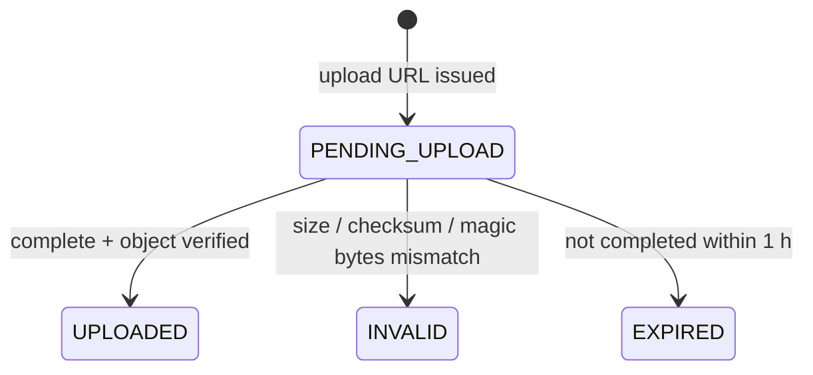
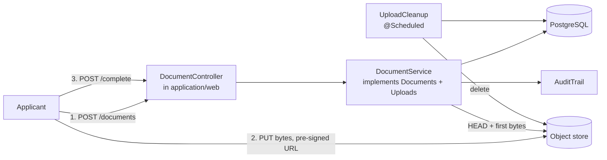

# FR3 — Upload KYC Documents

Parent: [Intake and Checks](../README.md). Previous: [FR2 — Audit Log](fr2-audit-log.md).
Next: [FR4 — Submit](fr4-submit.md).
Spring Boot 4.1, Java 21, Spring Data JPA, PostgreSQL, Flyway, S3-compatible object storage.

Evidence in, before anything is asked of a vendor. The applicant gets a URL, PUTs bytes straight to the object store, and
the server rules on what arrived.

**Bytes never pass through the API.** That is the one decision this increment is really about, and everything below
follows from it: the API issues a URL constrained enough that the store itself rejects the wrong bytes, then verifies the
stored object against the same claims.

## 1. Requirements

| #     | Functional                                                                                                        |
|-------|-------------------------------------------------------------------------------------------------------------------|
| FR3.1 | Request a pre-signed upload URL for a document of kind `ID` or `PAYSLIP`, bound to content type, length and sha256. |
| FR3.2 | Confirm an upload. The server verifies the stored object and records `UPLOADED` or `INVALID`.                       |
| FR3.3 | Read a document's kind and status.                                                                                 |
| FR3.4 | Sweep URLs that were issued and never used, deleting the object and marking the row `EXPIRED`.                      |
| FR3.5 | Record every upload request and every verdict through [FR2's audit log](fr2-audit-log.md), in the same transaction. |

Out of scope here: submit ([FR4](fr4-submit.md)) and anything a vendor does with the file
([FR5](fr5-identity-verification.md)). `PAYSLIP` is accepted so the model is not reshaped later, and nothing consumes one
until FR6's income check.

**This increment cannot be built without [FR2](fr2-audit-log.md).** `DocumentService` takes an `AuditTrail` in its
constructor, and writes `UPLOAD_REQUESTED` and `DOCUMENT_VERIFIED`. FR3 is the audit log's first writer; it adds two event
types and changes nothing about the module.

| Quality  | Requirement                                                                                                     |
|----------|-----------------------------------------------------------------------------------------------------------------|
| Bytes    | Client → store directly. The only server-side reads are the verification `HEAD` and the later send to a vendor.  |
| Trust    | A declared content type is a claim. The first bytes of the object are the evidence, and they are checked.         |
| Ownership | Another applicant's document id answers 404, never 403, so ids cannot be probed.                                |
| Keys     | An object key is derived from ids, never from client input, so no caller can steer a write at another prefix.     |
| Privacy  | Document content never reaches a log line, a disk, or an audit payload.                                          |
| Leaks    | An issued URL that is never used leaves no object behind.                                                        |
| Audit    | A verdict that committed is a verdict that was logged. The log cannot be edited by the code that writes it.       |

## 2. Core Entities

| Entity       | Fields                                                                                                                    | Invariants                                                              |
|--------------|---------------------------------------------------------------------------------------------------------------------------|-------------------------------------------------------------------------|
| **Document** | `id`, `applicationId`, `userId`, `kind`, `objectKey`, `sha256`, `sizeBytes`, `contentType`, `status`, `createdAt`, `version` | Only `UPLOADED` may answer a requirement or be sent to a vendor. `objectKey` immutable and derived. |

Its own aggregate, not a collection on `Application`: a document is verified, expired and read without loading or
locking the application it belongs to.

Value objects, each validating in its constructor and persisted through an `AttributeConverter` that routes loads back
through it:

| Type          | Rule                                                                                                |
|---------------|-----------------------------------------------------------------------------------------------------|
| `Sha256`      | 64 lower-case hex characters. Compares in constant time, because one side is client-supplied.        |
| `ObjectKey`   | `applications/{applicationId}/documents/{documentId}`. Derived, never accepted from a caller.         |
| `ContentType` | An **enum**, not a validating record: the allow-list is closed, and each entry carries its magic bytes. |

`ContentType` being an enum is deliberate. A closed allow-list *is* an enumeration, and keeping the magic bytes on the
same constant as the media type means the claim and its evidence cannot drift apart.

| #   | Invariant                                              | Enforced by                                    |
|-----|--------------------------------------------------------|------------------------------------------------|
| I11 | Only a verified object is sendable to a vendor          | `Document.isSendable()`, checked inside the module |
| I12 | One object per document                                 | `ux_document_object_key`                        |
| I13 | Size within bounds                                      | `ck_document_size`, and the aggregate's factory |

## 3. State Machine



`/complete` is idempotent: replaying it re-reads the object and reaches the same verdict. Only a status that could never
lead to the requested one is refused.

## 4. API

`X-User-Id` required. Nested under the application, because a document only exists in one.

| Method | Path                                               | Purpose                                     |
|--------|----------------------------------------------------|---------------------------------------------|
| POST   | `/v1/applications/{id}/documents`                  | Request a pre-signed upload URL → `201`     |
| POST   | `/v1/applications/{id}/documents/{docId}/complete` | Confirm the upload; the server verifies → `200` |
| GET    | `/v1/applications/{id}/documents/{docId}`          | Kind and status                             |

The endpoints live in the **`application` module's** web layer, not `document`'s. The resource is application-scoped and
the guard on it is the application's (`requireUploadable`), and keeping them there is what stops `document` depending on
`application` — which would be a cycle, since `application` already depends on `document`.

**Request upload** (FR3.1) — `{ "kind": "ID", "contentType": "image/jpeg", "sizeBytes": 812334, "sha256": "9a1f…" }`

| Outcome                                      | Response                                                                 |
|----------------------------------------------|--------------------------------------------------------------------------|
| Created                                      | `201` `{documentId, uploadUrl, method: PUT, requiredHeaders, expiresAt}`  |
| Application past gathering evidence          | `409` `/problems/not-editable`                                           |
| Content type off the allow-list              | `422` `/problems/invalid-request`, `errors[{field: "contentType"}]`        |
| `sizeBytes` ≤ 0 or > 10 MB                   | `422`, `errors[{field: "sizeBytes"}]`                                    |
| Malformed `sha256`                           | `422`, `errors[{field: "sha256"}]`                                       |

`requiredHeaders` carries the content type and `x-amz-checksum-sha256`, both signed into the URL, so **the store refuses
bytes that disagree with the declaration before they are ever stored**. The URL expires in 15 minutes — it is a bearer
token for a write into our bucket.

**Complete upload** (FR3.2) — empty body.

| Outcome                                   | Response                                       |
|-------------------------------------------|------------------------------------------------|
| Verified                                  | `200` `{documentId, kind, status: UPLOADED}`    |
| Size, checksum or magic-byte mismatch     | `200` `{status: INVALID, reason}`               |
| No object there                           | `409` `/problems/upload-incomplete`             |
| Not found, or not this applicant's        | `404`                                          |

`INVALID` is a **`200`, not a 4xx**. The request was well-formed and the server has an answer about the object; a 4xx
would say the *call* was wrong. `reason` is a code (`size-mismatch`, `checksum-mismatch`, `content-type-mismatch`), never
anything read out of the file.

## 5. High-Level Design

### 5.1 The module



```
document/
├── Documents.java          read API for other modules: what exists, and the bytes
├── Uploads.java            write API: issue a URL, rule on what arrived
├── DocumentKind.java       ID | PAYSLIP
├── DocumentStatus.java     PENDING_UPLOAD | UPLOADED | INVALID | EXPIRED
├── DocumentVerified.java   the verdict, as a value
├── domain/                 Document, ContentType, Sha256, ObjectKey (+ converters), the exceptions
├── persistence/            DocumentRepository, ObjectStore (port) + S3ObjectStore
├── service/                DocumentService
└── worker/                 UploadCleanup
```

**Two APIs, not one.** `Documents` is what other modules read (`ofApplication`, `hasAccepted`, `contentFor`); `Uploads`
is what the endpoints write to. Splitting them says which direction each caller is going, and keeps the read side free of
methods that mutate.

Everything else stays inside. Before `Documents` existed, the orchestrator held a `DocumentRepository` and the Onfido
adapter held an `ObjectStore` — both of which couple a caller to how documents are stored, and neither of which Modulith
allows now.

`Documents.Content` carries the media type and file extension as **strings**, not the `ContentType` enum, so the
allow-list and its magic bytes stay in one module and a caller cannot branch on the type and grow a second copy of the
rules.

### 5.2 Verification: three claims, cheapest first

`/complete` checks the object against exactly what was declared:

1. **Length** — comes back on the `HEAD`, free.
2. **Checksum** — the store's own digest, compared in constant time against ours.
3. **Magic bytes** — only now are the first 8 bytes read, with a ranged `GET`. A 10 MB object is never pulled into the
   application to answer this.

The pre-signed URL already constrains all three, so in practice the store rejects a mismatch first and this is the second
line. Both exist because the first depends on the store honouring what was signed, and the second does not depend on
anything.

### 5.3 Expiry

```
POST /documents → row PENDING_UPLOAD, URL issued
   … applicant never PUTs …
UploadCleanup (hourly): delete the object, mark EXPIRED
```

The timer is a column (`document.created_at`) plus a poller, not an in-memory schedule, so a restart loses nothing. The
object is deleted **before** the row is marked: a row marked `EXPIRED` with bytes still in the bucket is a leak nothing
looks at again, whereas a deleted object with the row still `PENDING_UPLOAD` is simply swept again next pass.

## 6. Migrations

| Migration                | Contents                                                                                   |
|--------------------------|--------------------------------------------------------------------------------------------|
| `V3__document.sql`       | `document`, `ux_document_object_key` — **I12**, `ck_document_size` — **I13**, and a partial index for the sweep |

`ix_document_pending (status, created_at) WHERE status = 'PENDING_UPLOAD'` is partial because the sweep only ever wants
those rows, and they are a vanishing fraction of the history.

`V2__audit_event.sql` belongs to [FR2](fr2-audit-log.md).

## 7. Tests

| Level | Spec                        | Covers                                                                                  |
|-------|-----------------------------|-----------------------------------------------------------------------------------------|
| Unit  | `DocumentTest`              | Size bounds, the one-way verdicts, idempotent replay, refusing to flip a reached verdict |
| Unit  | `ContentTypeTest`           | The allow-list, case and whitespace, and **a PDF renamed as a JPEG**, which is the point |
| Unit  | `Sha256Test`                | Hex validation, length, constant-time comparison                                         |
| API   | in `IdentityVerificationTest` | A real PUT to a real pre-signed URL against a container, then `/complete`; audit `seq` contiguous and free of declared data |

The API coverage currently lives in FR5's spec, because the end-to-end flow needs an application to hang documents on.
A declared-checksum mismatch is asserted there too: the store refuses the PUT outright, which is the first line working.

**Not covered: `UploadCleanup`.** It is wired and scheduled but has no spec — the only untested component of this
increment.

## 8. Open questions

- **`PAYSLIP` accepts uploads nothing reads.** Either keep the dead kind or reject it until FR6's income check; accepting
  it is the smaller change and the model is right either way.
- **Bucket provisioning.** A startup hook creates the bucket if missing, which makes `bootRun` and the tests work against
  a bare store. Production wants it provisioned out of band with a retention and access policy this has no opinion about.
- **Object retention.** Nothing deletes an `UPLOADED` document's bytes, ever. An ID document is exactly the kind of
  personal data that should not be kept indefinitely, and the answer is a compliance one.
