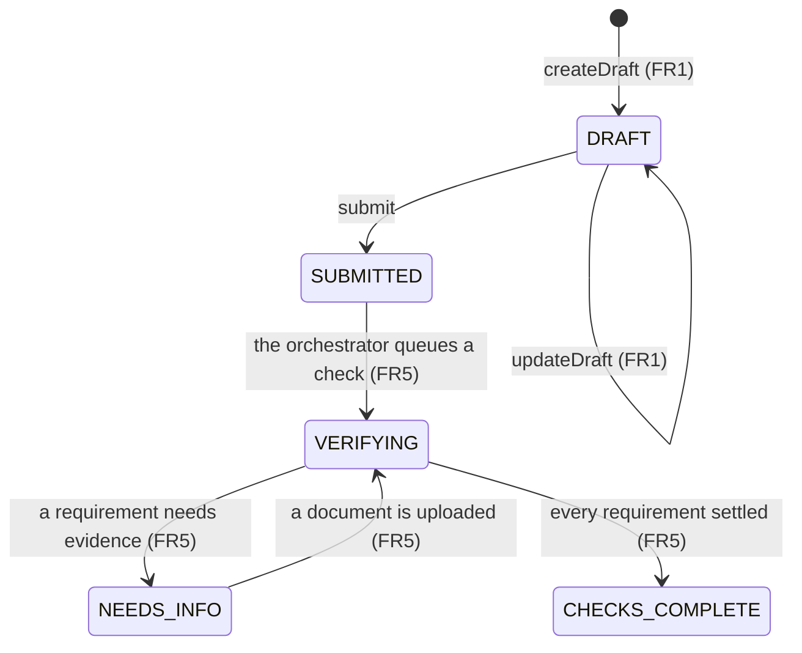
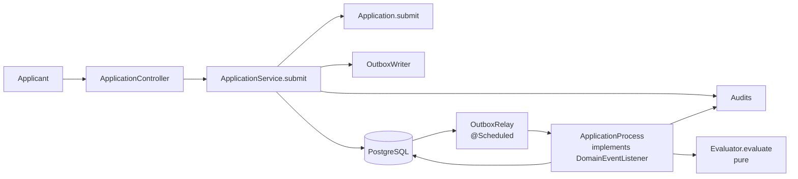

# FR4 — Submit

Parent: [Intake and Checks](credit-card-application-design-spec.md). Previous: [FR3 — Upload KYC Documents](fr3-document-upload.md).
Next: [FR5 — Identity Verification](fr5-identity-verification.md).
Spring Boot 4.1, Java 21, Spring Data JPA, PostgreSQL, Flyway.

Submit turns declared data and evidence into a **workflow**. That is the whole feature: after this the application is no
longer something the applicant edits, it is something the system is working on.

It is also the **spine every later check runs on** — the transactional outbox, the relay and the orchestrator (the audit
log is older than this increment; FR3 already writes to it). FR5 adds the first check to machinery that already exists;
FR6 adds three more to the same machinery unchanged. Building that spine here, under one check's worth of pressure, is the
point of the ordering.

## 1. Requirements

| #     | Functional                                                                                                              |
|-------|-------------------------------------------------------------------------------------------------------------------------|
| FR4.1 | Submit a draft. Refuse it unless declared data is complete and an `ID` document has been accepted.                        |
| FR4.2 | Record the durable workflow instance and `WorkflowStarted` in the audit log, in the same transaction as the transition.   |
| FR4.3 | Publish `ApplicationSubmitted` through the outbox, and dispatch it to the orchestrator, which decides what happens next.  |
| FR4.4 | Refuse further edits and further uploads once submitted.                                                                 |

Out of scope: what any check actually does ([FR5](fr5-identity-verification.md), FR6). At the end of this increment the
orchestrator receives `ApplicationSubmitted` and has nothing to start, so it waits — which is the correct behaviour for a
spine with no checks plugged into it yet.

| Quality       | Requirement                                                                                                     |
|---------------|-----------------------------------------------------------------------------------------------------------------|
| Durability    | No lost transition and no lost event: the state change and its outbox row commit together, or neither does.      |
| Auditability  | An intake that committed is an intake that was logged, in the same transaction.                                  |
| Exactly once  | A redelivered event has one effect on the consumer that already handled it.                                     |
| Small writes  | The API transaction records intake and nothing else, so a crash between intake and the next step costs a moment. |
| Privacy       | No declared value reaches an audit payload or an outbox payload — ids and codes only.                            |

## 2. Core Entities

### 2.1 Application — changes only

| Field    | Change                                                                                |
|----------|---------------------------------------------------------------------------------------|
| `status` | Gains `SUBMITTED`, and the states the checks will use: `VERIFYING`, `NEEDS_INFO`, `CHECKS_COMPLETE` |

**No migration.** FR1 stored status as `text` with `@Enumerated(STRING)` precisely so new values cost nothing; a Postgres
enum type would have needed one. This is the first increment to collect on that decision.

| Method              | Guard                                                    | Throws                      |
|---------------------|----------------------------------------------------------|-----------------------------|
| `submit(hasId)`     | `DRAFT`, all four declared fields set, an accepted `ID`   | `NotEditableException`, `NotSubmittableException` |
| `startVerifying()`  | `SUBMITTED`                                               | `NotEditableException`      |
| `requestInfo()`     | `VERIFYING`                                               | `NotEditableException`      |
| `resumeVerifying()` | `NEEDS_INFO`                                              | `NotEditableException`      |
| `completeChecks()`  | `VERIFYING`                                               | `NotEditableException`      |
| `acceptsUploads()`  | true in `DRAFT` and `NEEDS_INFO` only                     | —                           |

**`NotEditableException` becomes reachable.** FR1 recorded that it had no test because nothing could leave `DRAFT`. A
`PATCH` after submit is now a real 409, and the test FR1 left commented out gets written.

### 2.2 New entities

| Entity                  | Fields                                                                                       | Invariants                                          |
|-------------------------|----------------------------------------------------------------------------------------------|-----------------------------------------------------|
| **EvidenceRequirement** | `id`, `applicationId`, `type`, `status`, `sourceVendorCheckId?`, `sourceDocumentId?`, `version` | `RECEIVED` implies a source. One per type per application. |
| **OutboxEvent**         | `id`, `applicationId`, `type`, `payload` jsonb, `createdAt`, `publishedAt?`                    | Written in the producer's transaction.               |
| **ProcessedEvent**      | PK (`consumer`, `eventId`), `processedAt`                                                     | The key is the claim: a redelivery cannot insert.    |

`EvidenceRequirement` is a separate aggregate from `Application`, not a `@OneToMany`: a vendor result updates one
requirement without loading or locking its siblings.

| #   | Invariant                                     | Enforced by                                   |
|-----|-----------------------------------------------|-----------------------------------------------|
| I5  | One requirement per type per application      | `ux_requirement_app_type`                      |
| I8  | An event is consumed at most once per consumer| `processed_event` primary key                  |

## 3. State Machine



Only `DRAFT → SUBMITTED` belongs to this increment. The rest of the machine is declared here because the statuses and
their guards are the application's, not any check's — FR5 is what first drives them.

## 4. API

| Method | Path                           | Purpose                                     |
|--------|--------------------------------|---------------------------------------------|
| POST   | `/v1/applications/{id}/submit` | Submit → `202 {status: SUBMITTED}`          |

`202`, not `200`: intake is recorded and the checks have not run.

| Outcome                                          | Response                                                   |
|--------------------------------------------------|------------------------------------------------------------|
| Accepted                                         | `202` with the application representation                    |
| Not `DRAFT`                                      | `409` `/problems/not-editable`, `currentStatus`              |
| Declared data incomplete, or no accepted `ID`     | `409` `/problems/not-submittable`, `missing: [...]`          |

**`NotSubmittableException` is a conflict, not an invalid value.** Submit carries no body, so there is no request value the
caller could correct — what has to change is the application. Being `CONFLICTING_STATE` also gives it a
`/problems/not-submittable` type and keeps `missing` a top-level member instead of flattening it into the `errors[]` array
a malformed request uses.

**Editability is checked before the version precondition** on `PATCH`. A client that is both stale and too late hears
`not-editable` rather than being told to reload, which could only fail a second time.

## 5. High-Level Design

### 5.1 The spine



One API transaction: `DRAFT → SUBMITTED`, the `WorkflowStarted` audit row, the `ApplicationSubmitted` outbox row. Then it
returns. Queueing work is the orchestrator's job, reached through that event — which is what makes a crash between the two
harmless rather than a lost application.

### 5.2 Three rules the spine is built on

**`OutboxWriter` is `@Transactional(propagation = MANDATORY)`**, for the same reason `Audits` is
([FR2 §4.1](fr2-audit-log.md#41-writes-share-the-callers-transaction-and-that-is-enforced)): the annotation's absence
would not make it non-transactional, so a call with no ambient transaction would commit an event describing a change that
has not happened yet — and might never. `MANDATORY` makes that an exception rather than a published lie.

**One component decides.** `ApplicationProcess` is the only thing that transitions an application. Workers do one job and
report back through the outbox. Nothing may mutate a requirement on the way past the orchestrator either: doing so hides
state from the evaluator, and the next step never fires.

**The decision is pure.** `Evaluator.evaluate(application, requirements, documents) → NextStep` does no I/O, reads no
clock and has no randomness, so the whole decision table is a unit test rather than an integration test. This is where
most of the coverage for FR4 and FR5 lives.

```java
sealed interface NextStep {
    record Wait() implements NextStep { }
    record RequestInfo(List<RequirementType> missing) implements NextStep { }
    record Complete() implements NextStep { }
    // FR5 adds StartIdentityCheck(documentId)
}
```

### 5.3 Event handling

One transaction per event: insert `processed_event` (the primary key refuses a redelivery) → load → apply → `evaluate` →
apply the step → write any outbox and audit rows → commit.

The relay uses a programmatic `TransactionTemplate`, not `@Transactional`, for the same reason `ApplicationService` does:
a lost optimistic-lock race has to be caught *after* the rollback, and `@Transactional` would raise
`UnexpectedRollbackException` at commit instead. On a conflict the row stays unpublished and the next poll retries it from
the start — that is the entire recovery strategy.

The relay claims rows with `FOR UPDATE SKIP LOCKED`, so several instances can poll the same table with no coordination.

`DomainEvent` is sealed and its payloads carry **ids only**. They are serialised into a durable log read by code that may
be a version behind, so a name or a date of birth in there would be both a privacy leak and a compatibility problem.

### 5.4 What this increment adds to the audit log

The audit log itself is **not FR4's**: it is [FR2](fr2-audit-log.md), and FR3 is already writing `UPLOAD_REQUESTED` and
`DOCUMENT_VERIFIED` to it before submit exists.

What FR4 adds is three event types and the guarantee that matters most here: `WorkflowStarted` is written by the
transaction that moves `DRAFT → SUBMITTED`, so an intake that committed is an intake that was logged. It is the first row
of the **workflow**, not of the application.

| Event type            | Written when                                        |
|-----------------------|-----------------------------------------------------|
| `WORKFLOW_STARTED`    | `DRAFT → SUBMITTED`, in the same transaction         |
| `STATUS_CHANGED`      | Every later transition the orchestrator applies      |
| `REQUIREMENT_CHANGED` | A requirement's status moves                          |

## 6. Migrations

| Migration                      | Contents                                                                          |
|--------------------------------|-----------------------------------------------------------------------------------|
| `V4__evidence_requirement.sql` | `evidence_requirement`, `ux_requirement_app_type` — **I5**                          |
| `V5__outbox.sql`               | `outbox`, a partial index on unpublished rows, `processed_event` PK — **I8**        |

`V2__audit_event.sql` belongs to [FR2](fr2-audit-log.md), `V3` to [FR3](fr3-document-upload.md), and `V6` and `V7` to
[FR5](fr5-identity-verification.md).

`outbox.payload` is `jsonb` and mapped with `@JdbcTypeCode(SqlTypes.JSON)`. Without it Hibernate validates a bare `String`
against `varchar` and the context fails to start — a real failure found by running it. `audit_event.payload` needs the same
annotation for the same reason.

## 7. Tests

| Level | Spec                      | Covers                                                                              |
|-------|---------------------------|-------------------------------------------------------------------------------------|
| Unit  | `ApplicationTest`         | `submit` preconditions, every new transition and its guard                            |
| Unit  | `EvaluatorTest`           | The decision table with no database, clock or container                               |
| API   | `ApplicationControllerTest` | `PATCH` after submit → `409 not-editable` — the test FR1 could not write             |
| API   | `IdentityVerificationTest` | Intake recorded before any check exists; `seq` contiguous; no declared data in payloads |

## 8. Open questions

- **`Idempotency-Key` on submit is not built** (`V8__idempotency_key.sql`). Submit is the endpoint that needs it, and it is
  partly protected already: a second submit answers `409 not-editable` rather than starting a second workflow. A retry
  after a lost `202` therefore behaves, but for the wrong reason.
- **Nothing consumes `ChecksCompleted`.** It is the seam the decisioning increment subscribes to, and publishing it now
  means that increment adds a listener rather than a producer.
- **The relay is at-least-once with a dedupe table**, which is the right shape, but nothing yet proves the outbox drains
  under a poison event — one that always throws. Today it would be retried forever.
