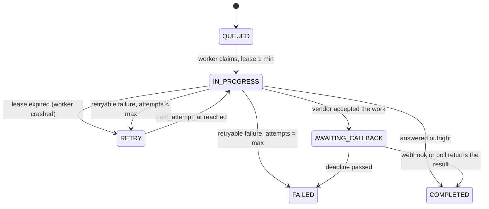
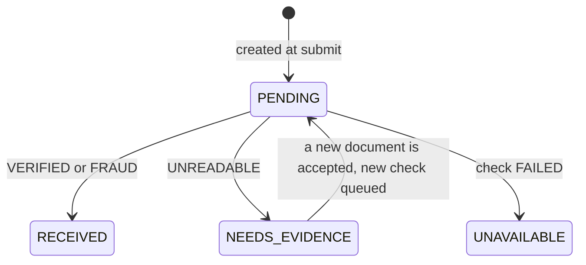
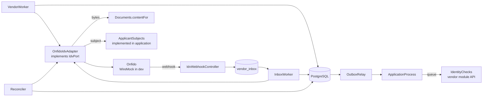
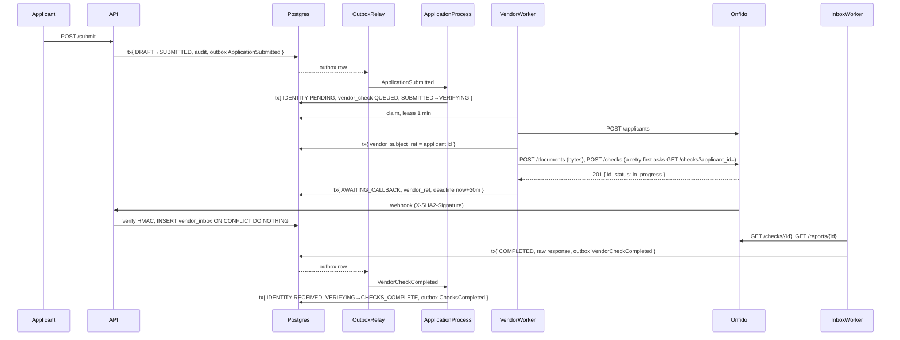

# FR5 — Verify Identity with an IDV Vendor

Parent: [Credit Card Application](../README.md). Previous: [FR4 — Submit](fr4-submit.md).
Provider: [providers/identity-verification.md](providers/identity-verification.md).
Spring Boot 4.1, Java 21, Spring Data JPA, PostgreSQL, Flyway, WireMock.

The first external check, and **the only asynchronous one of the four**. A document goes to Onfido, Onfido answers later,
and the application has to survive every way "later" can go wrong: a callback that never arrives, one that arrives twice,
one that is forged, a worker that dies mid-call, a vendor that is simply slow.

Identity is done first for exactly that reason. Everything the other three checks will need — the leased job queue,
`AWAITING_CALLBACK`, the webhook inbox, the reconciler, the deadline — is built and raced here against one check.
[FR6](../README.md#appendix-a) — outside this project — would add three *synchronous* providers to machinery that already works,
which is the easy direction.

## 1. Requirements

| #     | Functional                                                                                                       |
|-------|------------------------------------------------------------------------------------------------------------------|
| FR5.1 | On submit, create the `IDENTITY` requirement and queue one `IDV` check for the accepted `ID` document.             |
| FR5.2 | Run the check against Onfido: create applicant, upload document, create check, then await the answer.              |
| FR5.3 | Accept the IDV webhook, fetch the result it announces, and satisfy the requirement.                                |
| FR5.4 | An `UNREADABLE` document puts the application in `NEEDS_INFO`; a re-upload starts a **new** check and resumes.      |
| FR5.5 | A check that never answers leaves `IDENTITY` `UNAVAILABLE`, and the application still reaches `CHECKS_COMPLETE`.    |

Out of scope: the other three providers (FR6), and anything that reads the result. **Nothing in FR5 approves, declines or
refers** — `CHECKS_COMPLETE` carries no verdict.

| Quality          | Requirement                                                                                                   |
|------------------|---------------------------------------------------------------------------------------------------------------|
| No duplicate pay | A retried claim produces **one** Onfido check. Key: `{appId}:IDV:{documentId}`.                                |
| Crash safety     | A worker that dies mid-call is recovered by lease expiry, never by losing the check.                            |
| Webhook safety   | A duplicate, forged or lost callback all end in the same state. The body is never trusted as the result.        |
| Liveness         | No application waits forever: a 30 min deadline makes the requirement `UNAVAILABLE`.                           |
| Never a decline  | An outage is recorded as an absent answer, never turned into a negative one.                                   |
| Privacy          | Declared data crosses the network in exactly one place. Document bytes are never logged or written to disk.     |

## 2. Core Entities

| Entity          | Fields                                                                                                                                                          | Invariants                                          |
|-----------------|-----------------------------------------------------------------------------------------------------------------------------------------------------------------|-----------------------------------------------------|
| **VendorCheck** | `id`, `applicationId`, `type`, `provider`, `documentId`, `idempotencyKey`, `status`, `vendorRef?`, `outcome?`, `failureCode?`, `rawResponse?`, `attempts`, `nextAttemptAt`, `leaseUntil?`, `deadlineAt?`, `createdAt`, `version` | Unique `idempotencyKey`. Unique `vendorRef`. |
| **VendorInboxEvent** | `id`, `vendor`, `eventId`, `vendorRef`, `receivedAt`, `processedAt?`                                                                                        | Unique (`vendor`, `eventId`).                        |

**The table is the job queue.** Inserting a `vendor_check` row in the orchestrator's transaction is how work is
commanded, which means a command cannot be lost and cannot exist without the decision that asked for it. Retries, leases
and deadlines are all columns rather than in-memory timers, so a restart loses nothing.

| #   | Invariant                                       | Enforced by                                        |
|-----|-------------------------------------------------|----------------------------------------------------|
| I6  | One check per idempotency key                    | `ux_vendor_check_key`                               |
| I7  | A webhook event has one effect                   | `ux_vendor_inbox_event`                             |
| I14 | One check per vendor reference                   | `ux_vendor_check_ref` — a webhook resolves by it     |

## 3. State Machine



`COMPLETED` means **the vendor gave an answer**, which may be bad news. `FAILED` means no answer was obtained. Both emit
`VendorCheckCompleted`, and keeping them distinct is what stops an outage looking like a fraud finding.

### The requirement, driven by the check



**`FRAUD` reaches `RECEIVED`.** It is an answer; judging it is the deferred ruleset's job. Conflating bad news with no news
would make a fraud finding indistinguishable from an outage, which is the one confusion this design most wants to avoid.

## 4. API

| Method | Path              | Purpose                                                        |
|--------|-------------------|----------------------------------------------------------------|
| POST   | `/webhooks/idv`   | Onfido callback. **No `X-User-Id`** — authenticated by HMAC      |

Answers `200` fast, having done exactly two things: verified the signature and recorded that an answer exists. Fetching
the answer is a worker's job, so a slow vendor round trip can never make us time out their delivery and earn a redelivery
storm. A duplicate also gets `200` — the vendor did its job, and re-sending would help neither of us. A bad signature is
`401` with no body, and the log carries the event id only.

The body is bound as `byte[]`: the signature covers the raw bytes, so binding to a DTO first would destroy the thing being
verified.

`GET /v1/applications/{id}` (FR7) gains `requirements[]` with `acceptedDocumentKinds` — present only while something is
actually wanted, so a client never offers an upload that would be refused.

## 5. High-Level Design

### 5.1 Components



```
vendor/
├── IdentityChecks.java      API: queue a check, read a finished one's result
├── ApplicantSubjects.java   port: who the applicant is — implemented in `application`
├── domain/                  VendorCheck, IdvPort, VendorResult, VendorFailure, IdvOutcome, …
├── onfido/                  OnfidoIdvAdapter + package-private DTOs
├── persistence/             VendorCheckRepository, VendorInboxRepository
├── service/                 IdentityCheckService (implements IdentityChecks)
├── web/                     IdvWebhookController, SignatureVerifier
└── worker/                  VendorWorker, InboxWorker, Reconciler
```

**Two directions, one dependency.** The workflow commands the vendor through `IdentityChecks`. The vendor needs the
applicant's details, and gets them through `ApplicantSubjects` — a port **declared in `vendor` and implemented in
`application`**. So the conversation goes both ways while the dependency points one way. Widening
`allowedDependencies` to let `vendor` import `application` would have compiled and been a cycle.

It also keeps declared data out of `vendor_check`: the worker fetches the subject at the moment of the call rather than
storing a copy.

Onfido's DTOs are **package-private** in `vendor/onfido/`, so the compiler — not a convention — keeps its vocabulary out
of the rest of the codebase.

### 5.2 Three transactions per check, never one

```
claim   → tx: IN_PROGRESS, attempts+1, lease = now + 1 min, COMMIT
call    → no transaction, except one small tx storing the Onfido applicant id before the billed POST /checks
record  → tx: COMPLETED / AWAITING_CALLBACK / RETRY / FAILED, + outbox, COMMIT
```

The applicant id is the exception because Onfido ignores idempotency keys: a retry has to ask which checks the applicant
already has, and it can only ask if the id survived the attempt that lost the reply (provider spec §6).

The call happens **outside any transaction**. Holding a database transaction open across a network call to a third party
is how a slow vendor becomes a connection-pool outage.

Claiming commits *first*, which is what makes a crash recoverable: the row then looks exactly like one whose worker died,
and the claim query picks it up again on lease expiry. The claim query is one statement covering both cases:

```sql
WHERE (status IN ('QUEUED','RETRY') AND next_attempt_at <= now())
   OR (status = 'IN_PROGRESS'        AND lease_until    <  now())
FOR UPDATE SKIP LOCKED LIMIT 10
```

`SKIP LOCKED` lets many workers and instances poll the same table with no coordination: whoever locks a row owns it, the
others move on. It is also what will make FR6's four checks genuinely concurrent — four independently claimable rows, not
four threads in one method.

### 5.3 The callback, and why it is optional

A webhook is a **notification, never a result**. It says an answer exists; the answer is always fetched by `check_id`.

```
webhook → verify HMAC over raw bytes → INSERT vendor_inbox ON CONFLICT DO NOTHING → 200
InboxWorker → GET /checks/{id} → UPDATE … WHERE status = 'AWAITING_CALLBACK' → COMPLETED + outbox
Reconciler  → same conditional update, for callbacks that never came
```

That one rule makes all three failure modes harmless:

- **Duplicate** — the event id is unique in `vendor_inbox`, so the second insert does nothing.
- **Forged** — the HMAC fails, and even a valid replay could at worst make us re-read a check we already own.
- **Lost** — the reconciler polls `AWAITING_CALLBACK` checks and completes them, so the flow finishes with no callback at
  all. This is the case the design worries about most, and it is the **default path in development**, since the mock fires
  no webhook.

Webhook and reconciler race on the same check deliberately. Both complete with a conditional update on
`AWAITING_CALLBACK`, so exactly one wins and the loser updates 0 rows and does nothing.

**Onfido sends no timestamp**, only a signature over the body, so a captured request stays valid forever and replay cannot
be prevented at the signature layer. The two properties above are what make that acceptable; a vendor that *does* send a
timestamp gets the ±5 min window the parent spec describes.

### 5.4 Flow



The adapter reads the object through `Documents.contentFor`, which returns empty unless the document is accepted — so I11
lives in the document module and the adapter cannot forget it. This is the one place a document's bytes pass through the
application.

### 5.5 Mapping Onfido's answer to ours

| Onfido `result` | Report `sub_result` | `IdvOutcome` | Requirement becomes | Why                                              |
|-----------------|---------------------|--------------|---------------------|--------------------------------------------------|
| `clear`         | —                   | `VERIFIED`   | `RECEIVED`          | Document genuine                                  |
| `consider`      | `caution`           | `VERIFIED`   | `RECEIVED`          | An answer with a caveat; judging it is not ours    |
| `consider`      | `suspected`         | `FRAUD`      | `RECEIVED`          | Suspected forgery — still an answer                |
| `consider`      | `rejected`          | `UNREADABLE` | `NEEDS_EVIDENCE`    | Unusable image; ask for another                    |
| `unidentified`  | —                   | `UNREADABLE` | `NEEDS_EVIDENCE`    | Could not read it                                  |

The check carries the verdict and the **report** carries the reason, so both are fetched — a bare `consider` is not
actionable on its own.

A re-upload creates a **new** check under a new key (`{appId}:IDV:{newDocumentId}`), never a retry of the old one.

### 5.6 Failures

| Condition                        | `VendorResult`                | Retryable | Effect                              |
|----------------------------------|-------------------------------|-----------|-------------------------------------|
| `201 in_progress`                | `Pending(ref)`                | —         | `AWAITING_CALLBACK` + deadline       |
| `200 complete`                   | `Completed(outcome)`          | —         | `COMPLETED`                          |
| Read timeout                     | `Failed(Timeout)`             | Yes       | Backoff, then `UNAVAILABLE`          |
| Cannot connect                   | `Failed(Unavailable(0))`      | Yes       | Backoff, then `UNAVAILABLE`          |
| `429`, `5xx`                     | `Failed(Unavailable(status))` | Yes       | Backoff, then `UNAVAILABLE`          |
| `422`, `401`, `403`              | `Failed(InvalidRequest)`      | No        | `UNAVAILABLE`, and alert             |

A read timeout and an unreachable host are told apart on purpose: both are retryable, but one says the vendor is slow and
the other says we never reached it, and the audit log should not call them the same thing.

`VendorFailure` is sealed so `retryable()` is exhaustive — a new failure kind cannot be added without deciding whether
retrying it could ever help.

## 6. Onfido: real API, dockerized mock

The adapter targets **Onfido's published API** exactly as
[providers/identity-verification.md](providers/identity-verification.md) describes it. The mock stands in for the server,
not for the protocol, so moving to real Onfido is a base URL and a token — no code change.

```properties
app.onfido.base-url=http://localhost:8081     # https://api.eu.onfido.com in production
app.onfido.api-token=${ONFIDO_API_TOKEN}
app.onfido.webhook-token=${ONFIDO_WEBHOOK_TOKEN}
app.onfido.submit-timeout=10s
app.onfido.result-deadline=30m
app.onfido.poll-after=1m
app.onfido.max-attempts=5
```

This **replaces the in-process `fake-vendors` profile** for IDV. An in-process controller cannot exercise a connect
timeout, TLS, or a webhook arriving on a real socket — the three things most likely to be wrong.

### 6.1 The container

```yaml
  onfido-mock:
    image: 'wiremock/wiremock:3.13.2-alpine'
    command: [ '--verbose', '--global-response-templating' ]
    volumes:
      - './mock/onfido:/home/wiremock'
```

`mock/onfido/mappings` is mounted by **both** Docker Compose and the integration spec, so a stub fixed for a test is fixed
for local development and the two cannot drift. WireMock 3 carries response templating and the webhooks extension in core.

Two findings from making this actually run:

- **HTTP/1.1 is pinned on the Onfido client.** The JDK client defaults to HTTP/2 and attempts an h2c upgrade on plaintext,
  which WireMock answers by cancelling the stream (`RST_STREAM`) — a failure that looks like an unreachable vendor rather
  than a protocol disagreement. Worth keeping in production: it costs nothing for a handful of small requests.
- **The object store is LocalStack's S3, not MinIO.** Nothing in the application can tell the difference — that is what
  `ObjectStore` is for — but MinIO's community image is no longer pullable, and a test that cannot run is worth less than
  an equivalent one that can.

### 6.2 Stubs

| Mapping                    | Matches                                 | Returns                                        |
|----------------------------|-----------------------------------------|------------------------------------------------|
| `applicants-create-*.json` | `POST /v3.6/applicants`, by last name    | `201 {id: apl_<scenario>}`                      |
| `documents-create.json`    | `POST /v3.6/documents` (multipart)       | `201 {id}`                                      |
| `checks-create-*.json`     | `POST /v3.6/checks`, by `applicant_id`   | `201 {id: chk_<scenario>_<uuid>, in_progress}`  |
| `checks-get-*.json`        | `GET /v3.6/checks/chk_<scenario>_*`      | `200 {status: complete, result}`                |
| `reports-get-*.json`       | `GET /v3.6/reports/rpt_<scenario>`       | `200 {result, sub_result, properties}`          |

**The stubs fire no webhook**, and issue a **unique** check id per call. The tempting alternative — a fixed check id per
scenario, so the callback body and therefore its HMAC would be a constant a Gradle task could pre-compute — does not work,
for two reasons:

1. A fixed `vendor_ref` violates `ux_vendor_check_ref`, which is unique because it is unique in reality. The mock would
   have broken a real invariant rather than tested one.
2. The callback URL has to reach the application, which differs between Docker Desktop, Linux CI and a developer's machine.

What the mock does instead is better in both directions: the reconciler makes the callback an optimisation (§5.3), so the
flow completes with no webhook at all; and the integration spec builds its own correctly signed callback, so **verification
runs on the real code path** — genuine, forged and duplicate deliveries are all covered. Disabling verification under a test
profile would have left the one security-critical branch untested.

### 6.3 Scenario selection

The scenario travels on the **applicant**, exactly as identity does in the real API: the adapter sends the last name on
`POST /applicants`, that returns a per-scenario applicant id, and `POST /checks` matches on it. A test therefore picks its
behaviour through ordinary request data, with no special wiring.

| Last name contains | `result` / `sub_result`      | Maps to      | Exercises                                  |
|--------------------|------------------------------|--------------|--------------------------------------------|
| (anything else)    | `clear`                      | `VERIFIED`   | Happy path                                 |
| `Fraud`            | `consider` / `suspected`     | `FRAUD`      | A hit that still satisfies the requirement |
| `Unreadable`       | `consider` / `rejected`      | `UNREADABLE` | `NEEDS_INFO`, re-upload, a second check    |
| `Caution`          | `consider` / `caution`       | `VERIFIED`   | An answer with a caveat, not a refusal     |
| `Flaky`            | `503` twice, then `201`      | —            | Backoff, the lease, attempt counting        |
| `Timeout`          | 15 s delay on the first call | —            | The 10 s submit timeout                     |

`Flaky` uses a WireMock **Scenario** to answer differently across calls; reset with `POST /__admin/scenarios/reset`.

### 5.7 What this increment adds to the audit log

The audit module is not FR5's either — it is [FR2](fr2-audit-log.md). FR5 adds four
event types, and they are the ones that make an outage distinguishable from an answer after the fact:

| Event type               | Written when                                                   |
|--------------------------|----------------------------------------------------------------|
| `VENDOR_CHECK_QUEUED`    | A check is commanded, and again when the vendor accepts it       |
| `VENDOR_CHECK_COMPLETED` | An answer was obtained — including `FRAUD`, and noting whether the reconciler recovered it |
| `VENDOR_CHECK_FAILED`    | No answer was obtained, with the failure code and attempt count  |
| `WEBHOOK_RECEIVED`       | A verified callback arrived for a check still awaiting one       |

Payloads carry the check id, the outcome name and the failure code — never the vendor's own message, which could contain
anything.

## 7. Migrations

| Migration                | Contents                                                                                                    |
|--------------------------|-------------------------------------------------------------------------------------------------------------|
| `V6__vendor_check.sql`   | `vendor_check`, `ux_vendor_check_key` — **I6**, `ux_vendor_check_ref` — **I14**, `ix_vendor_check_claim`       |
| `V7__vendor_inbox.sql`   | `vendor_inbox`, `ux_vendor_inbox_event` — **I7**, a partial index on unprocessed rows                         |

Onfido sends no event id, so the inbox dedupe key is the **resource plus the action**, which is stable across
redeliveries of the same completion.

## 8. Tests

The API specs set `app.workers.enabled=false` and drive each worker by hand. With the scheduler running, an assertion like
"exactly one `POST /checks`" races a background poll and would pass or fail on timing rather than on behaviour.

| Level | Spec                       | Covers                                                                             |
|-------|----------------------------|------------------------------------------------------------------------------------|
| Unit  | `VendorCheckTest`          | Lease, attempts, deadline, and that `FRAUD` is `COMPLETED` while an outage is `FAILED` |
| Unit  | `VendorFailureTest`        | `retryable()` for every kind; codes never carry the vendor's message                |
| Unit  | `SignatureVerifierTest`    | Genuine, forged, truncated, absent, and **re-serialised JSON** — why raw bytes matter |
| Unit  | `EvaluatorTest`            | `UNREADABLE` → ask; a re-upload → new check; the rejected document is not re-checked  |
| API   | `IdentityVerificationTest` | The whole flow, plus `FRAUD`, the `NEEDS_INFO` loop, a lost callback, a forged signature, a duplicate delivery |

Three containers: Postgres, an S3-compatible store and the Onfido mock. Bytes are PUT to a genuine pre-signed URL and the
callback carries a genuine HMAC — nothing is mocked in-process. Without Docker the spec self-skips, which is exactly when
the races and the webhook path go untested.

## 9. Open questions

- ~~Does Onfido honour `Idempotency-Key` on `POST /checks`?~~ No. A retry reuses the stored applicant and lists its checks
  before creating one, so a lost reply does not mean a second paid check. Still open: whether the list call is billed.
- **The webhook URL in production.** The app must be publicly reachable, which is infrastructure this spec cannot settle —
  and the reconciler is what makes an imperfect answer survivable.
- **`ux_vendor_check_ref` assumes one provider's reference space.** With FR6's providers, two vendors could in principle
  issue the same string; the index should probably be on (`provider`, `vendor_ref`).
- **Nothing proves the outbox drains under a poison event.** A `VendorCheckCompleted` that always throws would be retried
  forever.
