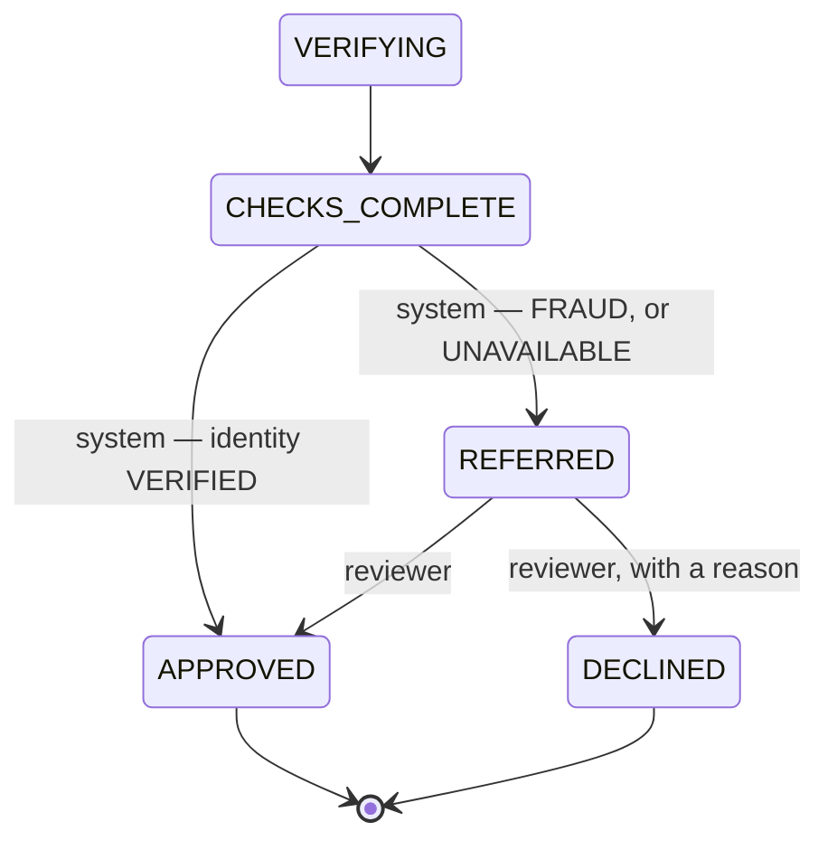

# FR8 — Decision

Parent: [Intake and Checks](../README.md). Previous: [FR5 — Identity Verification](fr5-identity-verification.md).
Spring Boot 4.1, Java 21, Spring Data JPA, PostgreSQL.

Today an application ends at `CHECKS_COMPLETE`: the evidence is in, and nothing decides. This increment closes the loop
with the **smallest decision that is safe**: the system approves a clean result, refers everything else to a person, and
only a person declines. No rule engine, no scoring, no provisioning — those stay deferred.

It decides on identity alone, because identity is the only check this project has ([README Appendix A](../README.md#appendix-a)).
That makes it a working end-to-end loop, **not a lending decision**: an approval here means "this person is who they say
they are", with no screening, credit or income behind it.

## 1. Requirements

| #     | Functional                                                                                                     |
|-------|----------------------------------------------------------------------------------------------------------------|
| FR8.1 | When checks complete, the system decides: **approve** a clean result, **refer** anything else. It never declines. |
| FR8.2 | A reviewer lists referred applications and sees why each was referred.                                          |
| FR8.3 | A reviewer approves or declines a referred application; a decline names a reason from a fixed list.             |
| FR8.4 | The applicant sees the outcome as the application's status, and never the reason.                              |

Out of scope: the deferred decisioning stack (normalised evidence, versioned ruleset, scoring), the `Decision` row,
provisioning, applicant notification, reviewer authentication and a review UI, a deadline on `REFERRED`.

| Quality         | Requirement                                                                                                       |
|-----------------|-------------------------------------------------------------------------------------------------------------------|
| Never auto-decline | Only a reviewer declines. A fraud flag or an outage is referred, never turned into a rejection (README: Compliance, and "`UNAVAILABLE` must not become a decline"). |
| Once            | A redelivered `ChecksCompleted` decides nothing twice.                                                             |
| No tipping off  | The applicant never sees a referral or decline reason — "suspected fraud" is not something to tell the suspect.    |
| No PII          | Reasons are codes, never free text, so nothing personal reaches the audit log.                                    |

## 2. Core Entities

### 2.1 Application — changes only

| Field            | Change                                                                                                    |
|------------------|-----------------------------------------------------------------------------------------------------------|
| `status`         | Gains `APPROVED`, `DECLINED`, `REFERRED`. Stored as `text`, so no migration for the constants.            |
| `decisionReason` | **New**, nullable code: why it was referred, or why a reviewer declined it. Never shown to the applicant.  |

No separate `Decision` table. The application's status and the audit log already record who decided what and when; a
`Decision` row earns its place when provisioning needs to read one (README: Deferred).

### 2.2 Reasons — codes, not text

| Code                   | Set by    | Meaning                                                  |
|------------------------|-----------|----------------------------------------------------------|
| `FRAUD_SUSPECTED`      | System    | Identity answered `FRAUD`                                 |
| `EVIDENCE_UNAVAILABLE` | System    | Identity is `UNAVAILABLE` — the vendor never answered     |
| `FRAUD_CONFIRMED`      | Reviewer  | Decline: the reviewer agrees it is fraudulent             |
| `IDENTITY_NOT_ESTABLISHED` | Reviewer | Decline: identity could not be confirmed               |
| `POLICY`               | Reviewer  | Decline for another reason, recorded outside this system  |

An approval needs no reason.

## 3. State Machine



| From → To                     | Trigger                     | Guard                                             |
|-------------------------------|-----------------------------|---------------------------------------------------|
| `CHECKS_COMPLETE` → `APPROVED` | `ChecksCompleted` (system)  | Rules say approve                                  |
| `CHECKS_COMPLETE` → `REFERRED` | `ChecksCompleted` (system)  | Rules say refer; `decisionReason` set              |
| `REFERRED` → `APPROVED`        | Reviewer                    | Version matches                                    |
| `REFERRED` → `DECLINED`        | Reviewer                    | Version matches; a reviewer reason given           |

`APPROVED` and `DECLINED` are terminal. `CHECKS_COMPLETE` stays a real state, briefly: it is where the evidence is final
and the decision has not been taken, and the decision runs in its own transaction off the outbox.

## 4. API

| Method | Path                                         | Purpose                                                     |
|--------|----------------------------------------------|-------------------------------------------------------------|
| GET    | `/v1/review/applications`                    | Referred applications: `[{id, cardProduct, decisionReason, version}]` |
| POST   | `/v1/review/applications/{id}/decision`      | `{outcome: APPROVED \| DECLINED, reason?, version}` → `200` |

`X-Reviewer-Id` identifies the reviewer — the same kind of placeholder as `X-User-Id`, resolved in `web`. It is not
authorisation: anyone who sends the header can decide (§8).

| Refusal                                                   | Category            | Status |
|-----------------------------------------------------------|---------------------|--------|
| Not `REFERRED`                                            | `CONFLICTING_STATE` | 409    |
| Stale `version`                                           | `CONFLICTING_STATE` | 409    |
| `DECLINED` without a reason, or with a system-only reason | `INVALID_VALUE`     | 422    |
| No such application                                       | `NOT_FOUND`         | 404    |

The applicant's `GET /v1/applications/{id}` (the existing status endpoint) shows the new statuses and no reason.

## 5. High-Level Design

### 5.1 The system's decision

`ApplicationProcess` already receives `ChecksCompleted` and ignores it; it now decides. That keeps "one component
transitions an application" true.

```
on ChecksCompleted, status CHECKS_COMPLETE:
    evidence = for each requirement: (type, status, outcome of the check that answered it)
    decision = DecisionRules.decide(evidence)          // pure
    Approve        → application.approve()
    Refer(reason)  → application.refer(reason)
    audit DECISION_MADE { outcome, reason, by: SYSTEM }
```

`DecisionRules.decide` is a pure function, unit-tested as a table:

| Evidence                                 | Decision                  |
|------------------------------------------|---------------------------|
| Any requirement `UNAVAILABLE`            | Refer `EVIDENCE_UNAVAILABLE` |
| `IDENTITY` answered `FRAUD`              | Refer `FRAUD_SUSPECTED`   |
| Every requirement answered, none flagged | Approve                   |

Refer wins over approve, and the first matching row names the reason. The outcome comes from
`IdentityChecks.resultOf(sourceVendorCheckId)` — the vendor module's existing API — so nothing new crosses the module
boundary. A later check type adds its own "flagged" outcomes as rows here (a sanctions hit refers too).

Status `CHECKS_COMPLETE` is the guard: a redelivered `ChecksCompleted` finds the application already decided and does
nothing.

### 5.2 The reviewer's decision

A `ReviewController` (web) and a method on `ApplicationService` (load, version precondition, transition, audit), exactly as
`PATCH` works today: the client sends the `version` it saw, and a stale one is `409`. The audit entry's actor is the
reviewer, so who decided is on record. No outbox event: nothing consumes a decision yet.

### 5.3 What this increment adds to the audit log

| Event type      | Written when                                                         |
|-----------------|----------------------------------------------------------------------|
| `DECISION_MADE` | Any decision — payload `{outcome, reason, by: SYSTEM \| REVIEWER}`     |

The audit actor gains `REVIEWER` alongside `APPLICANT` and `SYSTEM`, with the reviewer id as `actorId`.

## 6. Migrations

| Migration          | Contents                                   |
|--------------------|--------------------------------------------|
| `V8__decision.sql` | `application.decision_reason text`          |

FR4 had earmarked `V8` for submit's `Idempotency-Key`; it takes the next free number when it is built.

## 7. Tests

| Level | Spec                        | Covers                                                                                  |
|-------|-----------------------------|-----------------------------------------------------------------------------------------|
| Unit  | `DecisionRulesTest`         | The table above, including that no input ever produces a decline                        |
| Unit  | `ApplicationTest`           | `approve`, `refer`, `decline` and their guards                                          |
| API   | `IdentityVerificationTest`  | `VERIFIED` → `APPROVED`; `FRAUD` → `REFERRED`; deadline `UNAVAILABLE` → `REFERRED`; a redelivered `ChecksCompleted` changes nothing |
| API   | `ReviewControllerTest`      | List shows referred only; approve; decline with a reason; decline without one (422); not referred (409); stale version (409); the applicant's view shows no reason |

Existing scenarios that assert `CHECKS_COMPLETE` after draining the relay will now see the decision, because the relay
also delivers `ChecksCompleted`. They change to assert the decided status.

## 8. Open questions

- **Auto-approving on identity alone.** It closes the loop, and it approves applicants nobody screened or credit-checked.
  Acceptable for a demo; for real applicants, set the rules to refer everything until the other checks exist — the rule
  table is the only thing that changes.
- **Reviewers are unauthenticated.** `X-Reviewer-Id` has the same placeholder status as `X-User-Id`. Real auth is out of
  scope for the project; until it lands, the review endpoints must not be exposed publicly.
- **`REFERRED` has no deadline.** An application nobody reviews waits forever, as `NEEDS_INFO` does for an applicant who
  never re-uploads.
