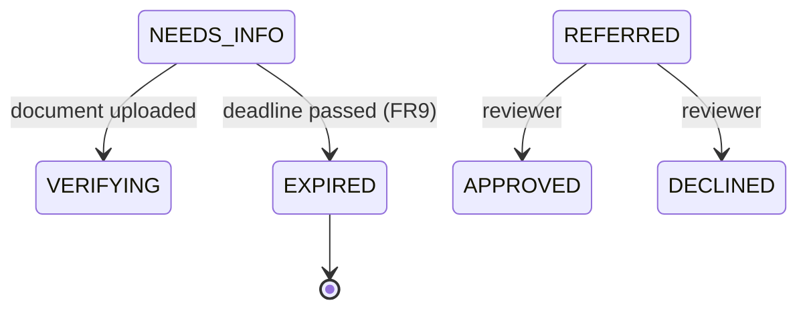

# FR9 — Deadlines

Parent: [Intake and Checks](../README.md). Previous: [FR8 — Decision](fr8-decision.md).
Spring Boot 4.1, Java 21, Spring Data JPA, PostgreSQL.

After FR8 every application that finishes its checks ends in a decision — except two that can wait forever: one
whose applicant never sends the document asked for (`NEEDS_INFO`), and one nobody reviews (`REFERRED`). This
increment gives each a deadline, the project's usual way: **a column plus a poller**, never an in-memory timer.

The two get different treatment on purpose. An abandoned application can end on its own, because ending it judges
nothing. A referral cannot: only a person decides one (FR8), so an overdue referral is surfaced, not closed.

## 1. Requirements

| #     | Functional                                                                                                        |
|-------|-------------------------------------------------------------------------------------------------------------------|
| FR9.1 | An application left in `NEEDS_INFO` past its deadline becomes `EXPIRED` — terminal, and not a decline.            |
| FR9.2 | A referral past its deadline is flagged `overdue` in the review queue and reported in the log. Its status does not change. |
| FR9.3 | Once an application is terminal, a late event — an upload, a vendor result — changes nothing.                    |

Out of scope: expiring a `DRAFT` (nothing was asked for, so nothing is owed), applicant notification of expiry,
withdrawal by the applicant, alert routing beyond a log line.

| Quality          | Requirement                                                                                     |
|------------------|-------------------------------------------------------------------------------------------------|
| Restart-safe     | Deadlines are columns; a restart, or a poller that missed a run, loses nothing — the next run catches up. |
| Never a decline  | Expiry is not a judgement of the applicant, so it is not `DECLINED`. Only a person declines (FR8).  |
| Once             | An application expires once, however many sweeps see it.                                          |
| One decider      | The sweep never transitions an application; it reports, and `ApplicationProcess` decides (CLAUDE.md: workers). |

## 2. Core Entities

### 2.1 Application — changes only

| Field             | Change                                                                                            |
|-------------------|---------------------------------------------------------------------------------------------------|
| `status`          | Gains `EXPIRED`, terminal. Text column, no migration for the constant.                             |
| `statusChangedAt` | **New.** When the application entered its current status. Set by every transition.               |

One timestamp covers both deadlines: "in `NEEDS_INFO` since" and "referred since" are both "in the current status
since". Every transition method takes the time it happened, from the injected `Clock`, so tests can move it.

### 2.2 Configuration

| Property                          | Default | Meaning                                       |
|-----------------------------------|---------|-----------------------------------------------|
| `app.deadlines.needs-info`        | `30d`   | How long an applicant has to send what was asked |
| `app.deadlines.referred`          | `48h`   | When a referral counts as overdue             |
| `app.workers.deadline-interval`   | `15m`   | How often the sweep runs                      |

## 3. State Machine



| From → To             | Trigger                             | Guard                                                   |
|-----------------------|-------------------------------------|---------------------------------------------------------|
| `NEEDS_INFO` → `EXPIRED` | `NeedsInfoExpired` (from the sweep) | Still `NEEDS_INFO`, and `statusChangedAt` + deadline has passed |

The guard is re-checked when the event is applied, not only when the sweep found it. An applicant who uploaded between
the two has moved the application back to `VERIFYING`, and the expiry is a no-op.

Terminal states are `APPROVED`, `DECLINED` and `EXPIRED`. `REFERRED` has no automatic transition at all.

## 4. API

No new endpoint.

- `GET /v1/applications/{id}` shows `EXPIRED` like any other status.
- `GET /v1/review/applications` gains `referredAt` and `overdue` on each item, and lists overdue items first, so the
  queue itself shows what is late.

## 5. High-Level Design

### 5.1 The sweep

A `DeadlineSweep` worker in the `application` module, `@Scheduled` like the others, does two things per run:

```
needs-info: for each application in NEEDS_INFO with statusChangedAt < now - needs-info deadline:
                outbox.write(NeedsInfoExpired(id))        // one transaction per application
referred:   count applications in REFERRED with statusChangedAt < now - referred deadline
            if count > 0: log WARN "N referred applications are overdue"    // ids only, never PII
```

It reads by status and age, with an index on (`status`, `status_changed_at`), as the upload cleanup does. It writes an
event rather than transitioning: one component decides, and the event makes a crash between finding and expiring
harmless — the next run finds the application again, and `NeedsInfoExpired` is applied once because of the guard.

### 5.2 Applying the expiry

`ApplicationProcess` handles `NeedsInfoExpired`: re-check the guard (§3), then `application.expire(now)`, audit
`STATUS_CHANGED` with reason `EVIDENCE_NOT_PROVIDED`. No decision is recorded, because none was taken.

### 5.3 Late events after a terminal state (FR9.3)

Today a `DocumentUploaded` handled after the application has left `NEEDS_INFO` reaches the evaluator, which could
start a check on an application that is already finished. `ApplicationProcess.on` returns immediately for an
application in `APPROVED`, `DECLINED` or `EXPIRED`. A vendor result for a check still in flight is recorded on the check
by the vendor module as usual; it just moves nothing in the application.

### 5.4 What this increment adds to the audit log

No new event type: expiry is a `STATUS_CHANGED` with `reason: EVIDENCE_NOT_PROVIDED`. The overdue-referral warning is a
log line, not an audit row — nothing happened to the application.

## 6. Migrations

| Migration                 | Contents                                                                                         |
|---------------------------|--------------------------------------------------------------------------------------------------|
| `V9__deadlines.sql`       | `application.status_changed_at timestamptz`, backfilled with the migration time; index on (`status`, `status_changed_at`) |

Backfilling with the migration time means existing `NEEDS_INFO` and `REFERRED` applications start their deadlines when
FR9 ships, rather than expiring at once.

## 7. Tests

| Level | Spec                        | Covers                                                                                       |
|-------|-----------------------------|----------------------------------------------------------------------------------------------|
| Unit  | `ApplicationTest`           | `expire` only from `NEEDS_INFO`; every transition records `statusChangedAt`                  |
| API   | `IdentityVerificationTest`  | An unreadable document left unanswered past the deadline becomes `EXPIRED`; an upload just before the expiry is applied wins; an upload after it changes nothing |
| API   | `ReviewControllerTest`      | An old referral is `overdue` and listed first; a fresh one is not                            |
| API   | `DeadlineSweepTest`         | A second sweep finds nothing new to expire; the warning is logged with a count and no PII (captured with a logback `ListAppender`) |

Deadlines are moved in tests by updating `status_changed_at`, the same way existing tests move `next_attempt_at` and
`deadline_at` — the sweep reads only the column.

## 8. Open questions

- **Thirty days, forty-eight hours.** Placeholders. The `NEEDS_INFO` deadline is a product decision; the referral one
  is an operations target.
- **Expiry is silent to the applicant.** Without notification they learn it only by polling. Notification is deferred.
- **A stuck outbox event is still unbounded.** An event that always throws is retried forever and nothing parks it
  (FR4 §8). It is the last way an application can stop moving without a deadline catching it, and the next thing worth
  closing.
