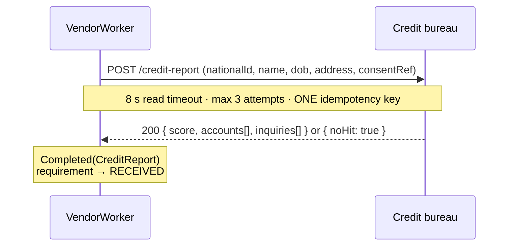

# Provider — Credit bureau report

Parent: [Intake and Checks](../credit-card-application-design-spec.md) §0 row 4, §5.5.

| | |
|---|---|
| **Question** | Are they likely to repay? |
| **Requirement** | `CREDIT` |
| **VendorCheck type** | `CREDIT_BUREAU` |
| **Port** | `CreditBureauPort` |
| **Mode** | **Sync** request/response — no webhook |
| **Paid** | Yes, per pull — **and a duplicate has a cost the applicant bears** |
| **Vendor** | The market's bureau (Experian, Equifax, TransUnion, or the local equivalent). Left unnamed: the API differs per country and the choice is commercial. |

The one provider where a retry is not merely wasteful. **A repeated pull can register a second hard inquiry on the
applicant's credit file, which lowers their score.** Every other decision in this document follows from that.

## 1. Shape of the integration



## 2. Auth and consent

mTLS plus OAuth2 client credentials is the usual shape; the bureau issues a client certificate per environment.

**Consent is part of the request, not just our records.** The bureau requires an assertion that the applicant consented
to the pull, and the contract usually requires us to be able to produce it on request. So:

- `consents` on the application must include the bureau-pull consent before submit — enforced by the `DRAFT → SUBMITTED`
  guard, not here.
- The consent reference goes in the request body.
- The consent is recorded in `audit_event` at intake, which is what we produce if challenged.

A pull without consent is a compliance incident, not a bug. It is cheaper to fail the submit guard than to explain the
pull afterwards.

## 3. Request and response

```http
POST /v1/credit-report
Authorization: Bearer <token>
Idempotency-Key: {appId}:CREDIT_BUREAU
Content-Type: application/json

{
  "subject": { "nationalId": "S1234567D", "name": "Jane Tan", "dateOfBirth": "1990-04-12",
               "address": { "line1": "...", "postalCode": "..." } },
  "purpose": "CREDIT_APPLICATION",
  "inquiryType": "HARD",
  "consentReference": "<auditEventId>"
}
```

```json
{
  "reportId": "rpt_88f1",
  "score": { "value": 712, "model": "LOCAL-v4", "range": { "min": 0, "max": 999 } },
  "accounts": [ { "type": "CARD", "status": "OPEN", "monthlyPayment": 240, "balance": 3100 } ],
  "inquiries": [ { "date": "2026-07-02", "purpose": "CREDIT_APPLICATION" } ],
  "noHit": false
}
```

A **thin file** answers `{ "noHit": true }` with no score. That is an answer, not a failure.

## 4. Mapping to `CreditReport`

```java
record CreditReport(boolean noHit, OptionalInt score, Money monthlyDebtPayments,
                    int openAccounts, List<Inquiry> inquiries) {
    record Inquiry(LocalDate date, String purpose) {
    }
}
```

| Bureau response      | `CreditReport`                             | Requirement |
|----------------------|--------------------------------------------|-------------|
| Score and accounts   | `noHit = false`, `score` present            | `RECEIVED`  |
| `noHit: true`        | `noHit = true`, `score` empty               | `RECEIVED`  |

`monthlyDebtPayments` is the sum of `accounts[].monthlyPayment` over open accounts, and `openAccounts` their count — the
two inputs the deferred `debtToIncome` feature needs. The score model name is kept: a cutoff is meaningless without
knowing which model produced the number, and models change.

**A thin file is not a decline.** No score means the deferred ruleset has nothing to cut off against, which is a referral
in that increment's design. Here it is simply `RECEIVED` with `noHit`.

## 5. Failures → `VendorResult`

| Condition                          | `VendorResult`                | Retryable |
|------------------------------------|-------------------------------|-----------|
| `200` with a report, or `noHit`    | `Completed(CreditReport)`     | —         |
| Connect or read timeout            | `Failed(Timeout)`             | Yes, **max 3** |
| `429`, `5xx`                       | `Failed(Unavailable(status))`  | Yes, **max 3** |
| `400`, `422` — bad subject data    | `Failed(InvalidRequest)`      | No        |
| `403` — consent rejected           | `Failed(InvalidRequest)`      | No — alert; this is a compliance signal |

Note there is no `SubjectNotFound`: a subject the bureau has never seen is `noHit`, which is a `Completed` result. Only a
transport or contract failure is `Failed`.

## 6. Idempotency, timeouts, retries

| | |
|---|---|
| Idempotency key | `{appId}:CREDIT_BUREAU` — **the same key on every one of the 3 attempts** |
| Read timeout | 8 s — the slowest of the four; bureau reports are assembled, not looked up |
| Max attempts | **3**, not 5 |
| Lease | 1 min |

Three deliberate differences from the other providers:

1. **Max 3 attempts, not 5.** Each attempt risks a duplicate inquiry if the key is not honoured. Fewer attempts, and an
   `UNAVAILABLE` requirement, beats damaging an applicant's file.
2. **The key never changes across attempts.** A retry must reach the vendor as *the same pull*. This is the one place in
   the codebase where regenerating an idempotency key would be a defect with a cost to a person outside the company.
3. **Verify the guarantee, don't assume it.** If the bureau does not honour idempotency keys, the adapter must look the
   pull up by our reference before retrying. **Confirm in the contract, and write a test against the real sandbox that
   asserts two identical calls produce one inquiry.**

Crash safety has the same asymmetry: if the worker dies after the call but before recording, the lease expires and the
claim is retried — which is exactly the case the key must cover.

## 7. Fake vendor (`fake-vendors` profile)

| Trigger              | Behaviour                         | Exercises                     |
|----------------------|-----------------------------------|-------------------------------|
| national id ends `2` | Score 550                         | Below any plausible cutoff     |
| national id ends `3` | Score 650                         | Mid band                       |
| national id ends `4` | Score 750                         | Top band                       |
| national id ends `5` | `noHit: true`                     | Thin file — an answer, no score |
| last name `FLAKY`    | `503` twice, then success         | Backoff under max 3            |
| last name `TIMEOUT`  | Hangs past 8 s                    | The read timeout               |

The fake must also **count inquiries per idempotency key and expose the count**, so a test can assert that a retried
claim produced exactly one. That is the one vendor behaviour worth faking precisely rather than plausibly.

## 8. To confirm before building

- Whether the contracted product is a hard or soft pull at application time, and the consent wording that must be
  captured before a hard one. This is the parent spec's open question and it gates FR1's consent increment.
- Whether the bureau honours idempotency keys, and what its own dedupe window is (§6).
- The score model and its range, which the deferred ruleset's cutoffs and band table depend on.
- Whether a sandbox exists that registers inquiries, so the duplicate-inquiry test is real rather than a mock agreeing
  with itself.
