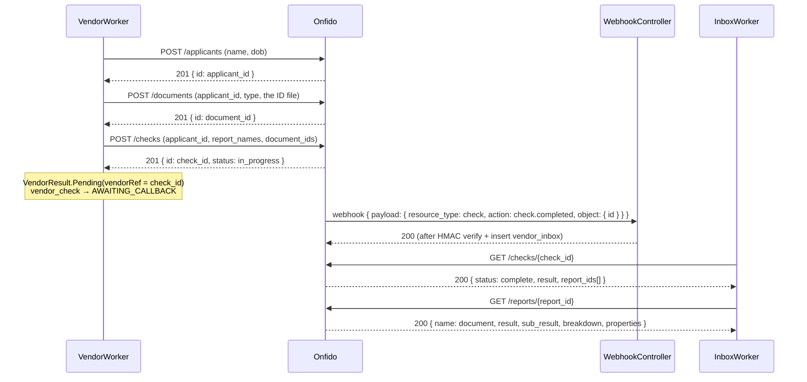

# Provider — Identity verification (Onfido)

Parent: [Intake and Checks](../../README.md) §0 row 1, §5.5.
Implementation: [FR5 — Identity Verification](../fr5-identity-verification.md), which mocks this API with a dockerized
WireMock rather than calling Onfido.

| | |
|---|---|
| **Question** | Is this person who they say they are? |
| **Requirement** | `IDENTITY` |
| **VendorCheck type** | `IDV` |
| **Port** | `IdvPort` |
| **Mode** | **Async** — request/response to submit, webhook to announce, request/response to fetch the result |
| **Paid** | Yes, per check |
| **Vendor** | Onfido (now Entrust Identity Verification). Jumio is the named alternative and implements the same port. |

The only asynchronous provider of the four. Everything in the design that exists for callbacks — `vendor_inbox`, the
inbox worker, the reconciler, `AWAITING_CALLBACK`, the 30-minute deadline — exists for this one integration.

## 1. Shape of the integration

Three calls plus a callback. The webhook is a **notification, not a result**: it says an answer is ready, and the result
is always fetched afterwards. That rule is what makes a lost, duplicated or forged webhook harmless.



The applicant id is stored on `vendor_check.vendor_subject_ref` as soon as `POST /applicants` answers, before anything
billed. A retried claim reuses that applicant, and first asks `GET /checks?applicant_id=` whether an earlier attempt
already created the check (§6). Only the document upload is repeated on a retry, which is unbilled.

## 2. Auth

`Authorization: Token token=<api_token>`, over TLS, region-specific base URL (`api.eu.onfido.com`,
`api.us.onfido.com`). The token is a live secret: it goes in the environment, never in the repository, and never in a log
line or an audit payload.

## 3. Request and response

**Create the check** — the one billed call.

```http
POST /v3.6/checks
Authorization: Token token=<api_token>
Idempotency-Key: {appId}:IDV:{documentId}
Content-Type: application/json

{ "applicant_id": "<applicant_id>", "report_names": ["document"], "document_ids": ["<document_id>"] }
```

```json
{ "id": "8b5f...", "status": "in_progress", "result": null, "report_ids": ["c1d2..."] }
```

**Fetch the result** — on the webhook, and again from the reconciler if no webhook arrives.

```http
GET /v3.6/checks/8b5f...
```

```json
{ "id": "8b5f...", "status": "complete", "result": "clear", "report_ids": ["c1d2..."] }
```

The check carries the verdict; the **report** carries the reason and the extracted data, so both are fetched. The report's
`properties` hold the name and date of birth read off the document, which is what the deferred `documentMatchScore`
feature will compare against the declared values.

## 4. Mapping to `IdvOutcome`

Onfido's own vocabulary never leaves the adapter package. The mapping is the adapter's whole job:

| Onfido `result` | Report `sub_result` | `IdvOutcome`  | Requirement becomes | Why                                                        |
|-----------------|---------------------|---------------|---------------------|------------------------------------------------------------|
| `clear`         | —                   | `VERIFIED`    | `RECEIVED`          | Document genuine, data extracted                            |
| `consider`      | `caution`           | `VERIFIED`    | `RECEIVED`          | An answer with a caveat — judging it is not this scope's job |
| `consider`      | `suspected`         | `FRAUD`       | `RECEIVED`          | Suspected forgery. Still an answer, so still `RECEIVED`     |
| `consider`      | `rejected`          | `UNREADABLE`  | `NEEDS_EVIDENCE`    | Unusable image — ask for a re-upload                        |
| `unidentified`  | —                   | `UNREADABLE`  | `NEEDS_EVIDENCE`    | Could not read the document                                 |

`FRAUD` is an **answer**, not a failure: the requirement reaches `RECEIVED` and nothing declines. Acting on it belongs to
the deferred ruleset.

A re-upload creates a **new** check under a new key (`{appId}:IDV:{newDocumentId}`), never a retry of the old one.

## 5. Failures → `VendorResult`

| Condition                             | `VendorResult`               | Retryable |
|---------------------------------------|------------------------------|-----------|
| `201` with `status: in_progress`      | `Pending(check_id)`          | —         |
| `200` with `status: complete`         | `Completed(IdvOutcome)`      | —         |
| Connect or read timeout               | `Failed(Timeout)`            | Yes       |
| `429`, `5xx`                          | `Failed(Unavailable(status))` | Yes      |
| `422` — bad document, malformed body  | `Failed(InvalidRequest)`     | No        |
| `401`, `403`                          | `Failed(InvalidRequest)`     | No — alert, it is a config fault |

Retries exhausted, or the 30-minute deadline passed with no result → check `FAILED` → requirement `UNAVAILABLE`. The
application still reaches `CHECKS_COMPLETE` with that gap visible.

## 6. Idempotency, timeouts, deadlines

| | |
|---|---|
| Idempotency key | `{appId}:IDV:{documentId}` — a re-upload is a new check, not a retry |
| Submit timeout | 10 s |
| Result deadline | 30 min from `AWAITING_CALLBACK`, on `vendor_check.next_attempt_at` |
| Max attempts | 5, backoff `2^attempts s ± jitter` |
| Lease | 1 min (`vendor_check.lease_until`) |

**Onfido does not honour `Idempotency-Key`.** The current API reference never mentions the header; the only idempotency
it documents is the token endpoint's cache and duplicate webhooks. The header is still sent, in case that changes, but
nothing relies on it.

What does: an attempt that cannot rule out an earlier success — a read timeout after `POST /checks`, a worker that died
before recording — is retried on the **same applicant**, and the retry lists that applicant's checks before creating one:

```http
GET /v3.6/checks?applicant_id=<applicant_id>
```

Each applicant is registered for exactly one `vendor_check`, so any check found there is ours: it is adopted as the
`vendor_ref` and the flow continues as if the original reply had arrived. Only when the list is empty is a new check
created. A list is a read and is not billed as far as the published material shows — no pricing is documented, and the
only billing condition in the reference (`missing_billing_info`) is on starting a check. **Confirm in the contract that
list calls are free.**

## 7. Webhook

- Header **`X-SHA2-Signature`**: hex HMAC-SHA256 of the **raw** request body, keyed by the webhook's secret token.
  Verify against the raw bytes — parsing to JSON first can reorder fields and break the digest.
- Compare in constant time. Reject with `401` and log the event id only, never the body.
- **There is no timestamp header to window.** Onfido signs the body alone, so a captured request stays valid forever and
  replay cannot be prevented at the signature layer. Two other properties make that harmless: the event id is unique in
  `vendor_inbox`, so a replay inserts nothing; and the result is always fetched by `check_id`, so a replay at worst makes
  us re-read a check we own. Vendors that *do* send a timestamp get the ±5 min window the parent spec describes.
- Then `INSERT INTO vendor_inbox … ON CONFLICT (vendor, event_id) DO NOTHING` and return `200` immediately. A duplicate
  delivery inserts nothing and is therefore a no-op.
- The inbox worker completes the check with `UPDATE … WHERE status = 'AWAITING_CALLBACK'`, so if the reconciler already
  polled the same result, one of the two updates 0 rows and does nothing.

Because the result is always fetched by `check_id`, a forged webhook can at worst make us re-read a check we own.

## 8. Mock server

IDV is **not** mocked in-process. It is a dockerized WireMock speaking this same API, so connect timeouts, TLS and a
webhook arriving on a real socket are all exercised — see [FR5 §6](../fr5-identity-verification.md) for the container,
the stubs and how the webhook is signed without an HMAC template helper.

Scenarios are selected by ordinary request data, so a test picks its behaviour without special wiring:

| Trigger              | Behaviour                                         | Exercises                        |
|----------------------|---------------------------------------------------|----------------------------------|
| national id ends `0` | `consider` / `suspected` → `FRAUD`                | A hit that is still an answer     |
| national id ends `1` | `rejected` → `UNREADABLE`, then `clear` on re-upload | The `NEEDS_INFO` loop         |
| last name `FLAKY`    | `503` twice, then success                         | Backoff and the lease            |
| last name `TIMEOUT`  | Hangs past 10 s                                   | Submit timeout                   |
| last name `LOSTHOOK` | Completes, never calls the webhook                | The reconciler                    |
| last name `DUPHOOK`  | Delivers the webhook twice                        | `vendor_inbox` dedupe            |
| last name `Lostreply` | Creates the check, answers after 12 s            | Adopting a check whose reply was lost |

## 9. To confirm before building

- Exact API version and whether to use `POST /checks` or a **workflow run**; Onfido has moved to Entrust branding and the
  documentation URL has changed, so pin the version and re-read it rather than trusting this page.
- ~~Whether `Idempotency-Key` is honoured on `POST /checks`~~ — it is not; the adapter lists the applicant's checks
  instead (§6). Still to confirm: that `GET /checks?applicant_id=` is not billed.
- Region and data-residency requirement, which fixes the base URL.
- Whether the document report alone is enough, or a facial-similarity report is also wanted — that is a product decision,
  and it changes `report_names` and the price per check.
