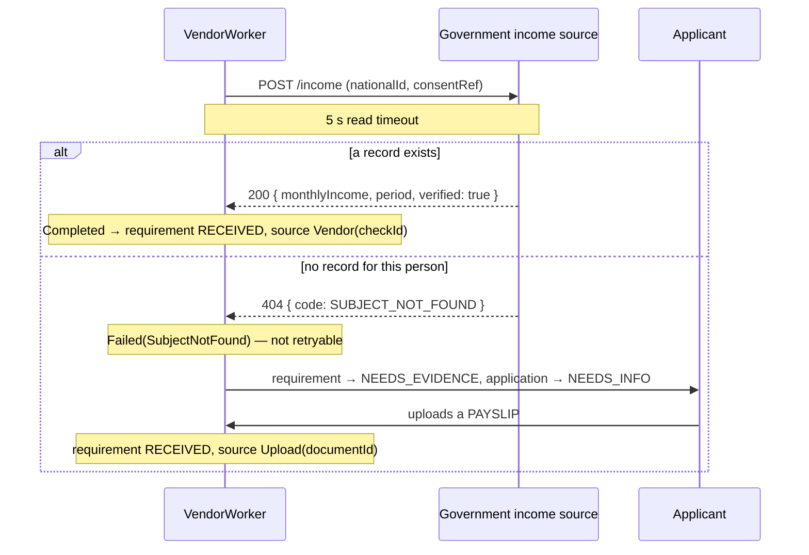

# Provider — Income verification

Parent: [Intake and Checks](../credit-card-application-design-spec.md) §0 row 3, §5.5.

| | |
|---|---|
| **Question** | Can they afford it? |
| **Requirement** | `INCOME` |
| **VendorCheck type** | `INCOME` |
| **Port** | `IncomePort` |
| **Mode** | **Sync** request/response — no webhook |
| **Paid** | Per lookup, or free where the source is a government service |
| **Source** | A government income data source, with an uploaded payslip as the fallback |

The only requirement with **two ways to be satisfied**: a vendor answer, or a document the applicant uploads. That makes
it the only provider whose failure mode routes back to the applicant instead of to an `UNAVAILABLE` requirement.

## 1. Shape of the integration



`SubjectNotFound` is the one failure in the whole design that is really a **question back to the user**, which is why it
is non-retryable: retrying cannot conjure a record, and only a document can move the requirement forward.

## 2. Auth and consent

OAuth2 client credentials against the government gateway, plus a consent reference in the request. The consent is the same
one captured at intake and recorded in `audit_event`; the source will typically require it be produced on audit.

## 3. Request and response

```http
POST /v1/income
Authorization: Bearer <token>
Idempotency-Key: {appId}:INCOME
Content-Type: application/json

{ "nationalId": "S1234567D", "consentReference": "<auditEventId>", "periods": 3 }
```

```json
{
  "subjectFound": true,
  "assessments": [
    { "period": "2026-08", "grossMonthly": 7200, "currency": "SGD" },
    { "period": "2026-07", "grossMonthly": 7200, "currency": "SGD" },
    { "period": "2026-06", "grossMonthly": 6900, "currency": "SGD" }
  ]
}
```

Several periods are requested and averaged rather than taking the latest, so one unusual month does not decide
affordability. The averaging rule lives in the adapter and is versioned with it.

## 4. Mapping to `VerifiedIncome`

```java
record VerifiedIncome(Money monthlyIncome, Source source, boolean verified) {
    enum Source { GOVERNMENT, PAYSLIP }
}
```

| Path                       | `monthlyIncome`                  | `source`     | `verified` | Requirement `source`   |
|----------------------------|----------------------------------|--------------|------------|------------------------|
| Government source answered | Mean of the returned periods      | `GOVERNMENT` | `true`     | `Vendor(checkId)`      |
| Payslip uploaded instead   | Read from the declared amount     | `PAYSLIP`    | **`false`** | `Upload(documentId)`  |

`verified = false` on the payslip path is the point. The document proves a payslip was uploaded, not that the income is
real — nobody reads the PDF in this scope. The deferred ruleset treats unverified income as a referral rather than as
income, which is why carrying the flag matters more than carrying the number.

## 5. Failures → `VendorResult`

| Condition                        | `VendorResult`                | Retryable | Effect                            |
|----------------------------------|-------------------------------|-----------|-----------------------------------|
| `200`, `subjectFound: true`      | `Completed(VerifiedIncome)`   | —         | `RECEIVED`                        |
| `404` / `subjectFound: false`    | `Failed(SubjectNotFound)`     | **No**    | `NEEDS_EVIDENCE` → ask for a payslip |
| Connect or read timeout          | `Failed(Timeout)`             | Yes       | Retry, then `UNAVAILABLE`         |
| `429`, `5xx`                     | `Failed(Unavailable(status))`  | Yes      | Retry, then `UNAVAILABLE`         |
| `400` — malformed request        | `Failed(InvalidRequest)`      | No        | `UNAVAILABLE`                     |
| `403` — consent rejected         | `Failed(InvalidRequest)`      | No        | `UNAVAILABLE`, alert              |

Note the two different non-retryable outcomes: `SubjectNotFound` asks the applicant for more, while `InvalidRequest`
gives up and records the gap. Collapsing them would either nag the applicant for a document that cannot help, or silently
lose a recoverable case.

## 6. Idempotency, timeouts, retries

| | |
|---|---|
| Idempotency key | `{appId}:INCOME` |
| Read timeout | 5 s |
| Max attempts | 5, backoff `2^attempts s ± jitter` |
| Lease | 1 min |

A payslip upload does **not** create a new `vendor_check` — unlike a re-uploaded ID, which starts a fresh IDV check. The
payslip satisfies the requirement directly with `Upload(documentId)`, because there is nothing to ask a vendor.

## 7. Fake vendor (`fake-vendors` profile)

| Trigger              | Behaviour                                  | Exercises                          |
|----------------------|--------------------------------------------|------------------------------------|
| national id ends `6` | `subjectFound: false`                      | The whole `NEEDS_INFO` payslip loop |
| last name `FLAKY`    | `503` twice, then success                  | Backoff                             |
| last name `TIMEOUT`  | Hangs past 5 s                             | Read timeout → `UNAVAILABLE`        |
| anything else        | Three periods averaging a usable income     | The common case                     |

## 8. To confirm before building

- Which government source, and whether it is available in the target market at all — if not, the payslip path becomes the
  only path, and then *every* application carries unverified income, which changes the economics of the deferred ruleset
  rather than just its inputs.
- How many periods to request and whether mean or median is the right average. A median resists a one-off bonus better;
  the mean is what a reviewer expects to see. Pick one and version the adapter.
- Currency handling if the source can answer in a currency other than the product's.
- **Open banking** is deliberately a later implementation of this same port (parent spec §5.7). It needs a consent
  redirect flow, which is a UI concern this scope has none of — but because it sits behind `IncomePort`, adding it changes
  one adapter and no requirement, no rule and no state machine.
