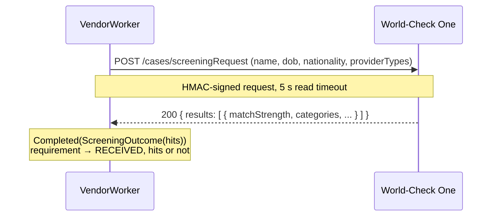

# Provider — Sanctions, PEP and adverse media screening (World-Check)

Parent: [Credit Card Application](../../README.md) §0 row 2, §5.5.

| | |
|---|---|
| **Question** | Are we allowed to serve them? |
| **Requirement** | `SCREENING` |
| **VendorCheck type** | `SANCTIONS` |
| **Port** | `ScreeningPort` |
| **Mode** | **Sync** request/response — no webhook |
| **Paid** | Yes, per screen |
| **Vendor** | Refinitiv/LSEG World-Check One. Dow Jones Risk & Compliance is the named alternative and implements the same port. |

One call, one answer, within seconds. No callback, so nothing in the inbox-and-reconciler machinery applies here.

## 1. Shape of the integration



**Zero hits is a result, not an absence.** `SCREENING` reaches `RECEIVED` either way; the difference is the content of
`rawResponse`, not the state.

## 2. Auth

HMAC request signing: each call carries a `Date` header and an `Authorization` header holding an HMAC-SHA256 over a
canonical string built from the method, path, date and a digest of the body, keyed by the API secret. Clock skew breaks
signing, so the container's clock must be synchronised — a failure that looks like `401` and is not a credential problem.

## 3. Request and response

```http
POST /v2/cases/screeningRequest
Authorization: Signature keyId="<api-key>",algorithm="hmac-sha256",headers="(request-target) date content-type content-length",signature="<sig>"
Date: Tue, 26 Sep 2026 06:12:00 GMT
Content-Type: application/json

{
  "groupId": "<our-group>",
  "entityType": "INDIVIDUAL",
  "providerTypes": ["WATCHLIST", "MEDIA_CHECK"],
  "name": "Jane Tan",
  "secondaryFields": [
    { "typeId": "DOB", "value": "1990-04-12" },
    { "typeId": "NATIONALITY", "value": "SG" }
  ]
}
```

```json
{
  "caseId": "0a9f...",
  "results": [
    {
      "resultId": "r1",
      "referenceId": "WC-12345",
      "matchStrength": "STRONG",
      "matchedTerm": "Jane Tan",
      "categories": ["SANCTIONS"],
      "sources": ["OFAC SDN"]
    },
    {
      "resultId": "r2",
      "matchStrength": "WEAK",
      "matchedTerm": "J. Tan",
      "categories": ["ADVERSE_MEDIA"],
      "sources": ["Reuters 2019-03-11"]
    }
  ]
}
```

`providerTypes` is what makes one call cover all three kinds: `WATCHLIST` returns sanctions and PEP profiles,
`MEDIA_CHECK` returns adverse media. Ask for both, or question 2 is only two-thirds answered.

## 4. Mapping to `ScreeningOutcome`

```java
record ScreeningOutcome(List<Hit> hits) {
    record Hit(HitType type, String list, int matchScore, String reference) {
    }

    enum HitType { SANCTION, PEP, ADVERSE_MEDIA }
}
```

| World-Check `categories` | `HitType`       | Confidence in a match                                    |
|--------------------------|-----------------|----------------------------------------------------------|
| `SANCTIONS`              | `SANCTION`      | High — an authoritative register; a match is near a fact   |
| `PEP`                    | `PEP`           | High — a curated register, though relatives widen it      |
| `ADVERSE_MEDIA`          | `ADVERSE_MEDIA` | **Low** — name-matching against news; false positives are normal |

`matchStrength` (`EXACT`, `STRONG`, `MEDIUM`, `WEAK`) maps onto `matchScore` so a later reviewer can sort by it. Keeping
the score is the whole reason the three hit types can share one requirement: the type says what kind of claim it is, the
score says how much to trust it, and **neither is judged here**.

No hits → `ScreeningOutcome(List.of())` → `RECEIVED`. Judging hits is compliance's, per the parent spec's Compliance
quality row.

## 5. Failures → `VendorResult`

| Condition                            | `VendorResult`                | Retryable |
|--------------------------------------|-------------------------------|-----------|
| `200` with `results` (possibly empty) | `Completed(ScreeningOutcome)` | —         |
| Connect or read timeout              | `Failed(Timeout)`             | Yes       |
| `429`, `5xx`                         | `Failed(Unavailable(status))`  | Yes      |
| `400` — malformed request            | `Failed(InvalidRequest)`      | No        |
| `401` — bad signature or clock skew  | `Failed(InvalidRequest)`      | No — alert; check the clock before the credentials |

There is no `SubjectNotFound` for screening: not being on a list is the good answer, not a missing record.

## 6. Idempotency, timeouts, retries

| | |
|---|---|
| Idempotency key | `{appId}:SANCTIONS` |
| Read timeout | 5 s |
| Max attempts | 5, backoff `2^attempts s ± jitter` |
| Lease | 1 min |

A screen has no lasting side effect at the vendor beyond a case record, so a duplicate is a wasted fee rather than a
correctness problem — unlike the bureau, where a duplicate is a second hard inquiry on the applicant's file. The key is
still sent, to keep every adapter's contract identical.

## 7. Fake vendor (`fake-vendors` profile)

| Trigger                    | Behaviour                                              |
|----------------------------|--------------------------------------------------------|
| last name `SANCTIONED`     | One `SANCTION` hit, `matchStrength: EXACT`              |
| last name `PEP`            | One `PEP` hit, `STRONG`                                 |
| last name `ADVERSEMEDIA`   | One `ADVERSE_MEDIA` hit, `WEAK` — the false-positive shape |
| last name `FLAKY`          | `503` twice, then success                               |
| last name `TIMEOUT`        | Hangs past 5 s                                          |
| anything else              | Empty `results` — the common case                       |

## 8. To confirm before building

- Exact API version, base URL and whether screening is `cases/screeningRequest` (synchronous) or a case-plus-poll flow on
  the contracted tier — **if the tier is asynchronous, this provider grows a webhook and stops being the simple one.**
- Whether ongoing monitoring is included, and whether it must be switched off: the parent spec puts post-decision
  monitoring out of scope, and a vendor that monitors by default will send events nothing consumes.
- The `groupId` per environment, so test screens are never recorded against the production case file.
- Data-retention terms for `rawResponse`: adverse media hits are personal data about third parties as well as the
  applicant, and how long we may keep them is a compliance answer, not an engineering one.
